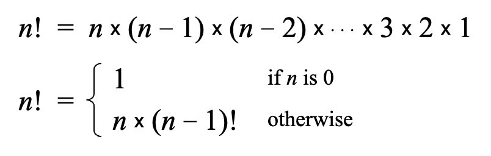
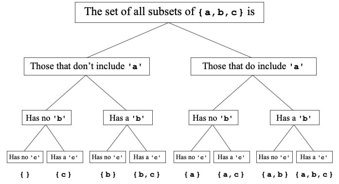

# 10. Recursion

> Recursive Paradigm, Search Algorithms I, Recursive Cases

*Last Update: 23-11-21*

Recursion is the process of solving a problem by **dividing** it into smaller sub-problems of **the same form**, which is a special kind of *divide and conquer*.

The recursive programs will use **the same** function or method to solve sub-problems at **different levels** of the solution, with the characteristic of **functions that call themselves**.

## 10.1 Recursive Paradigm

Sparked by the technic of *mathematical induction*, most recursive methods have bodies that fit the following general pattern:

+ Identify **simple cases** that can be solved without recursion
+ Find a **recursive decomposition** that breaks each instance of the problem into simpler sub-problems of the same type, recursively.

```cpp
if (test for a simple case) {
   Compute and return the simple solution without using recursion.
} else {
   Divide the problem into sub-problems with the same form.
   Solve each sub-problem by calling this method recursively.
   Return the solution by reassembling the results of various sub-problems.
}
```

Except for the simpliest *linear recursion*, we still have ***mutual recursion*** cases, where one function calls another, which calls another, which eventually circles back around to the original function:

```cpp
bool isOdd(unsigned int n) {
   return !isEven(n);
}

bool isEven(unsigned int n) {
   if (n == 0) {
      return true;
   } else {
      return isOdd(n – 1);
   }
}
```

**`fact` Function**

Here is a most intuitive example to implement the function `fact`:



+ *Iteration*-based: Uses a loop to calculate the factorial, efficient and stack-friendly.

  ```cpp
  int fact(int n) {
     int result = 1;
     for (int i = 1; i <= n; i++) {
        result *= i;
     }
     return result;
  }
  ```

+ *Recursion*-based: Uses standard recursion, elegant but can cause stack overflow for large input values.

  ```cpp
  int fact(int n) {
     if (n == 0) {
        return 1;
     } else {
        return n * fact(n - 1);
     }
  }
  ```

+ (*****) *Tail Recursion Optimization*: Employs tail recursion to allow compiler optimizations, reducing stack usage and preventing overflow.

  ```cpp
  int tailRecursiveFact(int n, int accumulator = 1) {
      if (n == 0)
          return accumulator;
      return tailRecursiveFact(n - 1, n * accumulator);
  }
  ```

**Fibonacci Function**

Another application of recursion is the one concerning Fibonacci sequence:

```cpp
int fib(int n) {
   if (n < 2) {
      return n;
   } else {
      return fib(n – 1) + fib(n - 2);
   }
}
```

**GCD Revisit**

We rewrite our `gcd()` as:

```cpp
int gcd(int x, int y) {
   if (x % y == 0) {
      return y;
   } else {
      return gcd(y, x % y);
   }
}
```

## 10.2 Search Algorithms I

**Linear Search**

The simplest strategy for searching is to start at the beginning of the array and look at each element in turn, which is called ***linear search***.

```cpp
int linearSearch(int key, Vector<int> vec) {
   for (int i = 0; i < vec.size(); i++) {
      if (key == vec[i]) return i;
   }
   return -1;
}
```

It needs to examine **each** element in the array to find the matching value, hence the number of steps required for linear search grows in **the same proportion** as the scale.

**Binary Search**

Here we introduces ***Binary search***, which proceeds each time by dividing the ordered list in half. 

For a sequence of ordered numbers, you get more information by **starting at the middle element** than you do by starting at the beginning.

When you look at the middle element in relation to the value you’re searching for, there are three possibilities:

+ If the value to search is **greater** than the middle element, discount every element in the **first half** of the array.

+ If the value to search is **less** than the middle element, discount every element in the **second half** of the array.
+ If the value to search **is equal to** the middle element, stop because you’ve found the value.

Repeat this process on the elements that remain after each cycle until **equality is satisfied**. 

```cpp
int binarySearch(string key, Vector<string> & vec, int p1, int p2) {
   if (p1 > p2) return -1;  // only indices between p1 and p2
   int mid = (p1 + p2) / 2;
   if (key == vec[mid]) return mid;
   if (key < vec[mid]) {
      return binarySearch(key, vec, p1, mid - 1);
   } else {
      return binarySearch(key, vec, mid + 1, p2);
   }
}
```

## 10.3 Recursive Cases

### 10.3.1 The Tower of Hanoi

You should transfer the disks from one needle to another according to the fixed and immutable laws, which require that **only one disk at a time** and there is **no smaller disk below it**.


Here are core elements within the problem:

+ The **number** of disks to move

+ The name of the spire where the disks **start out** and **finish**

+ The name of the spire used for **temporary storage**


The problem could be solved by dividing it into these three steps:

+ Move the entire stack consisting of the top $(n-1)$ disks from spire A to spire C, with the help of B.
+ Move the bottom disk from spire A to spire B.
+ Move the stack of $(n-1)$ disks from spire C to spire B with the help of A.

```cpp
void moveTower(int n, char start, char finish, char temp) {
   if (n == 1) {
      moveSingleDisk(start, finish);
   } else {
      moveTower(n - 1, start, temp, finish);
      moveSingleDisk(start, finish);
      moveTower(n - 1, temp, finish, start);
   }
}

int main() {
   int nDisks = 3;
   initHanoiGraphics(nDisks);
   moveTower(nDisks, 'A', 'B', 'C');
   return 0;
}
```

### 10.3.2 Inclusion-exclusion pattern

**Generating Subsets**

This problem is difficult to solve without using recursion, as the strategy requires exploring a solution space that **doubles in size** each time.

The recursive solution to this problem tries to find a solution that *includes* a particular element of the set and then tries to find a solution that *excludes* that element. This strategy is often called the ***inclusion-exclusion pattern***.



```cpp
Vector<string> generateSubsets(string set) {
   Vector<string> result;
   if (set == "") {
      result.add("");
   } else {
      result = generateSubsets(set.substr(1));
      int n = result.size();
      for (int i = 0; i < n; i++) {
         result.add(set[0] + result[i]);
      }
   }
   return result;
}
```

To make it clear, take the example of `"abc"`:

+ To generate all subsets of `"abc"`, we first generate all subsets of `"bc"`, and then we add `'a'` to each of those subsets.

- To generate subsets of `"bc"`, we start by generating all subsets of `"c"`, and then we add `'b'` to each of those subsets.
- To generate subsets of `"c"`, we start with the subsets of an empty string `""`, which has only itself as a subset, and then we add `'c'` to that subset.

**The Subset-Sum Problem**

The key insight is that there are two ways to produce the **desired target sum** after identifing a particular element:

+ One possibility: The subset you’re looking for *excludes* that element, so you could generate the value `target` using only the **leftover** set of elements.
+ Another possibility: The subset you’re looking for *includes* that element, so you produce the value `target-element `taking the rest of the set.

```cpp
bool subsetSumExists(Set<int> & set, int target) {
   if (set.isEmpty()) {
      return target == 0;
   } else {
      int element = set.first();
      Set<int> rest = set - element;
      return subsetSumExists(rest, target)
          || subsetSumExists(rest, target - element);
   }
}
```

**Generating Permutation**

A *permutation* of a collection of elements is simply an ordering of those elements. 

To generate all permutations of a collection of $N$ items, you can apply the following recursive decomposition:

+ Choose every element of the $N$ items to be the first element of the permutation.

+ Add all possible permutations of the remaining $(N-1)$ items to the set of permutations.

For example, the recursive permutations for the string `"ABCDE"` are:

+ The character `'A'` followed by all permutations of `"BCDE"`
  + The character `'B'` followed by all permutations of `"CDE"`
    + The character `'C'` followed by all permutations of `"DE"`
+ ...

```cpp
Set<string> generatePermutations(string str) {
   Set<string> result;
   if (str == "") {
      result += "";
   } else {
      for (int i = 0; i < str.length(); i++) {
         char ch = str[i];
         string rest = str.substr(0, i) + str.substr(i + 1);
         for (string s : generatePermutations(rest)) {
            result += ch + s;
         }
      }
   }
   return result;
}
```

### 10.3.3 Graphical Recursion

In graphical recursion, sometimes there seems to be no simple cases to be solved. Instead, there would be some stopping criteria to terminate the recursion. Examples could rage from **Mondrian Paintings** to **Fractal Coastline (fractals)**.


---

