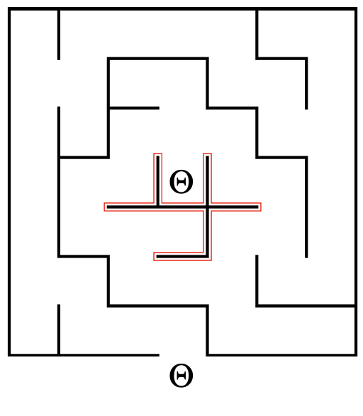
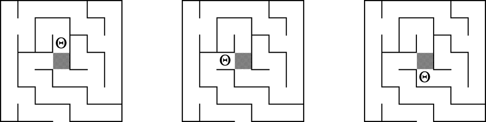
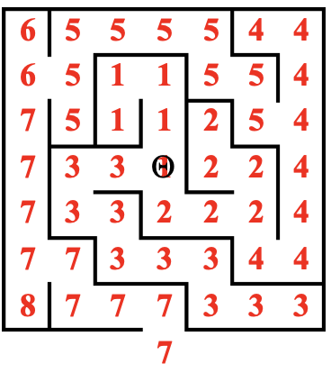
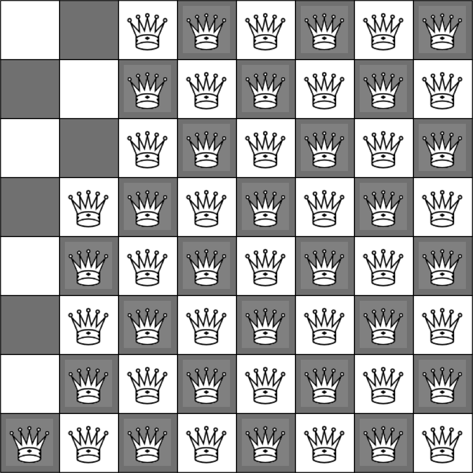
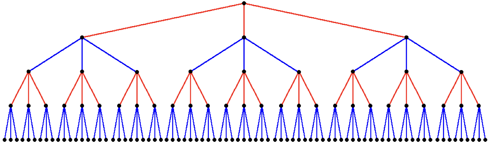
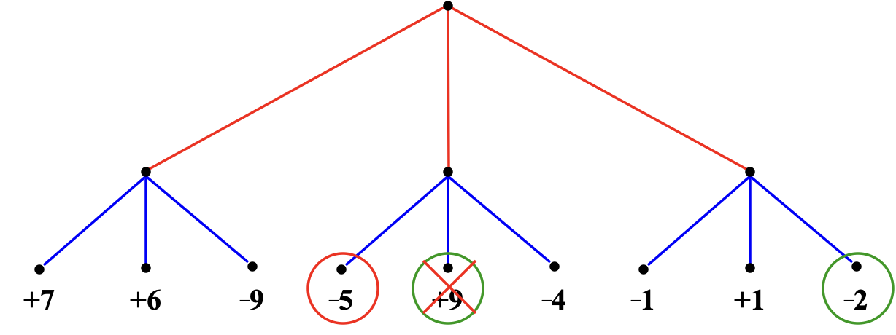
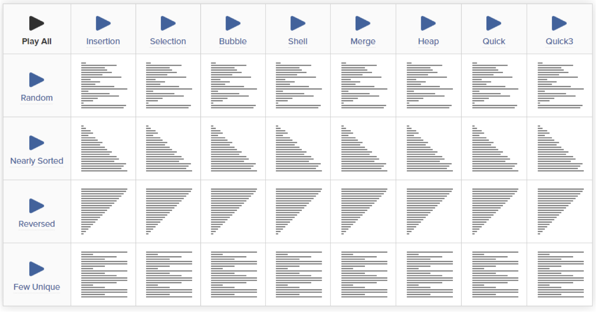
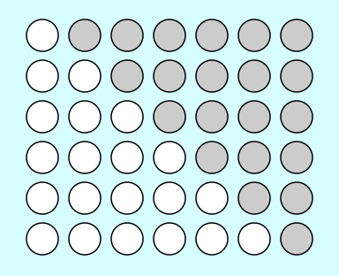
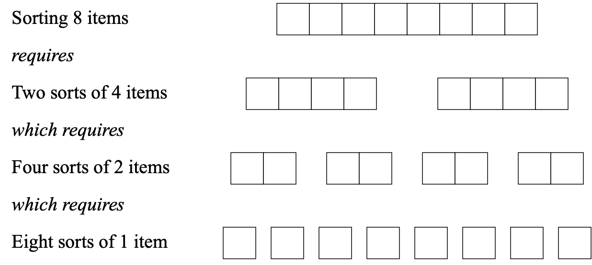

# 11. Algorithm

> Backtracking Algorithms, The Minimax Algorithm, Algorithmic Analysis & Sorting I

*Last Update: 23-11-20*

In this approach called ***backtracking algorithms***, there consists of a sequence of decision points, and you have to backtrack to a previous decision point and try a different path if you reach a dead end.

## 11.1 Backtracking Algorithms

**Solving a Maze**

The most widely known strategy for solving a maze is called the *right-hand rule*, but will be invalid if there are **loops** in the maze surrounding either the starting position or the goal.



It is also possible to solve a maze recursively. A maze is solvable only if it is possible to solve **one of the simpler mazes** that results from shifting the starting location to an adjacent square and taking the current square out of the maze completely.



Here is a detailed implementation:

```cpp
/*
 * Class: Maze
 * -----------
 * This class represents a two-dimensional maze contained in a rectangular
 * grid of squares.  The maze is read in from a data file in which the
 * characters '+', '-', and '|' represent corners, horizontal walls, and
 * vertical walls, respectively; spaces represent open passageway squares.
 * The starting position is indicated by the character 'S'.  For example,
 * the following data file defines a simple maze:
 *
 *       +-+-+-+-+-+
 *       |     |
 *       + +-+ + +-+
 *       |S  |     |
 *       +-+-+-+-+-+
 */

class Maze {
public:
  
/*
 * Constructor: Maze
 * Usage: Maze maze(filename);
 *        Maze maze(filename, gw);
 * -------------------------------
 * Constructs a new maze by reading the specified data file.  If the
 * second argument is supplied, the maze is displayed in the center
 * of the graphics window.
 */

   Maze(std::string filename);
   Maze(std::string filename, GWindow & gw);

/*
 * Method: getStartPosition
 * Usage: Point start = maze.getStartPosition();
 * ---------------------------------------------
 * Returns a Point indicating the coordinates of the start square.
 */

   Point getStartPosition();
  
/*
 * Method: isOutside
 * Usage: if (maze.isOutside(pt)) ...
 * ------------------------------------
 * Returns true if the specified point is outside the boundary of the maze.
 */

   bool isOutside(Point pt);

/*
 * Method: wallExists
 * Usage: if (maze.wallExists(pt, dir)) ...
 * ------------------------------------------
 * Returns true if there is a wall in direction dir from the square at pt.
 */

   bool wallExists(Point pt, Direction dir);

/*
 * Method: markSquare
 * Usage: maze.markSquare(pt);
 * ---------------------------
 * Marks the specified square in the maze.
 */

   void markSquare(Point pt);
  
/*
 * Method: unmarkSquare
 * Usage: maze.unmarkSquare(pt);
 * -----------------------------
 * Unmarks the specified square in the maze.
 */

   void unmarkSquare(Point pt);

/*
 * Method: isMarked
 * Usage: if (maze.isMarked(pt)) ...
 * -----------------------------------
 * Returns true if the specified square is marked.
 */

   bool isMarked(Point pt);
};

private:

/* Structure representing a single square */
   struct Square {
      bool marked;
      bool walls[4];
   };

/* Instance variables */
   Grid<Square> maze;
   Point startSquare;
   bool mazeShown;
   double x0;
   double y0;
   int rows;
   int cols;

/* Private Implementation */

/*
 * Function: solveMaze
 * Usage: solveMaze(maze, start);
 * ------------------------------
 * Attempts to generate a solution to the current maze from the specified
 * start point.  The solveMaze function returns true if the maze has a
 * solution and false otherwise.  The implementation uses recursion
 * to solve the submazes that result from marking the current square
 * and moving one step along each open passage.
 */

bool solveMaze(Maze & maze, Point start) {
   if (maze.isOutside(start)) return true;
   if (maze.isMarked(start)) return false;
   maze.markSquare(start);
   for (Direction dir = NORTH; dir <= WEST; dir++) {
      if (!maze.wallExists(start, dir)) {
         if (solveMaze(maze, move(start, dir))) {
            return true;
         }
      }
   }
   maze.unmarkSquare(start);
   return false;
}
```

We will go through the key function `solveMaze` to illustrate the algorithm behind:

+ **Check for Boundary Reach:** If the `start` point is outside the maze, it indicates an exit has been found, hence return `true`.

+ **Avoid Revisiting:** If the `start` point is already marked, it means it has been visited before. To avoid repeatedly entering dead ends, return `false`.

+ **Mark the Current Position:** Mark the `start` point as visited.

+ **Try All Directions:** For each direction (North, East, South, West), if there is no wall in that direction, move in that direction and recursively call `solveMaze`.

+ **Check for a Solution:** If the recursive call returns `true`, it means an exit has been found, and the current function should also return `true`.

+ **Backtracking:** If all directions have been tried and no exit is found, unmark the current position and return `false`.

**Recursion and Concurrency**

The recursive decomposition of a maze generates a series of **independent** submazes; the goal is to solve any one of them.

If you had a *multiprocessor* computer, you could try to solve each of these submazes **in parallel**. 

Refer to **P vs. NP** problem for reference.



**Searching in a Branching Structure**

The primary advantage of using recursion in these problems is that doing so dramatically **simplifies the bookkeeping**. Each level of the recursive algorithm considers one choice point. The historical knowledge of what choices have already been tested and which ones remain for further exploration is maintained automatically in the *execution stack*.

**The N Queen Problem**



Instead of traversing across all the possibilities, we could implement operations within **rows** and **columns** using *iteration* and *recursion*, by interpreting the rule as follows:

+ **One queen per row:** This is ensured by iterating over each row with the `for` loop.
+ **One queen per column:** This is ensured by the recursive call to `solveQueens` with the incremented `nPlaced` parameter. Each level of recursion represents moving to the next column.

Then we implement the function `solveQueens()` and `main()`:

```cpp
bool solveQueens(Grid<char> & board, int nPlaced = 0) {
   int n = board.numRows();
   if (nPlaced == n) return true; // return true if it is completed
   // loop to place the queen on each row 
   for (int row = 0; row < n; row++) { 
     if (queenIsLegal(board, row, nPlaced)) {
         board[row][nPlaced] = 'Q';
         // return true if true for sub-recursive call of the next column
         if (solveQueens(board, nPlaced + 1)) return true; 
         // erase the current one if false in sub-recursive call
         board[row][nPlaced] = ' ';
      }
   }
   return false;
}

int main() {
   int n = getInteger("Enter size of board: ");
   Grid<char> board(n, n);
   for (int i = 0; i < n; i++) {
      for (int j = 0; j < n; j++) {
         board[i][j] = ' ';
      }
   }
   if (solveQueens(board)) {
      displayBoard(board);
   } else {
      cout << "There is no solution for this board" << endl;
   }
   return 0;
}
```

## 11.2 The Minimax Algorithm

Here we take a simple game called *Nim*. The game begins with a pile of coins between two players, while the starting number of coins can vary. Each player takes **one, two, or three** coins from the pile and the player who takes the last coin loses.

The essential insight behind the Nim program is bound up in the following **mutually recursive** definitions:

+ **A good move:** The one that leaves your opponent in a bad position: You find yourself with either **two, three or four** coins on the table.

+ **A bad position:** The one that offers no good moves with just **one** coin on the table.

The implementation of the Nim game is really just a translation of these definitions into code:

```cpp
/*
 * Looks for a winning move, given the specified number of coins.
 * If there is a winning move in that position, findGoodMove returns
 * that value; if not, the method returns the constant NO_GOOD_MOVE.
 * This implementation depends on the recursive insight that a good move
 * is one that leaves your opponent in a bad position and a bad position
 * is one that offers no good moves.
 */

   int findGoodMove(int nCoins) {
      int limit = (nCoins < MAX_MOVE) ? nCoins : MAX_MOVE;
      for (int nTaken = 1; nTaken <= limit; nTaken++) {
         if (isBadPosition(nCoins - nTaken)) return nTaken;
      }
      return NO_GOOD_MOVE;
   }

/*
 * Returns true if nCoins is a bad position.  Being left with a single
 * coin is clearly a bad position and represents the simple case.
 */

   bool isBadPosition(int nCoins) {
      if (nCoins == 1) return true;
      return findGoodMove(nCoins) == NO_GOOD_MOVE;
   }

/* Strategy part */
struct Move {
   int nTaken;
};

void play() {
   initGame();
   while (!gameIsOver()) {
      displayGame();
      if (getCurrentPlayer() == HUMAN) {
         makeMove(getUserMove());
      } else {
         Move move = getComputerMove();
         displayMove(move);
         makeMove(move);
      }
      switchTurn();
   }
   announceResult();
}

// For Nim, move is simply nTaken, and getComputerMove() looks like this:
int getComputerMove() {
   int nTaken = findGoodMove(nCoins);
   return (nTaken == NO_GOOD_MOVE) ? 1 : nTaken;
}
```

**Game Trees**



Most two-player games have the same basic form: The first player (red) must choose between a set of moves, while the second player (blue) has several responses, then red has further choices, and vice versa.

**The Minimax Algorithm**

**Best Result at Worst Case:** Suppose that the ratings two turns from now are as shown. From your perspective, the +9 initially looks attractive; but your can’t get there, since the –5 is better for your smart opponent. The best you can do is choose the move that leads to the –2.



For more complex games, it is necessary to **cut off the analysis at some point** and then evaluate the position, **presumably** using some function that looks at a position and returns a `rating` for that position. Positive ratings are good for the player to move; negative ones are bad.

Instead of choosing the one with the highest rating as you control only half the play, you choose the move that minimizes the maximum rating available to your opponent, for which the strategy is called the ***minimax algorithm***.

Recursion has further applications on Games, like *Deep Blue* and *AlphaGo*.

## 11.3 Algorithmic Analysis & Sorting I

Of all the algorithmic problems, the one with the broadest practical impact is certainly the ***sorting problem***, which is the problem of arranging the elements of an array or a vector in order.



### 11.3.1 Selection Sort and Efficiency

Of the many sorting algorithms, the easiest one to describe is ***selection sort***:

```cpp
void sort(Vector<int> & vec) {
   int n = vec.size();
   for (int lh = 0; lh < n; lh++) {
      int rh = lh;
      for (int i = lh + 1; i < n; i++) {
         if (vec[i] < vec[rh]) rh = i;
      }
      int temp = vec[lh];
      vec[lh] = vec[rh];
      vec[rh] = temp;
   }
}
```

If you find the above hard to understand, then there is the decomposition version:

```cpp
/*
 * Function: sort
 * --------------
 * Sorts a Vector<int> into increasing order.  This implementation
 * uses an algorithm called selection sort, which can be described
 * in English as follows.  With your left hand (lh), point at each
 * element in the vector in turn, starting at index 0.  At each
 * step in the cycle:
 *
 * 1. Find the smallest element in the range between your left
 *    hand and the end of the vector, and point at that element
 *    with your right hand (rh).
 *
 * 2. Move that element into its correct position by swapping
 *    the elements indicated by your left and right hands.
 */

void sort(Vector<int> & vec) {
   for (int lh = 0 ; lh < vec.size() ; lh++ ) {
      int rh = findSmallest(vec, lh, vec.size() - 1);
      swap(vec[lh], vec[rh]);
   }
}

/*
 * Function: findSmallest
 * ----------------------
 * Returns the index of the smallest value in the vector between
 * index positions p1 and p2, inclusive.
 */

int findSmallest(Vector<int> & vec, int p1, int p2) {
   int smallestIndex = p1;
   for (int i = p1 + 1 ; i <= p2 ; i++ ) {
      if (vec[i] < vec[smallestIndex]) smallestIndex = i;
   }
   return smallestIndex;
}

/*
 * Function: swap
 * --------------
 * Exchanges two integer values passed by reference.
 */

void swap(int & x, int & y) {
   int temp = x;
   x = y;
   y = temp;
}
```

**Actual Time**

The primary question is how one might **evaluate the efficiency of an algorithm**.

One strategy is to measure the actual time it takes to run for arrays of different sizes. In C++, you can measure elapsed time by calling the `time` function, which returns the current time in milliseconds.

```cpp
#include <time.h>
/* time_t, struct tm, difftime, time, mktime */

int main() {
   Vector<int> vec = createTestVector();
   time_t begin, end;
   time(&begin);
   sort(vec);
   double diff = difftime(time(&end), begin);
   return 0;
}
```

Using this strategy (measuring the actual running time) could be rough sometimes:

+ `time` is often **too rough for accurate measurement**, thus it makes sense to measure several runs together and then divide the total time by the number of repetitions.

+ Most algorithms show some **variability depending on the data**. To avoid distortion, you should run several independent trials with different data and average the results.

+ Some measurements are **likely to be wildly off** because the computer needs to run some background task. Such data points must be discarded as you work through the analysis. 

As the running times on the preceding slide make clear, the situation for selection sort is very different. It appears that every **ten-fold increase in the size of the array** means that selection sort takes about **100 times as long**.

**Counting Operators**

Another way to estimate the running time is to count how many operations are required to sort an array of size $N$.

In the selection sort implementation, the section of code that is executed most frequently  is the body of the `findSmallest` method. The total number of this operation is $\frac{N(N+1)}{2}$.

Algorithms whose running times increase in proportion to the square of the problem size are said to be ***quadratic***.



**Big-O Notation**

Big-O notation offers a **qualitative assessment** of running time as a function of the problem size. If $$ f(N) = O(g(N)) $$, there exists a constant $$ C > 0 $$ and a number $$ N_0 $$, such that for all $$ N > N_0 $$, $$ f(N) \leq C g(N) $$.

For example, the computational complexity of linear search is $$ O(N) $$ and the computational complexity of selection sort is $$ O(N^2) $$.

When you write a big-O expression, you should always make the following **simplifications**:

+ Eliminate any term whose contribution to the running time ceases to be significant as *N* becomes large.

+ Eliminate any constant factors.

In many cases, you can deduce the computational complexity of a program directly from the structure of the code, while paying attention to the **dominance** part.

**Worst-case & Average-case**

When analysing the computational complexity of a program, you’re usually not interested in the minimum possible time (**Best-case complexity**) but the following two:

+ **Worst-case complexity:** The **upper bound** on the computational complexity. 
+ You can **guarantee** that the performance  will be at least as good as it indicates. The worst case occurs fairly often for many algorithms, e.g. look for an element but it does not exist.

+ **Average-case complexity:** The **best statistical estimate** of actual performance. It requires further knowledge, but the average case is often roughly as bad as the worst case.

In particular, a linear search has following complexity references: 

+ The worse-case complexity is $O(N)$;

+ The average-case complexity is $O(N)$;

+ The best-case complexity is $O(1)$.

### 11.3.2 The Merge Sort

In *Selection Sort*, sorting half as many elements takes only one fourth the time. Recursion makes it possible for a better approach:

+ Divide the vector into two halves: `v1` and `v2`.
+ Sort each of `v1` and `v2` recursively.
+ Clear the original vector.
+ Merge elements into the original vector by choosing the smallest element from `v1` or `v2` on each cycle.

The work done at each level is **proportional to the size of the vector**, thus the running time is therefore proportional to $N$ times the number of levels.

The number of levels in the merge sort decomposition is equal to the number of times you can **divide the original vector in half until there is only one element remaining**, and the complexity is therefore $O(N\log N)$.



Here is the implementation:

```cpp
/*
 * The merge sort algorithm consists of the following steps:
 *
 * 1. Divide the vector into two halves.
 * 2. Sort each of these smaller vectors recursively.
 * 3. Merge the two vectors back into the original one.
 */

void sort(Vector<int> & vec) {
   int n = vec.size();
   if (n <= 1) return;
   Vector<int> v1;
   Vector<int> v2;
   for (int i = 0; i < n; i++) {
      if (i < n / 2) {
         v1.add(vec[i]);
      } else {
         v2.add(vec[i]);
      }
   }
   sort(v1);
   sort(v2);
   vec.clear();
   merge(vec, v1, v2);
}

/*
 * Function: merge
 * ---------------
 * This function merges two sorted vectors (v1 and v2) into the
 * vector vec, which should be empty before this operation.
 * Because the input vectors are sorted, the implementation can
 * always select the first unused element in one of the input
 * vectors to fill the next position.
 */

void merge(Vector<int> & vec, Vector<int> & v1, Vector<int> & v2) {
   int n1 = v1.size();
   int n2 = v2.size();
   int p1 = 0;
   int p2 = 0;
   while (p1 < n1 && p2 < n2) {
      if (v1[p1] < v2[p2]) {
         vec.add(v1[p1++]);
      } else {
         vec.add(v2[p2++]);
      }
   }
   while (p1 < n1) vec.add(v1[p1++]);
   while (p2 < n2) vec.add(v2[p2++]);
}
```

**Standard Complexity Classes**

| Complexity  | Big-O Notation    | Example                                            |
| ----------- | ----------------- | -------------------------------------------------- |
| Constant    | $$ O(1) $$        | O(Yeah) Finding elements in a vector using indices |
| Logarithmic | $$ O(\log N) $$   | O(Nice) Binary search in a sorted vector           |
| Linear      | $$ O(N) $$        | O(Fine) Summing a vector; linear search            |
| Log-Linear  | $$ O(N \log N) $$ | O(K) Merge sort                                    |
| Quadratic   | $$ O(N^2) $$      | O(Well) Selection sort                             |
| Cubic       | $$ O(N^3) $$      | O(My) Obvious algorithms for matrix multiplication |
| Exponential | $$ O(2^N) $$      | O(No) Tower of Hanoi solution                      |
| Factorial   | $$ O(N!) $$       | O(MG) Brute-force search through all permutations  |

In general, theoretical computer scientists regard any problem whose complexity cannot be expressed as a polynomial as ***intractable***.

### 11.3.3 The Quicksort Algorithm

Most sorting libraries use some variation of the ***Quicksort algorithm***:

+ **Partition**: In the partition phase, the elements of the array are reordered so that the array begins with a set of "small" elements and ends with a set of "big" elements, where the distinction is made relative to an element called the ***pivot*** at the boundary between the two regions.

+ **Sort**: In the sort phase, the *Quicksort algorithm* is applied recursively to the “small” and “big” subarrays, which leaves the entire array sorted.

```cpp
/*
 * Function: sort
 * --------------
 * In this implementation, sort is a wrapper function that
 * calls quicksort to do all the work.
 */

void sort(Vector<int> & vec) {
   quicksort(vec, 0, vec.size() - 1);
}

/*
 * Function: quicksort
 * -------------------
 * Sorts the elements in the vector between index positions
 * start and finish, inclusive.  The Quicksort algorithm begins
 * by "partitioning" the vector so that all elements smaller
 * than a designated pivot element appear to the left of a
 * boundary and all equal or larger values appear to the right.
 * Sorting the subsidiary vectors to the left and right of the
 * boundary ensures that the entire vector is sorted.
 */

void quicksort(Vector<int> & vec, int start, int finish) {
   if (start >= finish) return;
   int boundary = partition(vec, start, finish);
   quicksort(vec, start, boundary - 1);
   quicksort(vec, boundary + 1, finish);
}

/*
 * Function: partition
 * -------------------
 * This function rearranges the elements of the vector so that the
 * small elements are grouped at the left end of the vector and the
 * large elements are grouped at the right end.  The distinction
 * between small and large is made by comparing each element to the
 * pivot value, which is initially taken from vec[start].  When the
 * partitioning is done, the function returns a boundary index such
 * that vec[i] < pivot for all i < boundary, vec[i] == pivot
 * for i == boundary, and vec[i] >= pivot for all i > boundary.
 */

int partition(Vector<int> & vec, int start, int finish) {
   int pivot = vec[start];
   int lh = start + 1;
   int rh = finish;
   while (true) {
      while (lh < rh && vec[rh] >= pivot) rh--;
      while (lh < rh && vec[lh] < pivot) lh++;
      if (lh == rh) break;
      int tmp = vec[lh];
      vec[lh] = vec[rh];
      vec[rh] = tmp;
   }
   if (vec[lh] >= pivot) return start;
   vec[start] = vec[lh];
   vec[lh] = pivot;
   return lh;
}
```

**Effieciency of Quick Sort**

+ Worst-case: $O(N^2)$, for a vector that is already sorted.

+ Average-case: $O(N\log N)$, for a random vector.

In practice, Quicksort is even much faster than Merge sort.

### 11.3.4 More issues

There are still more issues about this topic. As it is mainy a language course, it will not be discussed in detail here:

- **More Notiations:** $$ O $$ (bounded above) vs. $$ \Omega $$ (below) vs. $$ \Theta $$ (both)
  
  An upper bound of the worst case is a bound on the running time of the algorithm **on every input**. e.g. The worst case of Quicksort is actually $$ \Theta(N^2) $$ as well.

- **Comparison Sorting:** The worst case of any comparison sort is $$ \Omega(N\log N) $$.
  
- Other perspectives of sorting algorithms:

  Number of comparisons vs. number of swaps, time complexity vs. space complexity, in-place (at most $$ O(1) $$ extra space) vs. not-in-place, recursive vs. non-recursive, stable vs. unstable, serial vs. parallel and so on.


---

