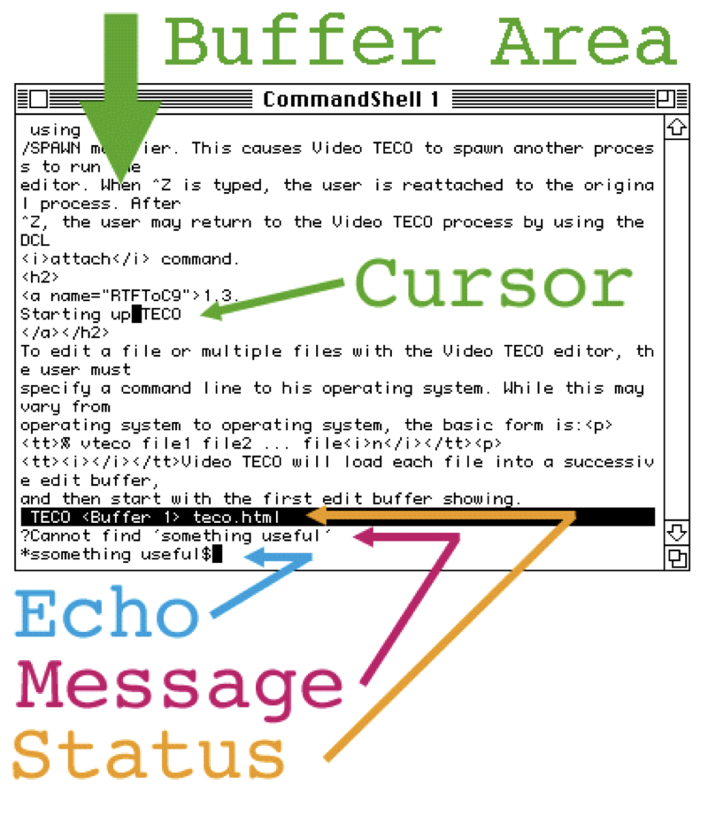
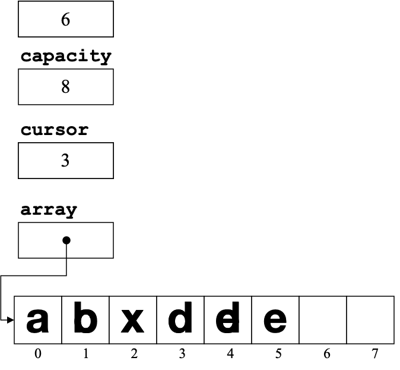
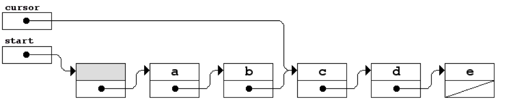
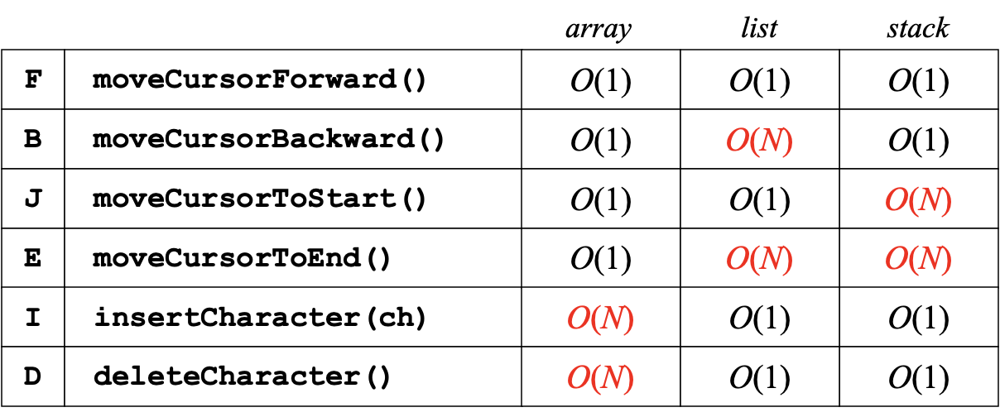
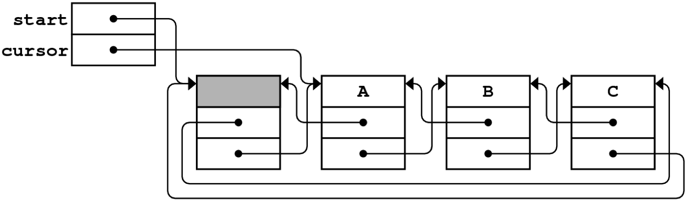

# 12. Efficiency

> The Array Model, The List-based Model, The Two-stack, Efficiency Analysis

A ***computer program*** is a collection of instructions that can be executed by a computer to perform a specific task.

Niklaus Emil Wirth: **Algorithms + Data Structures = Programs**

We will implement a **text editor** as an example today. Most editors today follow the **WYSIWYG** (What you see is what you get) **principle**, while before most editors used **a command-line model**.

Today we will implement a simple **TECO** (Text Editor and COrrector) command-line editor. 



The minimal version of TECO has the following commands:

| Key  | Action                                                   |
| ---- | -------------------------------------------------------- |
| I    | Inserts the *text* following the I into the buffer.      |
| J    | Jumps the current point (the *cursor*) to the beginning. |
| E    | Moves the cursor to the end of the buffer.               |
| F    | Moves the cursor forward one character.                  |
| B    | Moves the cursor backward one character.                 |
| D    | Deletes the character after the cursor.                  |
| H    | Prints a help message listing the commands.              |
| Q    | Quits from the editor.                                   |

with the following simulation:

```cpp
/*
 * Function: executeCommand
 * Usage: executeCommand(buffer, line);
 * -------------------------------------
 * Executes the command specified by line on the editor buffer.
 */

void executeCommand(EditorBuffer & buffer, string line) {
    switch (toupper(line[0])) {
        case 'I': foreach (char ch in line) {
            buffer.insertCharacter(ch);
        }
        displayBuffer(buffer);
        break;

        case 'D': buffer.deleteCharacter(); displayBuffer(buffer); break;
        case 'F': buffer.moveCursorForward(); displayBuffer(buffer); break;
        case 'B': buffer.moveCursorBackward(); displayBuffer(buffer); break;
        case 'J': buffer.moveCursorToStart(); displayBuffer(buffer); break;
        case 'E': buffer.moveCursorToEnd(); displayBuffer(buffer); break;
        case 'H': printHelpText(); break;
        case 'Q': exit(0);
        default: cout << "Illegal command" << endl; break;
    }
}
```

And the following methods:

| Method                        | Description                                                  |
| ----------------------------- | ------------------------------------------------------------ |
| `buffer.moveCursorForward()`  | Moves the cursor forward one character (does nothing if it's at the end). |
| `buffer.moveCursorBackward()` | Moves the cursor backward one character (does nothing if it's at the beginning). |
| `buffer.moveCursorToStart()`  | Moves the cursor to the beginning of the buffer.             |
| `buffer.moveCursorToEnd()`    | Moves the cursor to the end of the buffer.                   |
| `buffer.insertCharacter(ch)`  | Inserts the character `ch` at the cursor position and advances the cursor past it. |
| `buffer.deleteCharacter()`    | Deletes the character after the cursor, if any.              |
| `buffer.getText()`            | Returns the contents of the buffer as a string.              |
| `buffer.getCursor()`          | Returns the position of the cursor.                          |

We also provide the `buffer.h` interface:

```cpp
#include <string>

class Buffer {
  
public:
  
/*
 * Methods: moveCursorForward, moveCursorBackward
 * Usage: buffer.moveCursorForward();
 *        buffer.moveCursorBackward();
 * -----------------------------------
 * These functions move the cursor forward or backward one
 * character, respectively.  If you call moveCursorForward
 * at the end of the buffer or moveCursorBackward at the
 * beginning, the function call has no effect.
 */

   void moveCursorForward();
   void moveCursorBackward();

/*
 * Methods: moveCursorToStart, moveCursorToEnd
 * Usage: buffer.moveCursorToStart();
 *        buffer.moveCursorToEnd();
 * --------------------------------
 * These functions move the cursor to the start or the end of this
 * buffer, respectively.
 */

   void moveCursorToStart();
   void moveCursorToEnd();

/*
 * Method: insertCharacter
 * Usage: buffer.insertCharacter(ch);
 * ----------------------------------
 * This function inserts the single character ch into this
 * buffer at the current cursor position.  The cursor is
 * positioned after the inserted character, which allows
 * for consecutive insertions.
 */

   void insertCharacter(char ch);

/*
 * Method: deleteCharacter
 * Usage: buffer.deleteCharacter();
 * --------------------------------
 * This function deletes the character immediately after
 * the cursor.  If the cursor is at the end of the buffer,
 * this function has no effect.
 */

   void deleteCharacter();

/*
 * Method: getText
 * Usage: string str = buffer.getText();
 * -------------------------------------
 * Returns the contents of the buffer as a string.
 */

   std::string getText() const;

/*
 * Method: getCursor
 * Usage: int cursor = buffer.getCursor();
 * ---------------------------------------
 * Returns the index of the cursor.
 */

   int getCursor() const;

}

#endif
```

Our goal  is to implement the `EditorBuffer` class in three different underlying data structures and to compare the algorithmic efficiency:

+ A *simple array* model using dynamic allocation.

+ A *linked-list* model that uses pointers to indicate the order.

+ A *two-stack* model that uses a pair of character stacks.

For each model, we’ll analyze the complexity of each of the six fundamental methods in the `EditorBuffer` class. 

## 12.1 The Array Model

Conceptually, the simplest strategy for representing the editor buffer is to use **an array for the individual characters**.

+ To ensure that the buffer can contain an arbitrary amount of text, it is important to allocate the array storage dynamically and to expand the array whenever the buffer runs out of space.
+ The array used to hold the characters will contain elements that are allocated but not yet in use, which makes it necessary to distinguish the **allocated size (capacity)** of the array from its **effective size (length)**.
+ The data structure for the editor buffer must contain an additional integer variable that indicates **the current position of the cursor**, ranging from 0 up to and including the length of the buffer.



With these guidelines we implement the class like this:

```cpp
private:

/*
 * Implementation notes: Buffer data structure
 * -------------------------------------------
 * In the array-based implementation of the buffer, the characters in the
 * buffer are stored in a dynamic array.  In addition to the array, the
 * structure keeps track of the capacity of the buffer, the length of the
 * buffer, and the cursor position.  The cursor position is the index of
 * the character that follows where the cursor would appear on the screen.
 */

/* Constants */

   static const int INITIAL_CAPACITY = 10;

/* Instance variables */

   char *array;          /* Dynamic array of characters     */
   int capacity;         /* Allocated size of that array    */
   int length;           /* Number of characters in buffer  */
   int cursor;           /* Index of character after cursor */

/* Private method prototype */

   void expandCapacity();

/*
 * File: buffer.cpp (array version)
 * --------------------------------
 * This file implements the EditorBuffer class using an array representation.
 */

#include <iostream>
#include "buffer.h"
using namespace std;

/*
 * Implementation notes: Constructor and destructor
 * ------------------------------------------------
 * The constructor initializes the private fields.  The destructor
 * frees the heap-allocated memory, which is the dynamic array.
 */

EditorBuffer::EditorBuffer() {
   capacity = INITIAL_CAPACITY;
   array = new char[capacity];
   length = 0;
   cursor = 0;
}

EditorBuffer::~EditorBuffer() {
   delete[] array;
}

/*
 * Implementation notes: moveCursor methods
 * ----------------------------------------
 * The four moveCursor methods simply adjust the value of the
 * cursor instance variable.
 */

void EditorBuffer::moveCursorForward() {
   if (cursor < length) cursor++;
}

void EditorBuffer::moveCursorBackward() {
   if (cursor > 0) cursor--;
}

void EditorBuffer::moveCursorToStart() {
   cursor = 0;
}

void EditorBuffer::moveCursorToEnd() {
   cursor = length;
}

/*
 * Implementation notes: insertCharacter and deleteCharacter
 * ---------------------------------------------------------
 * Each of the functions that inserts or deletes characters
 * must shift all subsequent characters in the array, either
 * to make room for new insertions or to close up space left
 * by deletions.
 */

void EditorBuffer::insertCharacter(char ch) {
   if (length == capacity) expandCapacity();
   for (int i = length; i > cursor; i--) {
      array[i] = array[i - 1];
   }
   array[cursor] = ch;
   length++;
   cursor++;
}

void EditorBuffer::deleteCharacter() {
   if (cursor < length) {
      for (int i = cursor + 1; i < length; i++) {
         array[i - 1] = array[i];
      }
      length--;
   }
}

/* Simple getter methods: getText, getCursor */

string EditorBuffer::getText() const {
   return string(array, length);
}

int EditorBuffer::getCursor() const {
   return cursor;
}

/*
 * Implementation notes: expandCapacity
 * ------------------------------------
 * This private method doubles the size of the array whenever the old one
 * runs out of space.  To do so, expandCapacity allocates a new array,
 * copies the old characters to the new array, and then frees the old array.
 */

void EditorBuffer::expandCapacity() {
   char *oldArray = array;
   capacity *= 2;
   array = new char[capacity];
   for (int i = 0; i < length; i++) {
      array[i] = oldArray[i];
   }
   delete[] oldArray;
}
```

## 12.2 The List-based Model

The list-based model of the `EditorBuffer` class uses pointers to indicate the order of characters in the buffer.  

For example, the buffer is modeled conceptually like this:



It is impossible to represent all of the possible positions by pointing to some cell. If a list contains **five** cells, there have to be **six** positions for the cursor: the beginning of the cell, the intersection of the cells and the end of the cell.

In order to represent the position of the cursor by **pointing to the cell before the insertion point**, we allocate a dummy cell at the beginning of the list. Hence, the pointer `cursor` pointing to `c` represents the actual cursor at the insertion between cell `c` and cell `d`.

With these guidelines we implement the class like this:

```cpp
private:

/*
 * Implementation notes
 * --------------------
 * In the linked-list implementation of the buffer, the characters in the
 * buffer are stored in a list of Cell structures, each of which contains
 * a character and a pointer to the next cell in the chain.  To simplify
 * the code used to maintain the cursor, this implementation adds an extra
 * "dummy" cell at the beginning of the list.  The following diagram shows
 * a buffer containing "ABC" with the cursor at the beginning:
 *
 *        +-----+      +-----+      +-----+      +-----+      +-----+
 *  start |  o--+---==>|     |   -->|  A  |   -->|  B  |   -->|  C  |
 *        +-----+  /   +-----+  /   +-----+  /   +-----+  /   +-----+
 * cursor |  o--+--    |  o--+--    |  o--+--    |  o--+--    |  /  |
 *        +-----+      +-----+      +-----+      +-----+      +-----+
 */

   struct Cell {
      char ch;
      Cell *link;
   };

/* Data fields required for the linked-list representation */

   Cell *start;         /* Pointer to the dummy cell      */
   Cell *cursor;        /* Pointer to cell before cursor  */

/*
 * File: buffer.cpp (list version)
 * -------------------------------
 * This file implements the EditorBuffer class using a linked
 * list to represent the buffer.
 */

#include <iostream>
#include "buffer.h"
using namespace std;
 
/*
 * Implementation notes: EditorBuffer constructor
 * ----------------------------------------------
 * This function initializes an empty editor buffer represented as a
 * linked list.  In this representation, the empty buffer contains a
 * "dummy" cell whose ch field is never used.  The constructor must
 * allocate this dummy cell and set the internal pointers correctly.
 */

EditorBuffer::EditorBuffer() {
   start = cursor = new Cell;
   start->link = NULL;
}

/*
 * Implementation notes: EditorBuffer destructor
 * ---------------------------------------------
 * The destructor must delete every cell in the buffer.  Note that the loop
 * structure is not exactly the standard for loop pattern for processing
 * every cell within a linked list.  The complication that forces this
 * change is that the body of the loop can't free the current cell and
 * later have the for loop use the link field of that cell to move to
 * the next one.  To avoid this problem, this implementation copies the
 * link pointer before calling delete.
 */

EditorBuffer::~EditorBuffer() {
   Cell *cp = start;
   while (cp != NULL) {
      Cell *next = cp->link;
      delete cp;
      cp = next;
   }
}

void EditorBuffer::moveCursorForward() {
   if (cursor->link != NULL) {
      cursor = cursor->link;
   }
}

void EditorBuffer::moveCursorBackward() {
   Cell *cp = start;
   if (cursor != start) {
      while (cp->link != cursor) {
         cp = cp->link;
      }
      cursor = cp;
   }
}

void EditorBuffer::moveCursorToStart() {
   cursor = start;
}

void EditorBuffer::moveCursorToEnd() {
   while (cursor->link != NULL) {
      moveCursorForward();
   }
}

/*
 * Implementation notes: insertCharacter, deleteCharacter
 * ------------------------------------------------------
 * The primary advantage of the linked list representation for
 * the buffer is that the insert and delete operations can be
 * performed in constant time by updating pointers instead of
 * moving data.
 */

void EditorBuffer::insertCharacter(char ch) {
   Cell *cp = new Cell;
   cp->ch = ch;
   cp->link = cursor->link;
   cursor->link = cp;
   cursor = cp;
}

void EditorBuffer::deleteCharacter() {
   if (cursor->link != NULL) {
      Cell *oldcell = cursor->link;
      cursor->link = oldcell->link;
      delete oldcell;
   }
}

```

## 12.3 The Two-stack Model

In the two-stack implementation of the `EditorBuffer` class, the characters in the buffer are **stored in one of two stacks**. 

+ The characters before the cursor are stored in a stack called `before` and the characters after the cursor are stored in a stack called `after`. 
+ Characters in each stack are stored so that the ones close to the cursor are near the top of the stack.


```cpp
private:

/*
 * Implementation notes: Buffer data structure
 * -------------------------------------------
 * In the stack-based buffer model, the characters are stored in two
 * stacks.  Characters before the cursor are stored in a stack named
 * "before"; characters after the cursor are stored in a stack named
 * "after".  In each case, the characters closest to the cursor are
 * closer to the top of the stack.  The advantage of this
 * representation is that insertion and deletion at the current
 * cursor position occurs in constant time.
 */

#include "charstack.h"

/* Instance variables */

   CharStack before;    /* Stack of characters before the cursor */
   CharStack after;     /* Stack of characters after the cursor  */

/*
 * File: buffer.cpp (stack version)
 * --------------------------------
 * This file implements the EditorBuffer class using a pair of
 * stacks to represent the buffer.  The characters before the
 * cursor are stored in the before stack, and the characters
 * after the cursor are stored in the after stack.
 */

#include <iostream>
#include "buffer.h"
using namespace std;

/*
 * Implementation notes: EditorBuffer constructor/destructor
 * ---------------------------------------------------------
 * In this representation, the implementation of the CharStack class
 * automatically takes care of allocation and deallocation.
 */

EditorBuffer::EditorBuffer() {
   /* Empty */
}

EditorBuffer::~EditorBuffer() {
   /* Empty */
}

/*
 * Implementation notes: moveCursor methods
 * ----------------------------------------
 * These methods use push and pop to transfer values between the two stacks.
 */

void EditorBuffer::moveCursorForward() {
   if (!after.isEmpty()) {
      before.push(after.pop());
   }
}

void EditorBuffer::moveCursorBackward() {
   if (!before.isEmpty()) {
      after.push(before.pop());
   }
}

void EditorBuffer::moveCursorToStart() {
   while (!before.isEmpty()) {
      after.push(before.pop());
   }
}

void EditorBuffer::moveCursorToEnd() {
   while (!after.isEmpty()) {
      before.push(after.pop());
   }
}

/*
 * Implementation notes: insertCharacter and deleteCharacter
 * ---------------------------------------------------------
 * Each of the functions that inserts or deletes characters
 * can do so with a single push or pop operation.
 */

void EditorBuffer::insertCharacter(char ch) {
   before.push(ch);
}

void EditorBuffer::deleteCharacter() {
   if (!after.isEmpty()) {
      after.pop();
   }
}

/* 
 * Implementation notes: getText and getCursor
 * ---------------------------------------------------------
 * The getText method should return the entire content of the  
 * buffer, which requires to traverse the before stack in reverse 
 * order and then traverse the after stack in forward order.
 * The getCursor method should return the current position of 
 * the cursor, by simply returning the size of the before stack.
 */

string getText() const {
   std::string text;
   stack<char> temp = before;
   stack<char> reverse;
   
   while (!temp.empty()) {
      reverse.push(temp.pop());
   }
  
   while (!reverse.empty()) {
    text.push_back(reverse.pop());
   }
  
   temp = after;
   
   while (!temp.empty()) {
      text += temp.pop();
   }
   return text;
}

int getCursor() const {
   return before.size();
}

```

## 12.4 Efficiency Analysis

Now that we have completed the implementation, we revisited the above with a comparison:



The complexity of the stack-based operations may not be as straightforward as it appears, because it depends on the complexity of the operations of the `CharStack`.

It is possible to reimplement the editor buffer so that all operations run in **constant time** using *doubly linked lists* This sacrifice of space for time efficiency is an example of the **time-space tradeoff**.



**Amortized Analysis**

In an ***amortized analysis***, we average the time required to perform a sequence of data-structure operations over all the operations performed.

With amortized analysis, we might show that the average cost of an operation is small if we average over a sequence of operations, even though a single operation within the sequence might be expensive.

Amortized analysis differs from average-case analysis in that probability is not involved, but guarantees **the average performance of each operation in the worst case**. The collection classes in this text all use the strategy of **doubling their capacity whenever the structure runs out of room**, allowing the *amortized cost* of inserting elements is $O(1)$.

If $ \alpha $ is the cost of an insertion that doesn't expand the capacity and $ \beta $ is the per-element cost of the linear expansion, the total cost of inserting $ N $ items is:

$$
\text{total time} = \alpha N + \beta \left( N + \frac{N}{2} + \frac{N}{4} + \frac{N}{8} + \ldots \right)
$$

Dividing by $ N $ gives the average time, as follows:

$$
\text{average time} = \alpha + \beta \left( 1 + \frac{1}{2} + \frac{1}{4} + \frac{1}{8} + \ldots \right)
$$

The sum in parentheses is always less than two, so the average time of the worse case is constant. If deletion happens, the constant will be even lower.


---

