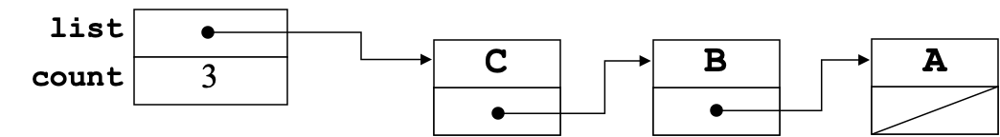
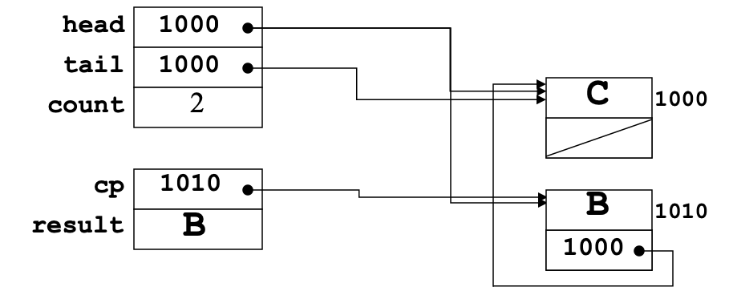
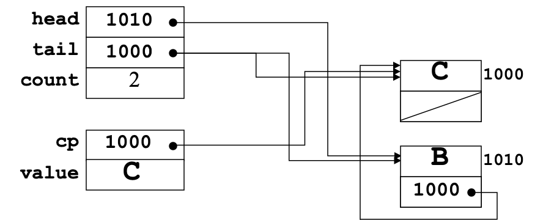

# 13. Linear Structures

*Last Update: 23-11-21*

First we recap what we have implemented as `CharStack` Class:

+ `charstack.h` Implementation:

  ```cpp
  #ifndef _charstack_h
  #define _charstack_h
  
  class CharStack {
  public:
  /* Constructor and Destructor */
     CharStack();
     ~CharStack();
    	
  /* Public Class Methods */
     int size();
     bool isEmpty();
     void clear();
     void push(char ch);
     char pop();
  
  #include "charstackpriv.h"
  }
  
  #endif
  ```
  
+ `charstackpriv.h` Implementation:

  ```cpp
  private:
     char *array;          
     int capacity; // allocated size of the array  
     int count; 	 // crt count of chars pushed 
  
  /* Private function prototypes */
     void expandCapacity();
  ```
  
+ `charstack.cpp` Implementation:

  ```cpp
  #include "charstack.h"
  #include "error.h"
  using namespace std;
  
  const int INITIAL_CAPACITY = 10;
  
  /* Constructor and Destructor */
  CharStack::CharStack() {
     capacity = INITIAL_CAPACITY;
     array = new char[capacity];
     count = 0;
  }
  
  CharStack::~CharStack() {
     delete[] array;
  }
  
  /* Implementation: methods */
  int CharStack::size() {
     return count;
  }
  
  bool CharStack::isEmpty() {
     return count == 0;
  }
  
  void CharStack::clear() {
     count = 0;
  }
  
  void CharStack::push(char ch) {
     if (count == capacity) expandCapacity();
     array[count++] = ch;
  }
  
  char CharStack::pop() {
     if (isEmpty()) error("pop: Attempting to pop an empty stack");
     return array[--count];
  }
  
  void CharStack::expandCapacity() {
     char *oldArray = array; 
     capacity *= 2;
     array = new char[capacity];
     for (int i = 0; i < count; i++) {
        array[i] = oldArray[i];
     }
     delete[] oldArray;
  }
  ```

## 13.1 Technics for Linear Structures

**Overloading**

As a form of *polymorphism*, function/operator ***overloading*** allows you to define several functions with the same name as long as they can be distinguished by their **signatures**.

Overloaded functions can have quite different behaviors with different signatures; or simply **different parameter types**, which is exactly what we need to do to `CharStack` to implement the new `Stack` class.

```cpp
#include <iostream>
using namespace std;

int operate(int a, int b) {
   return a/b;
}

double operate(double a, double b) {
   return a/b;
}

int main () {
   cout<<operate(1, 2)<<endl;
   cout<<operate(1.0, 2.0)<<endl;
   return 0;
}
```

Actually, C++ can help you generate the overloading **automatically**.

**Templates**

Templates allows us to **automate** the overloading process in situations where the code is **identical except for the types** involved. The specification could be:

```cpp
template <typename placeholder>
template <typename placeholder1, typename placeholder2>
```

The `placeholder` is an identifier that is used to stand for a specific type, and `typename` can also be a **class**.

Pay attention that a template is not a class or a function. It is a “pattern” that the compiler uses to generate **a generic collection** of classes or functions. 

+ Here is an example:
  ```cpp
  template <typename ValueType>
  ValueType max(ValueType v1, ValueType v2) {
     return (v1 > v2) ? v1 : v2;
  }
  ```
  The only condition is that, `max()` is applicable to types that **implement** the `>` operator.
  
+ Here is a further example of **multiple types**: 

  ```cpp
  template <typename ValueType1, typename ValueType2>
  ValueType1 max(ValueType1 v1, ValueType2 v2) {
     return (v1 > v2) ? v1 : v2;
  }
  ```

  Pay attention that if `max(1, 1.1)` is executed, it will return `1`.

## 13.2 Implementation of Linear Structures

### 13.2.1 Generic `Stack` Class

The first step in writing the template version of the `Stack` class is to add the `template` keyword to the interface just before the class definition:

```cpp
template <typename ValueType>
class Stack {};
```

Then each instance must be replaced by the `ValueType` placeholder as:

```cpp
ValueType *array;
```

Finally we need to add `template` declarations to every method body, as in the constructor:

```cpp
template <typename ValueType>
Stack<ValueType>::Stack() {
   capacity = INITIAL_CAPACITY;
   array = new ValueType[capacity];
   count = 0;
}
```

Because of the restrictions of C++ compilers, the implementations of the methods **need to be included** as part of the `stack.h` header, even though the details are not of interest to most clients. You could gently *comment* them.

Here is the complete implementation:

```cpp
/*
 * File: stack.h
 * -------------
 * This interface exports a template version of the Stack class.  This
 * implementation uses a dynamic array to store the elements of the stack.
 */

#ifndef _stack_h
#define _stack_h

#include "error.h"

/*
 * Class: Stack<ValueType>
 * -----------------------
 * This class implements a stack of the specified value type.
 */

template <typename ValueType>
class Stack {
public:
  	
/* Constructor and Destructor */ 
    Stack();
    ~Stack();
		
/* Basic methods */
    int size() const;
		bool isEmpty() const;
		void clear();
		void push(ValueType value);
		ValueType pop();
		ValueType peek() const;

/* Copy constructor and assignment operator */
   	Stack(const Stack<ValueType> & src);
   	Stack<ValueType> & operator=(const Stack<ValueType> & src);
  
private:
   static const int INITIAL_CAPACITY = 10;

/* Instance variables */
   ValueType *array; // A dynamic array of the elements
   int capacity;     // The allocated size of the array 
   int count;        // The number of stack elements    

/* Private method prototypes */
   void deepCopy(const Stack<ValueType> & src);
   void expandCapacity();

};

/* Implementation section: NOT for clients */ 

/* Implementation: Stack constructor and destructor */
template <typename ValueType>
Stack<ValueType>::Stack() {
   capacity = INITIAL_CAPACITY;
   array = new ValueType[capacity];
   count = 0;
}

template <typename ValueType>
Stack<ValueType>::~Stack() {
   delete[] array;
}

/* Implementation: size, isEmpty, clear */
template <typename ValueType>
int Stack<ValueType>::size() const {
   return count;
}

template <typename ValueType>
bool Stack<ValueType>::isEmpty() const {
   return count == 0;
}

template <typename ValueType>
void Stack<ValueType>::clear() {
   count = 0;
}

/* Implementation: push, pop, peek */
template <typename ValueType>
void Stack<ValueType>::push(ValueType value) {
   if (count == capacity) expandCapacity();
   array[count++] = value;
}

template <typename ValueType>
ValueType Stack<ValueType>::pop() {
   if (isEmpty()) error("pop: Attempting to pop an empty stack");
   return array[--count];
}

template <typename ValueType>
ValueType Stack<ValueType>::peek() const {
   if (isEmpty()) error("peek: Attempting to peek at an empty stack");
   return array[count - 1];
}

/* Implementation: copy constructor and assignment operator */
template <typename ValueType>
Stack<ValueType>::Stack(const Stack<ValueType> & src) {
   deepCopy(src);
}

template <typename ValueType>
Stack<ValueType> & Stack<ValueType>::operator=(const Stack<ValueType> & src) {
   if (this != &src) {
      delete[] array;
      deepCopy(src);
   }
   return *this;
}

/* Implementation: deepCopy */
template <typename ValueType>
void Stack<ValueType>::deepCopy(const Stack<ValueType> & src) {
   capacity = src.count + INITIAL_CAPACITY;
   this->array = new ValueType[capacity];
   for (int i = 0; i < src.count; i++) {
      array[i] = src.array[i];
   }
   count = src.count;
}

/* Implementation: expandCapacity */
template <typename ValueType>
void Stack<ValueType>::expandCapacity() {
   ValueType *oldArray = array;
   capacity *= 2;
   array = new ValueType[capacity];
   for (int i = 0; i < count; i++) {
      array[i] = oldArray[i];
   }
   delete[] oldArray;
}

#endif
```

It is also possible to implement stacks **using the list structure**. The top of the stack is the first element in the list and each additional item appears one cell further down. We will delve into the detail when we implement the **list-based queue**.



The implementation of the **list-based stack** is much simpler than the corresponding code for the **list-based queue**, as

+ In a stack, `push` and `pop` occur at the same end of the internal data structure.
+ In a queue, `enqueue` happens at one end and `dequeue` happens at the other.

### 13.2.2 Implementation of `Queue`

**LinkedList-Based Queue**

In some ways, the linked-list implementation of a queue is easier to understand than the array-based model, even though it contains pointers:

+ The private data structure for the `Queue` class requires **two pointers** to cells: 
  + a `head` pointer that indicates the first cell in the chain;
  + a `tail` pointer that indicates the last cell.
+ The `enqueue` operation adds a new cell after the one marked by the `tail` pointer and then updates the `tail` pointer so that it continues to indicate the end of the list. 
+ The `dequeue` operation consists of removing the cell addressed by the `head` pointer and returning the value in that cell.



Here is the implementation of `queue.h`:

```cpp
/*
 * File: queue.h
 * -------------
 * This interface exports a template version of the Stack class.  This
 * implementation uses a dynamic array to store the elements of the stack.
 */

#ifndef _queue_h
#define _queue_h

#include "error.h"

/*
 * Class: Queue<ValueType>
 * -----------------------
 * This class implements a queue of the specified value type.
 */

template <typename ValueType>
class Queue {
public:
/* Constructor and Destructor */ 
   Queue();
   ~Queue();
		
/* Basic methods */
   int size() const;
	 bool isEmpty() const;
	 void enqueue(ValueType);
   void dequeue();
   ValueType peek() const;
   void clear();	

/* Copy constructor and assignment operator */
   Queue(const Stack<ValueType> & src);
   Queue<ValueType> & operator=(const Stack<ValueType> & src);
  
private:
/* Type for the linked-list cell */
   struct Cell {
      ValueType data; 
      Cell *link;
   }

/* Instance variables */
   Cell *head;
   Cell *tail;
   int count;  // Number of elements in the queue

   template <typename ValueType>
   Queue<ValueType>::Queue() {
      head = tail = NULL;
      count = 0;
   }

   template <typename ValueType>
   Queue<ValueType>::~Queue() {
      clear();
   }

/* Implementation: size, isEmpty, clear */
   template <typename ValueType>
   int Queue<ValueType>::size() {
      return count;
   }

   template <typename ValueType>
   bool Queue<ValueType>::isEmpty() {
      return count == 0;
   }

   template <typename ValueType>
   void Queue<ValueType>::clear() {
      while (count > 0) {
         dequeue();
      }
   }

/* Implementation: enqueue */
   template <typename ValueType>
   void Queue<ValueType>::enqueue(ValueType value) {
      Cell *cp = new Cell;
      cp->data = value;
      cp->link = NULL;
      if (head == NULL) {
         head = cp;
      } else {
         tail ->link = cp;
      }
      tail = cp;
      count++;
   }

/* Implementation: dequeue, peek */
   template <typename ValueType>
   ValueType Queue<ValueType>::dequeue() {
      if (isEmpty()) error("dequeue: Attempting to dequeue an empty queue");
      Cell *cp = head;
      ValueType result = cp->data;
      head = cp->link;
      if (head == NULL) tail = NULL;
      count--;
      delete cp;
      return result;
   }

   template <typename ValueType>
   ValueType Queue<ValueType>::peek() {
      if (isEmpty()) error("peek: Attempting to peek at an empty queue");
      return head->data;
   }

/* Implementation: copy constructor and assignment operator */
   template <typename ValueType>
   Queue<ValueType>::Queue(const Queue<ValueType> & src) {
      head = tail = NULL;
      count = 0;
      deepCopy(src);
   }

   template <typename ValueType>
   Queue<ValueType> & Queue<ValueType>::operator=(const Queue<ValueType> & src) {
      if (this!= &src) {
         clear();
         deepCopy(&src)
      }
      return *this;
   }

/* Implementation: deepCopy */
   template <typename ValueType>
   void Queue<ValueType>::deepCopy(const Queue<ValueType> & src) {
      head = tail = NULL;
      count = 0;
      for (Cell *cp = src.head; cp != NULL; cp = cp->link) {
         enqueue(cp->data);
      }
   }
}

#endif
```

**Array-Based Queue**

Another way to represent the elements of a queue is to store the elements in an array.

+ The `enqueue` operation is extremely simple to implement. All you need to do is add the element to the end of the array and increment the element count, which takes $O(1)$ time.

+ However, the `dequeue` operation requires removing the element from the beginning of the array. If you apply the same methodology of the `Stack` class, implementing this operation requires **moving all the remaining elements to fill the hole** left by the `dequeued` element, which takes $O(N)$ time.

The key to fix the $O(N)$ issue is to eliminate the need for any data motion by **keeping track of two indices**: one to mark the `head` of the queue and another to mark the `tail`. Given these two indices, 

+ The `enqueue` operation stores the new element at the position marked by the `tail` index and then increments `tail` so that the next element is enqueued into the next slot. 
+ The `dequeue` operation is symmetric. The next value to be dequeued appears at the array position marked by the `head` index. Removing it is then simply a matter of incrementing `head`. 



Unfortunately, this strategy typically ends up filling the array space even when the queue itself contains very few elements, and the solution is **to let the elements cycle back to the beginning of the array**. 

**Ring-Buffer Queue**

The ***ring buffer*** gets its name because the end of the array is linked back to the beginning.

***Modular arithmetic*** will be applied, with all values reduced to a specific range by dividing each result by some constant and taking the remainder. 

When you are using the ring-buffer strategy, it is typically necessary to expand the queue **when there is still one free element left in the array**. Otherwise, `isEmpty()` will be invalid, as`head == tail` is also true for a full queue.

Only cover the `private` section:

```cpp
private:
   static const int INITIAL_CAPACITY = 10;

/* Instance variables */
   ValueType *array;                    
   int capacity;     // The allocated size of the array 
   int head;         // The index of the head element  
   int tail;         // The index of the tail element   

/* Private method prototypes */
   void expandCapacity();

/* Implementation section */

/* Constructor and Destructor */
template <typename ValueType>
Queue<ValueType>::Queue() {
   capacity = INITIAL_CAPACITY;
   array = new ValueType[capacity];
   head = 0;
   tail = 0;
}

template <typename ValueType>
Queue<ValueType>::~Queue() {
   delete[] array;
}

/* Implementation: size */
template <typename ValueType>
int Queue<ValueType>::size() {
   return (tail + capacity - head) % capacity;
}

/* Implementation: isEmpty */ 
template <typename ValueType>
bool Queue<ValueType>::isEmpty() {
   return head == tail;
}

/* Implementation: clear */
template <typename ValueType>
void Queue<ValueType>::clear() {
   head = tail = 0;
}

/* Implementation: enqueue */
template <typename ValueType>
void Queue<ValueType>::enqueue(ValueType value) {
   if (size() == capacity - 1) expandCapacity();
   array[tail] = value;
   tail = (tail + 1) % capacity;
}

/* Implementation: dequeue, peek */
template <typename ValueType>
ValueType Queue<ValueType>::dequeue() {
   if (isEmpty()) error("dequeue: Attempting to dequeue an empty queue");
   ValueType result = array[head];
   head = (head + 1) % capacity;
   return result;
}

template <typename ValueType>
ValueType Queue<ValueType>::peek() {
   if (isEmpty()) error("peek: Attempting to peek at an empty queue");
   return array[head];
}

/* Implementation: expandCapacity */
template <typename ValueType>
void Queue<ValueType>::expandCapacity() {
   int count = size();
   int oldCapacity = capacity;
   capacity *= 2;
   ValueType *oldArray = array;
   array = new ValueType[capacity];
   for (int i = 0; i < count; i++) {
      array[i] = oldArray[(head + i) % oldCapacity];
   }
   head = 0;
   tail = count;
   delete[] oldArray;
}

#endif
```

### 13.2.3 Implementation of `Vector`

The `Vector` class allows clients to **insert and remove** elements at any point in the sequence of values. At the same time, `Vector` resembles the `Stack` and `Queue` classes by implementing deep copying and by using templates to support polymorphism.

The `Vector` class is typically implemented using **a dynamic array** as the underlying model. Despite the fact that the `Vector` class exports more methods, the code is similar to the array-based implementation of the `Stack` class.

The only new feature of the `Vector` class is the definition of the *square-bracket* operators for selection, which requires providing a new definition of the `operator[]` method, which makes it possible to use **array-like selection notation** on `Vector` objects.

+ Modification to `vector.h` interface:

  ```cpp
  template <typename ValueType>
  class Vector {
  public:
  ...
  /* Operator: [] */
     ValueType & operator[](int index);
  ...
    
  private:
  ...
     ValueType *array;     
     int capacity;         
     int count;           
  ...
  }
  
  /* Implementation: Vector selection */
  template <typename ValueType>
  ValueType & Vector<ValueType>::operator[](int index) {
     if (index < 0 || index >= count) {
        error("Vector selection index out of range");
     }
     return array[index];
  }
  ```


The implementation of `operator[]` uses a new feature of C++ called ***return by reference***, which indicates that the return value is shared with the caller rather than copied. It means putting the result into an *lvalue*, which is an expression that can be used on the left side of an assignment:

  ```cpp
  vec[i] = 17;
  ```

The most important caution is that you must **never** use *return by reference* with a value that **lives in the stack frame** of the current method. It is suggested to limit the use within:

+ Select a field from an abstract structure supplied by the caller, like `Vec[index]`;
+ Return the same object that is passed into the current function using call by reference, like `=` and `<<`.

```cpp
#include <iostream>
using namespace std;

int & ReturnByReference(int a) { // call by value, return by reference
    cout << "Into ReturnByReference:" << endl;
    cout << "&a = " << &a << "; a = " << a << endl;
    int* b = new int(a); // can be safely returned by reference
    //int* b = &a; 			 // must not be returned by reference
    cout << "&b = " << &b << "; b = " << b << "; *b = " << *b << endl;
    cout << "Out of ReturnByReference:" << endl;
    return *b;
}

int CallByReference(int & a) { // call by reference, return by value
    cout << "Into CallByReference:" << endl;
    cout << "&a = " << &a << "; a = " << a << endl;
    cout << "Out of CallByReference:" << endl;
    return a;
}

int main() {
    int a = 1;
    cout << "&a = " << &a << "; a = " << a << endl;
    a = CallByReference(ReturnByReference(a) = a+1);
    cout << "&a = " << &a << "; a = " << a << endl;
    return 0;
}
```

**Integrating Prototypes and Code**

One of the primary reasons for using interfaces is to **hide the complexity** of the implementation. Everything for the client goes into the `.h` file that defines the *interface*, relegating the implementation details in the `.cpp` file.

However, it is even more difficult to maintain that level of separation as the interfaces become more sophisticated:

+ The **declaration of private sections** of a class is included in the `.h` file as the class definition, together with public ones.
+ The **entire** implementation for `template` classes should be included in the interfaces for special needs of compilers.

+ C++ even allows class definitions to include the bodies of the methods not only in the `.h` file, but directly **within the classes**, hence the `template` keyword appears only once and the `::` tags could be eliminated.

In the latest C++ standard updates, there are other ways to avoid combining code and prototypes, even for the template definitions. These techincs include *Concept* and *Module*, and might be intruduced in the subpages.

---
