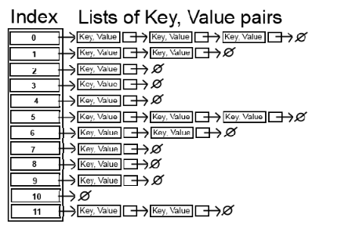

# 14. Map

> Implementation with vectors, Strategies for Maps, Hash Maps

*Last Update: 23-11-22*

## 14.1 Implementation with vectors

The `Map` class is a generalization of what provides an association between a ***key*** and a ***value***. 

```cpp
Map<key_type, value_type> map;
```

Intuitively, we could implement a `Map` with vectors storing key-value pair. However, the type for the keys stored in a `Map` must define a natural ordering, usually through a `less` function or `<` operator so that the keys can be **compared** and **ordered**.

+ With this intuition, we set up an example of `stringmap.h`:

  ```cpp
  /*
   * File: stringmap.h
   * -----------------
   * This interface exports the StringMap class, which maintains a collection
   * of key/value pairs, both of which are of type string.
   */
  
  #ifndef _stringmap_h
  #define _stringmap_h
  
  #include <string>
  #include "vector.h"
  
  class StringMap {
  
  public:
  
  /*
   * Constructor: StringMap
   * Usage: StringMap map;
   * ---------------------
   * Initializes a new empty StringMap.
   */
  
     StringMap();
  
  /*
   * Destructor: ~StringMap
   * ----------------------
   * Frees any heap storage associated with this map.
   */
  
     ~StringMap();
  
  /*
   * Method: get
   * Usage: string value = map.get(key);
   * -----------------------------------
   * Returns the value for key or the empty string, if key is unbound.
   */
  
     std::string get(const std::string & key) const;
  
  /*
   * Method: put
   * Usage: map.put(key, value);
   * ---------------------------
   * Associates key with value in this map.
   */
  
     void put(const std::string & key, const std::string & value);
  
  /* Private section */
  
  private:
  
  /*
   * Type: KeyValuePair
   * ------------------
   * This type combines a key and a value into a single structure.
   */
  
     struct KeyValuePair {
        std::string key;
        std::string value;
     };
  
  /* Instance variables */
  
     Vector<KeyValuePair> bindings;
  
  /* Private function prototypes */
  
     int findKey(const std::string & key) const;
  
  }
  
  #endif
  ```
  
+ Here is the detailed implementation within `stringmap.cpp`:

  ```cpp
  /*
   * File: stringmap.cpp
   * -------------------
   * This interface exports the StringMap class using a Vector.
   */
  
  #include <string>
  #include "stringmap.h"
  using namespace std;
  
  /*
   * Implementation notes: StringMap constructor and destructor
   * ----------------------------------------------------------
   * All dynamic allocation is handled by the Vector class.
   */
  
  StringMap::StringMap() { }
  StringMap::~StringMap() { }
  
  /*
   * Implementation notes: put, get
   * ------------------------------
   * These methods use findKey to search for the specified key.
   */
  
  string StringMap::get(const string & key) const {
     int index = findKey(key);
     return (index == -1) ? "" : bindings.get(index).value;
  }
  
  void StringMap::put(const string & key, const string & value) {
     int index = findKey(key);
     if (index == -1) {
        KeyValuePair entry;
        entry.key = key;
        index = bindings.size();
        bindings.add(entry);
     }
     bindings[index].value = value;
  }
  
  /*
   * Private method: findKey
   * -----------------------
   * Returns the index at which the key appears, or -1 if the key is not found.
   */
  
  int StringMap::findKey(const string & key) const {
     for (int i = 0; i < bindings.size(); i++) {
        if (bindings.get(i).key == key) return i;
     }
     return -1;
  }
  ```

## 14.2 Strategies for Maps

Now we rethink about our vector implementation, sincr there could be several strategies to implement the method like `get` and `put`. These strategies include:

+ **Linear Search:** 

  Keeping track of all the key-value pairs in a vector requires operations run in $O(N)$ time.

+ **Binary Search:** 

  Keep the vector sorted by the key, and apply binary search. 

  + `get` runs in $O(logN)$ time, as the steps for searching has been cut half;

  + `put` runs in $O(N)$ time, as in the worst time you need to adjust elements in the whole vector.

+ **Table lookup strategy**: 

  Recall the time-spacece tradeoff, we use a map to reduce the complexity of serching  $O(1)$, at the cost of the memeory space:
  
  
  
  Here is the corresponding implementation:
  
  ```cpp
  string getStateName(string key, Grid<string> & grid) {
     char row = key[0] - 'A';
     char col = key[1] - 'A';
     if (!grid.inBounds(row, col) || grid[row][col] == "") {
        error("No state name for " + abbr);
     }
     return grid[row][col];
  }
  ```

The *lookup-table strategy* shows that `get` and `put` operations could run very quickly, even independent of the number of keys in the table. In this idea of ***hashing***, you can improve performance enormously if you use the key to figure out where to look.

## 14.3 Hash Maps

The `StringMap` class implementation using the hashing strategy is called a ***hash map*** or ***hash table***.

The implementation requires the existence of a free function (called a ***hash function***) that transforms a key into a non-negative integer (called a ***hash code***). Ideally, the hash code should be one-to-one hence **unique** for each `key`, or it will cause *collision* problem. 

To achieve the **high level of efficiency** that hashing offers, a hash function must follow:

+ The function must be **inexpensive to compute**.

+ The function should distribute keys **uniformly cross the integer range** to minimize *collisions*.

Here is one implementation of the *djb2* hash algorithm:

```cpp
const int HASH_SEED = 5381;     			   /* Starting point for first cycle */
const int HASH_MULTIPLIER = 33; 				 /* Multiplier for each cycle */
const int HASH_MASK = unsigned(-1) >> 1; /* Largest positive integer */

/*
 * Function: hashCode
 * Usage: int code = hashCode(key);
 * --------------------------------
 * This function takes a string key and uses it to derive a hash code,
 * which is nonnegative integer related to the key by a deterministic
 * function that distributes keys well across the space of integers.
 * The specific algorithm used here is called djb2 after the initials
 * of its inventor, Daniel J. Bernstein, Professor of Mathematics at
 * the University of Illinois at Chicago.
 */

int hashCode(const string & str) {
   unsigned hash = HASH_SEED;
   int nchars = str.length();
   for (int i = 0; i < nchars; i++) {
      hash = HASH_MULTIPLIER * hash + str[i];
   }
   return (hash & HASH_MASK);
}
```

However, the collision seems hard to avoid considering the wide-range of hash code. One common strategy to solve this issue is to **store the key with same hash code in one "bucket"**.



With this guidance we finish the private part of `StringMap.h`:

```cpp
private:
  
	 /* Type definition for cells in the bucket chain */
  
     struct Cell {
        std::string key;
        std::string value;
        Cell* link;
     };
  
  /* Instance variables */
  
     Cell* *buckets;    /* Dynamic array of pointers to cells */
     int nBuckets;      /* The number of buckets in the array */
     int count;         /* The number of entries in the map   */
  
  /* Private method prototypes */
  
     Cell* findCell(int bucket, std::string key);
  
  /* Make copying illegal */
  
     StringMap(const StringMap & src) { }
     StringMap & operator=(const StringMap & src) { return *this; }
```

  Here we need to further emphasise a few:

  + **`Cell* *buckets` syntax:** As an array name, `bucket` is **the const pointer** pointing to the first element of the array, then `*buckets` is the value of the first element. As the `bucket` stores poiters to the corresponding buckets (represented by *linked list*), the type of `*buckets` is `Cell*`.

  + **Making copying illegal:** To avoid the *deep copy* of the entire map, the copy constructor and the assignment oprator are left blank or returning itself, which in fact forbids copying the whole structure.

The entire private array is viewed as a collection of **buckets**, each containing all keys with the same hash code. To locate the bucket a key belongs to, **the wide-range hash code could be converted into a limited bucket index** using `%`.

```cpp
int index = hashCode(key) % nBuckets;
```

Then how to organize multiple keys within one bucket? We come up with two technics:

+ **Separate Chaining**: To resolve collisions, each bucket can point to a *linked list*, where each node contains a key/value pair. When collisions occur, key/value pairs with the same hash code are **added to the end of that linked list** corresponding to that bucket.

+ **Open Addressing**: Another strategy to resolve collisions is open addressing. If a key's hash code corresponds to a bucket that is already occupied, the algorithm will find **the next empty bucket** to store the key/value pair.

  **Rehash** is also applied within the *open addressing* version. A map achieves  $O(1)$ performance only if the ratio of the number of keys to the number of buckets (the ***load factor***) is small, thus the library implementation **increases the number of buckets** (rehash) when the map **becomes too full**.

With these technics, $O(1)$ could be achieved on average, though the worst case is still $O(N)$.

Here is the implementation:

+ **Linked-list version** of `stringMap.cpp`:

  ```cpp
  /*
   * File: stringmap.cpp
   * -------------------
   * This file implements the stringmap.h interface using a hash table
   * as the underlying representation.
   */
  
  #include <string>
  #include "stringmap.h"
  using namespace std;
  
  /*
   * Implementation notes: StringMap constructor and destructor
   * ----------------------------------------------------------
   * The constructor allocates the array of buckets and initializes each
   * bucket to the empty list.  The destructor frees the allocated cells.
   */
  
  StringMap::StringMap() {
     nBuckets = INITIAL_BUCKET_COUNT;
     buckets = new Cell*[nBuckets];
     for (int i = 0; i < nBuckets; i++) {
        buckets[i] = NULL;
     }
  }
  
  StringMap::~StringMap() {
     for (int i = 0; i < nBuckets; i++) {
        Cell *cp = buckets[i];
        while (cp != NULL) {
           Cell *oldCell = cp;
           cp = cp->link;
           delete oldCell;
        }
     }
     delete [] buckets;
  }
  
  /*
   * Implementation notes: get
   * -------------------------
   * This method calls findCell to search the linked list for the matching
   * key.  If no key is found, get returns the empty string.
   */
  
  string StringMap::get(const string & key) const {
     Cell *cp = findCell(hashCode(key) % nBuckets, key);
     return (cp == NULL) ? "" : cp->value;
  }
  
  /*
   * Implementation notes: put
   * -------------------------
   * The put method calls findCell to search the linked list for the
   * matching key.  If a cell already exists, put simply resets the
   * value field.  If no matching key is found, put adds a new cell
   * to the beginning of the list for that chain.
   */
  
  void StringMap::put(const string & key, const string & value) {
     int bucket = hashCode(key) % nBuckets;
     Cell *cp = findCell(bucket, key);
     if (cp == NULL) {
        cp = new Cell;
        cp->key = key;
        cp->link = buckets[bucket];
        buckets[bucket] = cp;
     }
     cp->value = value;
  }
  
  /*
   * Private method: findCell
   * Usage: Cell *cp = findCell(bucket, key);
   * ----------------------------------------
   * Finds a cell in the chain for the specified bucket that matches key.
   * If a match is found, the return value is a pointer to the cell
   * containing the matching key.  If no match is found, findCell
   * returns NULL.
   */
  
  StringMap::Cell *StringMap::findCell(int bucket, const string & key) const {
     Cell *cp = buckets[bucket];
     while (cp != NULL && key != cp->key) {
        cp = cp->link;
     }
     return cp;
  }
  ```

+ **Open-addressing version** of `stringMap.cpp` (only showing differences):

  ```cpp
  /*
   * Implementation notes: put
   * -------------------------
   * The put method calls insertKey to search the bucket array for a matching
   * key.  If a key already exists, put simply resets the value field.  If no
   * matching key is found, put adds a new entry in the first free slot.
   */
  
  void StringMap::put(const string & key, const string & value) {
     if ((double) count / nBuckets > REHASH_THRESHOLD) {
        rehash(2 * nBuckets + 1);
     }
     int index = insertKey(key);
     buckets[index].value = value;
  }
  
  /*
   * Implementation notes: remove
   * ----------------------------
   * This implementation is tricky because removing one key can make later
   * keys inaccessible.  This implementation finds the first key that could
   * have gone in this position (if any) and moves it to this space, repeating
   * that process until an empty entry is found.  A much simpler but less
   * efficient strategy is to rehash after every deletion.
   */
  
  void StringMap::remove(const string & key) {
     int index = findKey(key);
     if (index != -1) {
        buckets[index].occupied = false;
        count--;
        int toFill = index;
        while (true) {
           index = (index + 1) % nBuckets;
           if (!buckets[index].occupied) return;
           if (insertKey(buckets[index].key) == toFill) {
              buckets[toFill].value = buckets[index].value;
              buckets[index].occupied = false;
              toFill = index;
           }
        }
     }
  }
  
  void StringMap::clear() {
     for (int i = 0; i < nBuckets; i++) {
        buckets[i].occupied = false;
     }
     count = 0;
  }
  
  int StringMap::getNBuckets() {
     return nBuckets;
  }
  
  /* 
   * Implementation notes: rehash
   * ----------------------------
   * The rehash method iterates over the existing key-value pairs, entering
   * them into a new table.
   */
  
  void StringMap::rehash(int newNBuckets) {
      KeyValuePair *newBuckets = new KeyValuePair[newNBuckets];
  
      for (int i = 0; i < newNBuckets; i++) {
          newBuckets[i].occupied = false;
      }
  
      KeyValuePair *oldBuckets = buckets;
      int oldNBuckets = nBuckets;
  
      buckets = newBuckets;
      nBuckets = newNBuckets;
      count = 0;
  
      for (int i = 0; i < oldNBuckets; i++) {
          if (oldBuckets[i].occupied) {
              put(oldBuckets[i].key, oldBuckets[i].value);
          }
      }
  
      delete[] oldBuckets;
  }
  
  
  /*
   * Private method: findKey
   * Usage: int index = findKey(key);
   * --------------------------------
   * This private method looks for a key in the buckets array.  If the
   * key is found, findKey returns its index.  If no match is found, the
   * findKey returns -1.
   */
  
  int StringMap::findKey(const string & key) const {
     int hash = hashCode(key);
     int bucket = hash % nBuckets;
  
     for (int i = 0; i < nBuckets; i++) {
         int index = (bucket + i) % nBuckets;
         if (!buckets[index].occupied) {
             return -1;
         }
         else if (buckets[index].key == key) {
             return index;
         }
     }
     return -1;
  }
  
  /*
   * Private method: insertKey
   * Usage: int index = insertKey(key);
   * ----------------------------------
   * This private method is identical to findKey except that it inserts the
   * key in the correct place if it is not already in the table.
   */
  
  int StringMap::insertKey(const string & key) {
      int hash = hashCode(key);
      int bucket = hash % nBuckets;
  
      for (int i = 0; i < nBuckets; i++) {
          int index = (bucket + i) % nBuckets;
          if (!buckets[index].occupied) {
              buckets[index].key = key;
              buckets[index].occupied = true;
              count++;
              return index;
          } else if (buckets[index].key == key) {
              return index;
          }
      }
  
      error("Insufficient space in hash table");
      return -1;
  }
  ```
  Here I will emphasize even more:
  + The `put` method checks whether it is necessary to **enlarge the table size** (rehash) when adding elements.
  + The `rehash` method is used to dynamically **adjust the size of the hash table**, maintaining good performance and minimizing collisions.
  + The implementation of the `remove` method is complex, as directly removing an element can **disrupt the search path** for other elements in the hash table. To avoid this issue, the code employs a strategy of moving subsequent elements forward.

**Generalization**

This rough implementation of `StringMap` could still be further generalized as a `HashMap` class:

+ The `key` type must be **assignable** so that the code can store copies of the `key`s in the cells.
+ The `key` type must **support the comparison operator** `==` so that the code can tell whether two keys are identical.
+ At the time the template for `HashMap` is expanded for a specific `key` type defined by the client other than the built-in types, a special version of the `hashCode` function must also be provided.

Also kindly refer to STL `map<>` and `unordered_map<>` for more information: The former is implemented using *balanced binary tree*, while the latter is implemented using *hash approach*.


---
