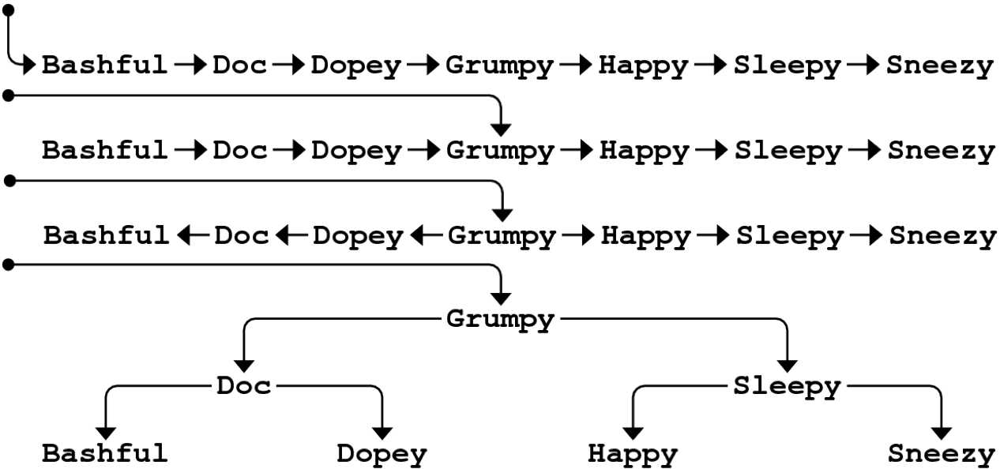
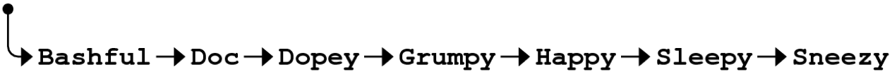
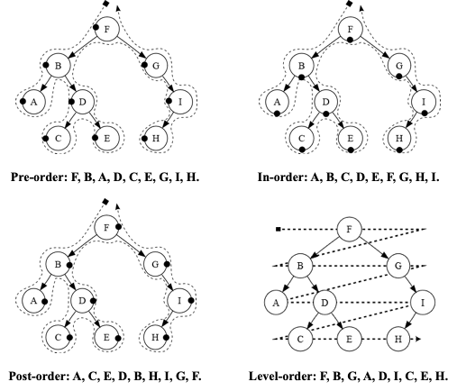

# 15. Tree

*Last Update: 23-11-27*

## 15.1 Motivation

Despite its extraordinary $O(1)$ efficiency, *hashing* is not always the best strategy for implementing maps:

+ Hash tables depend on being able to compute a hash function on some `key`, which is hard to expand for all types.

+ Using the range-based `for` on hash tables does not deliver the keys in any sensible order, while some keys have a natural order.

Motivated by the failure *a sorted array* to hold the `key`-`value` pairs, we try to fix *the linked* list by **pointing to the middle element** in a linked list, which is actually a new data structure called a ***tree***.

In C++, programmers typically define a *structure* or *object* type to represent a ***node*** and then use an explicit pointer type to represent the ***tree***:

+ A ***tree*** is a pointer to a node, and can be `NULL` indicating an empty tree.
+ A ***node*** is a *structure* that contains some number of trees, and can contain an **empty** list of children.

```cpp
struct TreeNode {
   string key;
   Vector<TreeNode *> children;
};
```

## 15.2 Binary Search Trees

The tree that supports the implementation of the `Map` class is called a ***Binary Search Tree (BST)***.  The idea of ***Binary Search Tree*** is to combine the linked list data structure (for **easier insertion/deletion**) and the binary search algorithm (for **faster search**).



Each node in a *BST* has exactly two subtrees: a **left** **subtree** that contains all the nodes that come before the current node and a **right** **subtree** after it. Either or both of them may be `NULL`.

Here we imlement the `BSTNode`:

```cpp
struct BSTNode {
   string key;
   BSTNode *left, *right;
};
```

The code for **finding** a node in a tree begins by **comparing the desired key with the key in the root node**:

+ If the strings match, you’ve found the correct node.
+ If not, you simply call yourself recursively on the left or right subtree depending on whether the key you want comes **before** or **after** the current one.

```cpp
/*
 * Type: Node
 * ----------
 * This type represents a node in the binary search tree.
 */

struct Node {
   string key;
   Node *left, *right;
};

/*
 * Function: findNode
 * Usage: Node* node = findNode(t, key);
 * -------------------------------------
 * Returns a pointer to the node in the binary search tree t than contains
 * a matching key.  If no such node exists, findNode returns NULL.
 */

Node* findNode(Node* t, string key) {
   if (t == NULL) return NULL;
   if (key == t->key) return t;
   if (key < t->key) {
      return findNode(t->left, key);
   } else {
      return findNode(t->right, key);
   }
}

/*
 * Function: insertNode
 * Usage: insertNode(t, key);
 * --------------------------
 * Inserts the specified key at the appropriate location in the
 * binary search tree rooted at t.  Note that t must be passed
 * by reference, since it is possible to change the root.
 */

void insertNode(Node* & t, string key) {
   if (t == NULL) {
      t = new Node;
      t->key = key;
      t->left = t->right = NULL;
      return;
   }
   if (key == t->key) return;
   if (key < t->key) {
      insertNode(t->left, key);
   } else {
      insertNode(t->right, key);
   }
}
```

**Removing Nodes in BST**

+ For **a leaf node** (with no children), replace the pointer to the node with a `NULL` pointer.

+ If **either child** of the node you want to remove is `NULL`, replace it with its non-`NULL` child.

+ If you try to remove a node with **both a left and a right child**, replace it with the rightmost node in the left subtree (*predecessor*) or the leftmost node in the right subtree (*successor*).

**Balance Trees**

If the elements enter **in order**, the tree would end up as a single linked list, with the algorithm running $O(N)$ instead of $O(logN)$ time.



A binary search tree is **balanced** if **the height of its left and right subtrees differ by at most one** and if both of those subtrees are themselves balanced.

The ***AVL*** algorithm was the first tree-balancing strategy and has been superseded by newer algorithms that are more effective in practice, like *Red-black trees*, *2-3 trees*, *AA trees*, *Fibonacci trees*, *Splay trees*, etc.

## 15.3 BST Applications

**Implementing Maps Using BSTs**

The Stanford `Map` class (and `map` in Standard C++) uses a BST structure internally, in which `get` and `put` operate in $O(logN)$ time while allowing iteration to proceed in order.

The `BSTNode` structure must be expanded to include a `value` field, and the code for manipulating the tree must be embedded in the `Map` class.

**Tree Traversal Strategies**

The order in which keys are processed depends on when you process the current node with respect to the recursive calls:



Here are traversal methods that reach the nodes in the same order known as ***Depth-First Traversal (DFT)***:

+ If you process the current node before either recursive call, the result is a ***pre-order traversal***.

  ```cpp
  void preorderTraversal(Node *t) {
     if (t != null) {
        cout << t->key << endl;
        preorderTraversal(t->left);
        preorderTraversal(t->right);
     }
  }
  ```
  The output:
  ```txt
  Grumpy
  Doc
  Bashful
  Dopey
  Sleepy
  Happy
  Sneezy

+ If you process the current node after the recursive call on the left subtree but before the recursive call on the right subtree, the result is an ***in-order traversal***, which often appears in a good order.

  ```cpp
  void inorderTraversal(Node *t) {
     if (t != null) {
        inorderTraversal(t->left);
        cout << t->key << endl;
        inorderTraversal(t->right);
     }
  }
  ```

  The output:

  ```cpp
  Bashful
  Doc
  Dopey
  Grumpy
  Happy
  Sleepy
  Sneezy
  ```

+ If you process the current node after completing both recursive calls, the result is a ***post-order** **traversal***. Postorder traversals are particularly useful if you are trying to **free all the nodes** in a tree.

  ```cpp
  void postorderTraversal(Node *t) {
     if (t != null) {
        postorderTraversal(t->left);
        postorderTraversal(t->right);
        cout << t->key << endl;
     }
  }
  ```

  The output:

  ```cpp
  Bashful
  Dopey
  Doc
  Happy
  Sneezy
  Sleepy
  Grumpy
  ```

And level-order traverse works in ***Breadth-First Traversal (BFT)***:

```cpp
void levelOrderTraversal(Node *root) {
    if (root == NULL) return;
		
    queue<Node*> q;
    q.push(root);
		
    while (!q.empty()) {
        Node *node = q.front();
        q.pop();

        cout << node->key << endl; 
        
        if (node->left != NULL) q.push(node->left); 
        if (node->right != NULL) q.push(node->right); 
    }
}
```

## 15.4 Partially Ordered Trees

A ***Partially Ordered Tree*** is a special class of *binary tree* (but not a BST) with these additional properties recursely applied to the whole:

+ The tree is **complete**: It is completely balanced, and each level of the tree is filled as far to the left as possible.
+ The `root` node of the tree **has higher priority** (minimum or maximum) than the `root` of either of its subtrees, which are also *partially ordered trees*.

A ***heap*** (no relationship to that of dynamic allocation) is hence an array-based data structure that simulates the operation of a *partially ordered tree*. 

**Heapsort**

And ***heapsort*** is a **comparison-based** sorting algorithm utilizing the *heap* data structure:

+ Heapsort can be thought of as an **improved selection sort**. But Unlike selection sort, heapsort does not waste time with a linear-time scan of the unsorted region, but maintain them in a *heap* data structure to more quickly find **the largest element in each step**.
+ Although slower in practice than a well-implemented *quicksort*, it has the advantage of **a more favorable worst-case** $O(NlogN)$ runtime.
+ Heapsort is an **in-place** algorithm, but it is **not** a **stable** sort.


Here is a brief illustration:

+ **Heapify:** Build an initial heap from the input list.

  + Bottom-up *SiftDown* with $O(N)$

  + Top-down *SiftUp* with $O(NlogN)$

+ Swap the first (largest) element with the last element, and no longer consider the last (largest) element.

+ SiftDown the current first element to maintain the heap property.

+ Repeat the last two steps and the list will be sorted.

Here is a conclusion of sorting technics introduced:

| Sorting  complexity |  Best   | Average |  Worst  |
| ------------------- | :-----: | :-----: | :-----: |
| Selection sort      |  $N^2$  |  $N^2$  |  $N^2$  |
| Insertion sort      |   $N$   |  $N^2$  |  $N^2$  |
| Bubble sort         |   $N$   |  $N^2$  |  $N^2$  |
| Merge sort          | $NlogN$ | $NlogN$ | $NlogN$ |
| Heap sort           | $NlogN$ | $NlogN$ | $NlogN$ |
| Quicksort           | $NlogN$ | $NlogN$ |  $N^2$  |

---

