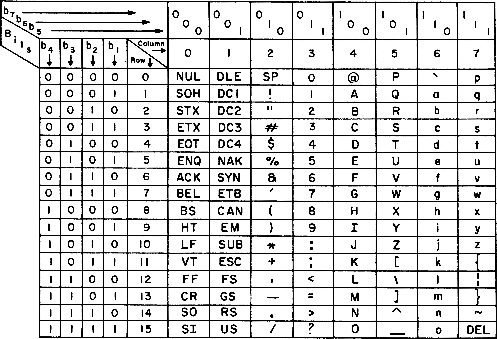

# 16. Set

*Last Update: 23-11-28*

A ***set*** is an unordered collection of distinct values.

The easiest way to implement the `Set` class is to build it out of the `Map` class. 

```cpp
private:
   Map<ValueType, bool> map;         
```

## 16.1 Expanding the set interface

Today we will consider the high-level operations of *union,* *intersection*, *difference,* *subset* and *equality*. 

Here is the prototypes for **high-level operations**:

```cpp
/*
 * Method: isSubsetOf
 * Usage: if (set.isSubsetOf(set2)) . . .
 * --------------------------------------
 * Implements the subset relation for sets.  This method returns true
 * if every element of this set is contained in set2.
 */

   bool isSubsetOf(const Set & set2) const;

/*
 * Operator: ==
 * Usage: set1 == set2
 * -------------------
 * Returns true if set1 and set2 contain the same elements.
 */

   bool operator==(const Set & set2) const;

/*
 * Operator: !=
 * Usage: set1 != set2
 * -------------------
 * Returns true if set1 and set2 are different.
 */

   bool operator!=(const Set & set2) const;

/*
 * Operator: +
 * Usage: set1 + set2
 *        set1 + element
 * ---------------------
 * Returns the union of sets set1 and set2, which is the set of elements
 * that appear in at least one of the two sets.  The right hand set can be
 * replaced by an element of the value type, in which case the operator
 * returns a new set formed by adding that element.
 */

   Set operator+(const Set & set2) const;
   Set operator+(const ValueType & value) const;

/*
 * Operator: +=
 * Usage: set1 += set2;
 *        set1 += value;
 * ---------------------
 * Adds all elements from set2 (or the single specified value) to set1.
 */

   Set & operator+=(const Set & set2);
   Set & operator+=(const ValueType & value);

/*
 * Operator: *
 * Usage: set1 * set2
 * ------------------
 * Returns the intersection of sets set1 and set2, which is the set of all
 * elements that appear in both.
 */

   Set operator*(const Set & set2) const;

/*
 * Operator: *=
 * Usage: set1 *= set2;
 * --------------------
 * Removes any elements from set1 that are not present in set2.
 */

   Set & operator*=(const Set & set2);

/*
 * Operator: -
 * Usage: set1 - set2
 *        set1 - element
 * ---------------------
 * Returns the difference of sets set1 and set2, which is all of the
 * elements that appear in set1 but not set2.  The right hand set can be
 * replaced by an element of the value type, in which case the operator
 * returns a new set formed by removing that element.
 */

   Set operator-(const Set & set2) const;
   Set operator-(const ValueType & value) const;

/*
 * Operator: -=
 * Usage: set1 -= set2;
 *        set1 -= value;
 * ---------------------
 * Removes all elements from set2 (or a single value) from set1.
 */

   Set & operator-=(const Set & set2);
   Set & operator-=(const ValueType & value);
```

Here is the implementation section:

```cpp
template <typename ValueType>
Set<ValueType>::Set() {
   /* Empty */
}

template <typename ValueType>
Set<ValueType>::~Set() {
   /* Empty */
}

template <typename ValueType>
int Set<ValueType>::size() const {
   return map.size();
}

template <typename ValueType>
bool Set<ValueType>::isEmpty() const {
   return map.isEmpty();
}

template <typename ValueType>
void Set<ValueType>::add(const ValueType & value) {
   map.put(value, true);
}

template <typename ValueType>
void Set<ValueType>::remove(const ValueType & value) {
   map.remove(value);
}

template <typename ValueType>
bool Set<ValueType>::contains(const ValueType & value) const {
   return map.containsKey(value);
}

template <typename ValueType>
void Set<ValueType>::clear() {
   map.clear();
}

/*
 * Method: first
 * Usage: ValueType value = set.first();
 * ------------------------------
 * Returns the first element of the.
 */
template <typename ValueType>
ValueType Set<ValueType>::first() {
/* Iterator needed */
}

/*
 * Implementation notes: isSubsetOf
 * --------------------------------
 * The implementation of the high-level functions does not require knowledge
 * of the underlying representation
 */

template <typename ValueType>
bool Set<ValueType>::isSubsetOf(const Set & set2) const {
   for (ValueType value : map) {
      if (!set2.contains(value)) return false;
   }
   return true;
}

/*
 * Implementation notes: ==
 * ------------------------
 * Two sets are equal if they are subsets of each other.
 */

template <typename ValueType>
bool Set<ValueType>::operator==(const Set & set2) const {
   return isSubsetOf(set2) && set2.isSubsetOf(*this);
}

/*
 * Operator: +
 * Usage: set1 + set2
 *        set1 + value
 * ---------------------
 * Returns the union of sets set1 and set2, which is the set of elements
 * that appear in at least one of the two sets.  The right hand set can be
 * replaced by an element of the value type, in which case the operator
 * returns a new set formed by adding that element.
 */

template <typename ValueType>
Set<ValueType> Set<ValueType>::operator+(const Set & set2) const {
   Set<ValueType> set = *this;
      for (ValueType value : set2.map) {
         set.add(value);
   }
   return set;
}

template <typename ValueType>
Set<ValueType> Set<ValueType>::operator+(const ValueType & value) const {
   Set<ValueType> set = *this;
   set.add(value);
   return set;
}
```

## 16.2 Implementation strategies for sets

Modern library systems adopt either of two strategies for implementing sets:

+ **Hash tables:** Sets implemented as hash tables are **extremely efficient**, offering average $O(1)$ performance for adding or testing. The primary disadvantage is that IT do not support **ordered iteration**.

  **Application:** STL `set` class

+ **Balanced binary trees:** Sets implemented using balanced binary trees offer $O(logN)$ performance on the fundamental operations, but do make it possible to write an ordered iterator. 

  The underlying value type must **support the comparison operators** `==` and `<`, while the restriction could be relaxed by specifying a comparison function as an argument to the `Set` constructor.

  **Application:** STL `unordered_set` class

**Sets and Efficiency**

Clients using Sets for particular types often have much more efficient data structures than binary trees:

+ If the element type was `string` and then use a `Lexicon` (*DAWG*) instead of a binary search tree, and the resulting implementation would be far more efficient. 
+ Another type of common sets is `Set<char>`, which comes up if you want to specify a set of delimiter characters for a scanner. 

**Character Sets**

For ***character sets***, you can represent the inclusion or exclusion of a character using a single bit. If the bit is a 1, then that element is in the set; if it is a 0, it is not in the set.

A ***characteristic vector*** is created, to indicate the character value (ASCII codes) with an array of bits. This representation is efficient, as the bits for a characteristic vector are **packed into** a small number of *words* inside the machine and then operate in large chunks.



For a given set {0, 1, 2, 3, 4, 5, 6, 7, 8, 9}, it can be indicated a characteristic vector of 10 bits:


The advantage is that operations `add`, `remove`, and `contains` could be implemented **in constant time**. For example,

+ Add the element $k$ to a set: Set the element at index position $k$ in the characteristic vector to true. 
+ Testing membership: Select the appropriate element in the array.

This picture shows a characteristic vector representation for the set containing **the uppercase and lowercase letters**:


## 16.3 Bitwise Operator

### 16.3.1 Bitwise Operator Strategies


For client working with sets of characters, you can implement the set operators extremely efficiently by storing the set as an array of bits and then manipulating the bits all at once using C++’s ***bitwise operators***.

| Operation | Description                                                  |
| --------- | ------------------------------------------------------------ |
| `x & y`   | Bitwise AND. The result has a 1 bit wherever both `x` and `y` have 1s. |
| `x | y`   | Bitwise OR. The result has a 1 bit wherever either `x` or `y` have 1s. |
| `x ^ y`   | Exclusive OR. The result has a 1 bit wherever `x` and `y` differ. |
| `~x`      | Bitwise NOT. The result has a 1 bit wherever `x` has a 0.    |
| `x << n`  | Left shift. Shift the bits in `x` left `n` positions, shifting in 0s. |
| `x >> n`  | Right shift. Shift `x` right `n` bits (logical shift if `x` is unsigned). |

**The Bitwise AND Operator `&`**

The bitwise AND operator `&` takes two integer operands, `x` and `y`, and computes a result that has a 1 bit in every position in which both `x` and `y` have 1 bits. 

The primary application of the `&` operator is **masking**, which is to **select** certain bits in an integer, clearing the unwanted bits to 0. 

**The Bitwise OR Operator `|`**

The bitwise OR operator `|` takes two integer operands, x and y, and computes a result that has a 1 bit in every position in which either x or y have 1 bits. 

The primary use of the `|` operator is to **assemble** a single integer value from other values, each of which contains a subset of the desired bits.

**The Exclusive OR Operator `^`**

The exclusive OR or XOR operator (^) takes two integer operands, x and y, and computes a result that has a 1 bit in every position in which x and y have different bit values, as shown on the right.

The primary use of the `^` operator is to **flip**.

**The Bitwise NOT Operator**

The bitwise NOT operator `~` takes a single operand x and returns a value that has a 1 wherever x has a 0, and vice versa.

You can use the bitwise NOT operator to create a **mask** in which you mark the bits you want to eliminate as opposed to the ones you want to preserve.

The `~` operator creates the **complement** of a set. To compute the set difference operation, apply `A&(~B)`.

**The Shift Operators**

C++ defines two operators that have the effect of shifting the bits in a word by a given number of bit positions:

+ The expression `x << n` shifts the bits in the integer x leftward n positions. Spaces appearing on the right are filled with 0s.

+ The expression `x >> n` shifts the bits in the integer x rightward *n* positions:

  + If x is an **unsigned** type, the `>>` operator performs a **logical shift** in which missing digits are always filled with 0s.

  + If x is a **signed** type, the `>>` operator performs what computer scientists call an **arithmetic shift** in which the leading bit in the value of x never changes. Thus, the `>>` operator fills in 1s if the first bit is 1; , those spaces are filled with 0s if it is a 0.

    Arithmetic shifts are efficient ways to perform **multiplication or division of signed integers** by powers of two.

**Two’s Complement**

The sum of a $N$-bit number and its two's complement is $2^N$. Another way of finding the two's complement is **inverting the digits and adding one**.

| 0    | 000  |
| ---- | ---- |
| 1    | 001  |
| 2    | 010  |
| 3    | 011  |
| −4   | 100  |
| −3   | 101  |
| −2   | 110  |
| −1   | 111  |

Here are two examples of bitwise operation:

```cpp
int a = 5;
int b = 10;
cout << (a&&b) << ' ' << (a&b) << endl;
// 1 0
```

and

```cpp
cout << hex << -1 << ' '
<< (-1 << 1) << ' '
<< (-1 >> 1) << ' '
<< unsigned(-1) << ' '
<< (unsigned(-1) << 1) << ' '
<< (unsigned(-1) >> 1) << endl;

// ffffffff fffffffe ffffffff ffffffff fffffffe 7fffffff
// decimal: -1 -2 -1 4294967295 4294967294 2147483647
```
### 16.3.1 Bitwise Operator Example

Computers typically represent each pixel in an image as an `int` in which the 32 bits are interpreted as follows:


Write the code to isolate the red component of a color stored in the integer variable `pixel`:

```cpp
int red = (pixel >> 16) & 0xFF;
```
Here is the entire refernece:

```cpp
const int BITS_PER_BYTE = 8;
const int BITS_PER_LONG = BITS_PER_BYTE * sizeof(long);
const int CVEC_WORDS = (RANGE_SIZE + BITS_PER_LONG - 1) / BITS_PER_LONG;
struct CharacteristicVector {
   unsigned long words[CVEC_WORDS];
};
unsigned long createMask(int k) {
   return unsigned long(1) << k % BITS_PER_LONG;
}
bool testBit(CharacteristicVector & cv, int k) {
    if (k < 0 || k >= RANGE_SIZE) {
       error("testBit: Bit index is out of range");
    }
    return cv.words[k / BITS_PER_LONG] & createMask(k);
}
void setBit(CharacteristicVector & cv, int k) {
   if (k < 0 || k >= RANGE_SIZE) {
      error("setBit: Bit index is out of range");
   }
   cv.words[k / BITS_PER_LONG] |= createMask(k);
}
void clearBit(CharacteristicVector & cv, int k) {
   if (k < 0 || k >= RANGE_SIZE) {
      error("setBit: Bit index is out of range");
   }
   cv.words[k / BITS_PER_LONG] &= ~createMask(k);
}

```

---

