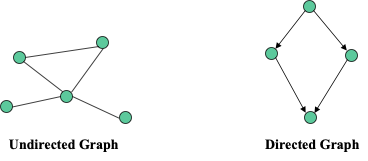
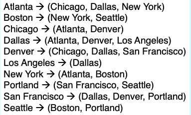
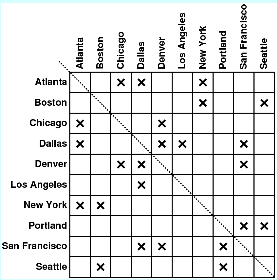
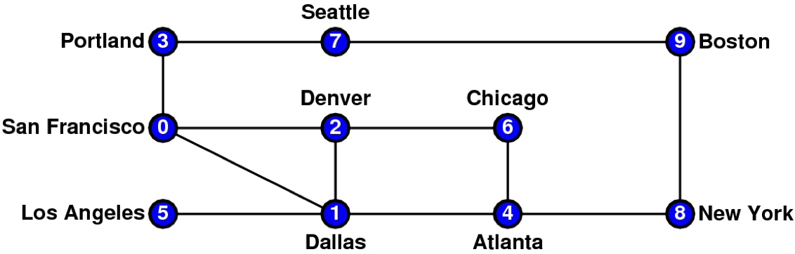
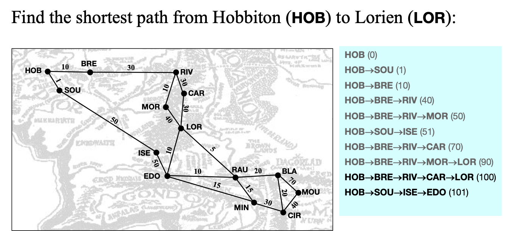
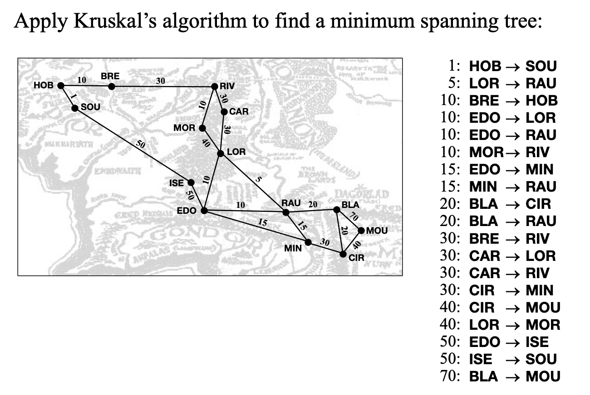
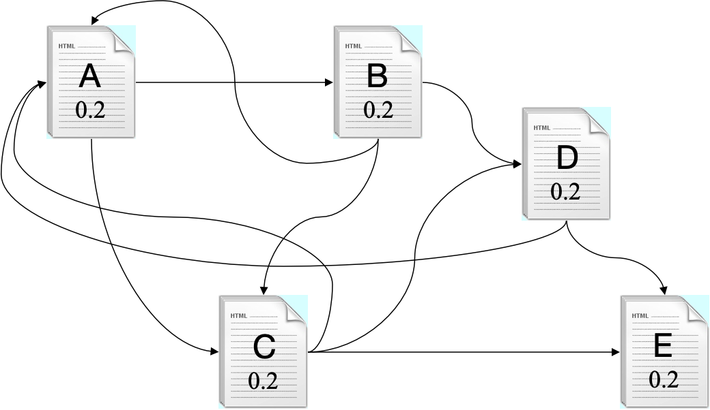
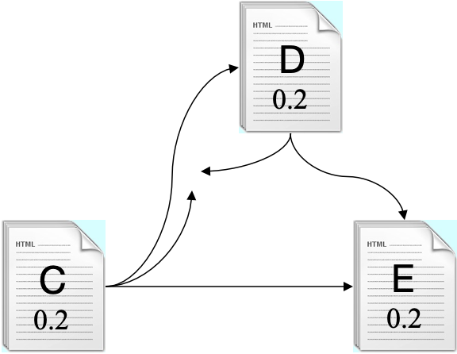
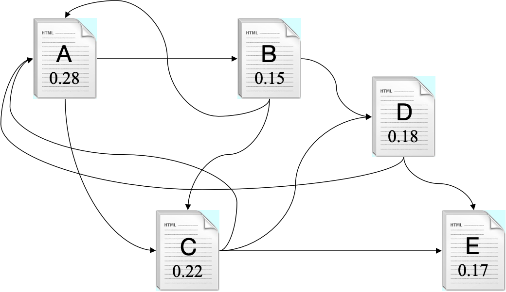

# 17. Graph

*Last Update: 23-11-29*

A ***graph*** consists of a set of **nodes** together with a set of **arcs**. 

The nodes correspond to the dots or circles in a graph diagram and the arcs correspond to the links that connect two nodes:

+ **Directed graphs:** In these graphs, arcs are shown **with an arrow** that indicates the direction in which two nodes are linked. 
+ **Undirected graphs:** Arcs are simple connections indicating that one can **move** in either direction between the two nodes. 



## 17.1 Graph Representations

**Graph Terminology**

The nodes to which a particular node is connected are called its ***neighbors***:

+ In an undirected graph, the number of connections from a node is called its ***degree***. 
+ In a directed graph, the number of arcs leading outward is called the ***out-degree***, and the number of arcs leading inward is called the ***in-degree***.

A series of arcs that connect two nodes is called a ***path***. A path that returns to its starting point is called a ***cycle***. A **simple path/cycle** is a path/cycle without duplicated nodes. 

A graph in which there is a path between every pair of nodes is said to be **strongly connected**. A directed graph is only **weakly connected** if its undirected counterpart is connected.

**Graph Representations**

The primary feature that differentiates implementations is the strategy used to represent **connections between nodes**. In practice, the most common strategies are:

+ Storing the connections for each node in an ***adjacency list***.

  

  Although simple and convenient, this representation can be i**nefficient when searching through the list of arcs associated with a node**. This cost, $O(D)$, where $D$ represents the degree of the originating node, becomes more significant in a **dense** graph where $D\rightarrow N$.

+ Storing the connections for the entire graph in an **adjacency matrix**.

  

  Similar to the idea of lookup table, this representation reduces the cost of checking for connections to $O(1)$. But the $O(N^2)$ storage space is inefficient for a **sparse** graph where $D << N$.

+ Storing the connections for each node as a ***set of arcs***. 

  Start with a pair of sets:

  ```cpp
  struct StringBasedGraph {
     Set<string> nodes; /* Atlanta, … */
     Set<string> arcs; /* Atlanta_Chicago, … */
  };
  ```

  This representation is conceptually simple and mirrors. Finding neighbors for any node requires **going through every arc**, which needs a collection class that supports iteration.

  Associating additional data with nodes and arcs requires using structures/classes to represent the nodes and arcs. For example, many graph algorithms assign a numeric value to each of the arcs that indicates the cost of traversing that arc.

## 17.2 Graph Abstraction Strategies

There are three strategies for graph abstraction:

+ Use low-level structures;
+ Adopt a hybrid strategy;
+ Define classes for each of the component types. 

### 17.2.1 Use low-level structures

This design uses the structure types `Node` and `Arc` to represent the components of a graph, which gives clients complete freedom to extend these structures but offers no support for graph operations.

Here is a low-level `graphtypes.h` interface:

```cpp
/*
 * File: graphtypes.h
 * ------------------
 * This file defines low-level data structures that represent graphs.
 */

#ifndef _graphtypes_h
#define _graphtypes_h

#include <string>
#include "map.h"
#include "set.h"

struct Node;     /* Forward references to these two types so  */
struct Arc;      /* that the C++ compiler can recognize them. */

/*
 * Type: SimpleGraph
 * -----------------
 * This type represents a graph and consists of a set of nodes, a set of
 * arcs, and a map that creates an association between names and nodes.
 */

struct SimpleGraph {
   Set<Node *> nodes;
   Set<Arc *> arcs;
   Map<std::string,Node *> nodeMap;
};

/*
 * Type: Node
 * ----------
 * This type represents an individual node and consists of the
 * name of the node and the set of arcs from this node.
 */

struct Node {
   std::string name;
   Set<Arc *> arcs;
};

/*
 * Type: Arc
 * ---------
 * This type represents an individual arc and consists of pointers
 * to the endpoints, along with the cost of traversing the arc.
 */

struct Arc {
   Node *start;
   Node *finish;
   double cost;
};

#endif
```

**Graph Traversals**

The process of visiting each node in a graph by moving along its arcs is called **traversing** the graph. At each node, a function `visit` can be called to perform some operations, like simply printing the name of the node being visited.

```cpp
void visit(Node *node) {
   cout << node->name << endl;
}
```

The goal of a traversal is to call `visit` only once on every node in an order determined by the connections, which requires some structure to keep track of nodes that have already been visited. Common strategies are to include a `visited` flag in each node or to pass a set of visited nodes:

```cpp
void depthFirstSearch(Node *node) {
   Set<Node *> visited;
   visitUsingDFS(node, visited);
}

void visitUsingDFS(Node *node, Set<Node *> & visited) {
   if (visited.contains(node)) return;
   visit(node);
   visited.add(node);
   for (Arc *arc : node->arcs) {
      visitUsingDFS(arc->finish, visited);
   }
}
```

+ **Depth-First Search (DFS): Stack-implemented (recursion)**

  DFS processes the graph **following each branch**, assuming that the neighboring nodes are stored in alphabetical order, visiting nodes as it goes, until every node is visited.

  If the current node has no unvisited nodes, it will **backtrack to the nearest node** that still has unexplored adjacent nodes.

  

+ **Breadth-First Search (BFS): Queue-implemented**

   BFS proceeds outward from the starting node, visiting the start node, **then all nodes one hop away**, and so on.

  

## 17.2.2 Adopt a hybrid strategy

For graphs, the elements are **nodes** and **arcs**. Both nodes and arcs have some properties closely tied to the graph:

+ Each **node** must keep track of the **arcs that lead to its neighbors**, and each **arc** needs to know **what nodes it connects**.

+ At the same time, they are likely to contain other information that depends on the application, such as **the name of a node** or the **cost of traversing an arc**.

The basic idea behind this design is to export a parameterized `Graph` class that lets the client choose types for nodes and arcs.

The type the client chooses to represent a **node** must contain:

+ A *string* field that specifies the `name` of the node.
+ An `arcs` field that specifies the set of arcs that begin at this node.

The type chosen to represent an **arc** must contain:

+ Fields called `start` and `finish` that indicate the endpoints of the arc (also need a `cost` for some algorithms).

```cpp
/*
 * File: graph.h
 * -------------
 * This interface exports a parameterized Graph class used to represent
 * graphs, which consist of a set of nodes and a set of arcs.
 */

#ifndef _graph_h
#define _graph_h

#include <string>
#include "error.h"
#include "map.h"
#include "set.h"

/*
 * Functions: nodeCompare, arcCompare
 * ----------------------------------
 * Standard comparison functions for nodes and arcs.
 */

template <typename NodeType>
int nodeCompare(NodeType *n1, NodeType *n2);

template <typename NodeType,typename ArcType>
int arcCompare(ArcType *a1, ArcType *a2);

/*
 * Class: Graph<NodeType,ArcType>
 * ------------------------------
 * This class represents a graph with the specified node and arc types. 
 * The NodeType and ArcType parameters indicate the structure type or class
 * used for nodes and arcs, respectively.  These types can contain any
 * fields or methods required by the client, but must contain the following
 * public fields required by the Graph package itself:
 *
 * The NodeType definition must include:
 *   - A string field called name
 *   - A Set<ArcType *> field called arcs
 *
 * The ArcType definition must include:
 *   - A NodeType * field called start
 *   - A NodeType * field called finish
 */

template <typename NodeType,typename ArcType>
class Graph {

public:
/*
 * Constructor: Graph
 * Usage: Graph<NodeType,ArcType> g;
 * ---------------------------------
 * Creates an empty Graph object.
 */

   Graph();

/*
 * Destructor: ~Graph
 * Usage: (usually implicit)
 * -------------------------
 * Frees the internal storage allocated to represent the graph.
 */

   ~Graph();

/*
 * Method: size
 * Usage: int size = g.size();
 * ---------------------------
 * Returns the number of nodes in the graph.
 */

   int size();

/*
 * Method: isEmpty
 * Usage: if (g.isEmpty()) ...
 * -----------------------------
 * Returns true if the graph is empty.
 */

   bool isEmpty();

/*
 * Method: clear
 * Usage: g.clear();
 * -----------------
 * Reinitializes the graph to be empty, freeing any heap storage.
 */

   void clear();
  
/*
 * Method: addNode
 * Usage: NodeType *node = g.addNode(name);
 *        NodeType *node = g.addNode(node);
 * ----------------------------------------
 * Adds a node to the graph.  The first version of this method creates a
 * new node of the appropriate type and initializes its fields; the second
 * assumes that the client has already created the node and simply adds it
 * to the graph.  Both versions of this method return a pointer to the node.
 */

   NodeType *addNode(std::string name);
   NodeType *addNode(NodeType *node);

/*
 * Method: getNode
 * Usage: NodeType *node = g.getNode(name);
 * ----------------------------------------
 * Looks up a node in the name table attached to the graph and returns a
 * pointer to that node.  If no node with the specified name exists,
 * getNode signals an error.
 */

   NodeType *getNode(std::string name);

/*
 * Method: addArc
 * Usage: g.addArc(s1, s2);
 *        g.addArc(n1, n2);
 *        g.addArc(arc);
 * ---------------------
 * Adds an arc to the graph.  The endpoints of the arc can be specified
 * either as strings indicating the names of the nodes or as pointers to
 * the node structures.  Alternatively, the client can create the arc
 * structure explicitly and pass that pointer to the addArc method.  All
 * three of these versions return a pointer to the arc in case the client
 * needs to capture this value.
 */

   ArcType *addArc(std::string s1, std::string s2);
   ArcType *addArc(NodeType *n1, NodeType *n2);
   ArcType *addArc(ArcType *arc);

/*
 * And all the remove methods…
 */
   void removeNode(std::string name);
   void removeNode(NodeType *node);

   void removeArc(std::string s1, std::string s2);
   void removeArc(NodeType *n1, NodeType *n2);
   void removeArc(ArcType *arc);

/*
 * Method: isConnected
 * Usage: if (g.isConnected(n1, n2)) . . .
 *        if (g.isConnected(s1, s2)) . . .
 * ---------------------------------------
 * Returns true if the graph contains an arc from n1 to n2.  As in the
 * addArc method, nodes can be specified either as node pointers or by
 * name.
 */

   bool isConnected(NodeType *n1, NodeType *n2);
   bool isConnected(std::string s1, std::string s2);

/*
 * Method: getNeighbors
 * Usage: foreach (NodeType *node in g.getNeighbors(node)) . . .
 *        foreach (NodeType *node in g.getNeighbors(name)) . . .
 * -------------------------------------------------------------
 * Returns the set of nodes that are neighbors of the specified node, which
 * can be indicated either as a pointer or by name.
 */

   Set<NodeType *> getNeighbors(NodeType *node);
   Set<NodeType *> getNeighbors(std::string node);

/*
 * Method: getNodeSet
 * Usage: foreach (NodeType *node in g.getNodeSet()) . . .
 * -------------------------------------------------------
 * Returns the set of all nodes in the graph.
 */

   Set<NodeType *> & getNodeSet();

/*
 * Method: getArcSet
 * Usage: foreach (ArcType *arc in g.getArcSet()) . . .
 *        foreach (ArcType *arc in g.getArcSet(node)) . . .
 *        foreach (ArcType *arc in g.getArcSet(name)) . . .
 * --------------------------------------------------------
 * Returns the set of all arcs in the graph or, in the second and third
 * forms, the arcs that start at the specified node, which can be indicated
 * either as a pointer or by name.
 */

   Set<ArcType *> & getArcSet();
   Set<ArcType *> & getArcSet(NodeType *node);
   Set<ArcType *> & getArcSet(std::string name);

template <typename NodeType,typename ArcType>
class Graph {

/* Private section */

private:

/*
 * Implementation notes: Data structure
 * ------------------------------------
 * The Graph class is defined -- as it traditionally is in
 * mathematics -- as a set of nodes and a set of arcs.  These
 * structures, in turn, are implemented using the Set class.
 * The element type for each set is a pointer to a structure
 * chosen by the client, which is specified as one of the
 * parameters to the class template.
 */

/* Instance variables */

   Set<NodeType *> nodes;                /* The set of nodes in the graph */
   Set<ArcType *> arcs;                  /* The set of arcs in the graph  */
   Map<std::string,NodeType *> nodeMap; /* A map from names to nodes     */

/* Private methods */

   void deepCopy(const Graph & src);
   NodeType *getExistingNode(std::string name) const;

/* Implementation notes: Graph class
 * ---------------------------------
 * As is typical for layered abstractions built on top of other classes,
 * the implementations of the methods in the graph class tend to be very
 * short, because they can hand all the hard work off to the underlying 
 * class.
 *
 * Implementation notes: addNode
 * -----------------------------
 * The addNode method adds the node to the set of nodes for the graph and
 * to the map from names to nodes.
 */
template <typename NodeType,typename ArcType>
NodeType *Graph<NodeType,ArcType>::addNode(std::string name) {
   if (nodeMap.containsKey(name)) {
      error("addNode: Node " + name + " already exists");
   }
   NodeType *node = new NodeType();
   node->name = name;
   return addNode(node);
}
template <typename NodeType,typename ArcType>
NodeType *Graph<NodeType,ArcType>::addNode(NodeType *node) {
   nodes.add(node);
   nodeMap[node->name] = node;
   return node;
}
  
/*
 * Implementation notes: addArc
 * ----------------------------
 * The addArc method appears in three forms, as described in the interface.
 */

template <typename NodeType,typename ArcType>
ArcType *Graph<NodeType,ArcType>::addArc(std::string s1, std::string s2) {
   return addArc(getExistingNode(s1), getExistingNode(s2));
}

template <typename NodeType,typename ArcType>
ArcType *Graph<NodeType,ArcType>::addArc(NodeType *n1, NodeType *n2) {
   ArcType *arc = new ArcType();
   arc->start = n1;
   arc->finish = n2;
   return addArc(arc);
}

template <typename NodeType,typename ArcType>
ArcType *Graph<NodeType,ArcType>::addArc(ArcType *arc) {
   arc->start->arcs.add(arc);
   arcs.add(arc);
   return arc;
}
```

Compared with `SimpleGraph.h` where the clients should implement both graph algorithms and user applications, `Graph.h` offers all about the graph algorithms.

```cpp
/* graphtypes.h - header for
 * SimpleGraph structure
 */
struct Node {
   string name;
   Set<Arc *> arcs;
};
struct Arc {
   Node *start;
   Node *finish;
   double cost;
};
struct SimpleGraph {
   Set<Node *> nodes;
   Set<Arc *> arcs;
   Map<string,Node *> nodeMap;
};
```

### 17.2.3 Define classes for each component

This design uses the `Node` and `Arc` classes to define the structure. In this model, clients define **subclasses of the supplied types** to particularize the graph data structure to their own application. *Inheritance* is applied.

```cpp
class Node;
class Arc;

class Node {
   string name;
   Set<Arc *> arcs;
};

class Arc {
   Node *start;
   Node *finish;
};

class Graph {
   Set<Node *> nodes; 
   Set<Arc *> arcs; 
   Map<std::string,Node *> nodeMap;
};

class City : public Node {
   additional members and operations you want for your graph node
};

class Flight : public Arc {
   additional members and operations you want for your graph arc
};
```

## 17.3 Finding Shortest Paths

**Dijkstra’s Algorithm**

In general, the number of paths between two nodes in a graph grows in an exponential fashion, which means that the running time of the explore-all-paths approach is $O(2^N)$.

One of the most useful algorithms for computing *the shortest paths* in a graph was developed by Edsger W. Dijkstra in 1959.

The strategy is similar to the BFS with the following additions:

+ The *priority queues* used to hold the paths delivers items in increasing order of **total cost** rather than in the traditional FIFO order. 

+ The algorithm keeps track of all nodes to which the total distance has already been fixed. Distances are **fixed** whenever you **dequeue a path from the priority queue**.



**Kruskal’s Algorithm**

Certainly, let's go over the Kruskal's algorithm in English. This algorithm is used to find the minimum spanning tree in a weighted graph, where a minimum spanning tree is a tree structure that connects all vertices in the graph and has the minimum possible total edge weight. Here are the steps of Kruskal's algorithm:

+ **Initialization:** Start with **an empty graph that includes all nodes but no arcs**, and consider each arc in the graph as an individual tree (is its own separate set).
+ **Edge Sorting:** Sort all the edges in the original graph in ascending order based on their weights.

- **Selecting Arcs to Build the Minimum Spanning Tree**: Sequentially consider each arc in the sorted order to determine if it should be added to the minimum spanning tree.

  - If an edge connects two vertices that belong to different sets,  safely add this edge because it will not create a cycle in the same tree.

  + Every time you add an edge, merge the sets of the two connected nodes into one, so all nodes in these two sets are now directly or indirectly connected.

+ **Avoiding Cycles**: If the two endpoints of an arc are already in the same set, it means they are already directly or indirectly connected in the tree structure. Adding this arc would create a cycle, so you should not choose this edge.

+ **Repeating the Process**: Continue this process until all nodes are connected in a single set without any further possibility of adding an arc without creating a cycle. At this point, you have obtained the *minimum spanning tree*.



**Google’s Page Rank Algorithm**

The ***page rank algorithm*** gives each page *a rating of its importance*, which is a recursively defined measure whereby a page becomes important if other important pages link to it.

+ Start with a set of pages.
+ Crawl the web to determine the link structure.



+ Assign each page an initial rank of $1/N$.

+ Successively update the rank of each page by **adding up the weight of every page that links to it divided by the number of links emanating from the referring page**.

  The new page rank for $E$ is $PR(E) = \frac{PR(C)}{3} + \frac{PR(D)}{2} = \frac{0.2}{3} + \frac{0.2}{2} = 0.17$.



+ If a page (such as $E$ in the current example) has no outward links, redistribute its rank equally among the other pages in the graph, as users will keep searching if they reach a dead end.

  In this graph, 1/4 of $E$’s page rank is distributed to pages $A$, $B$, $C$ and $D$ respectively.

  

+ Repeat this process until the page ranks stabilize.

  

+ In practice, the Page Rank algorithm adds a ***damping factor*** at each stage to model the fact that users stop searching. 

  $PR(A) = \frac{1-d}{N} + d \left( \frac{PR(B)}{L(B)} + \frac{PR(C)}{L(C)} + \frac{PR(D)}{L(D)} + \frac{PR(E)}{N} \right)$

Google’s random surfer is an example of a Markov process, in which a system moves from state to state, based on probability information that shows the likelihood of moving from each state to every other possible state. 

---

