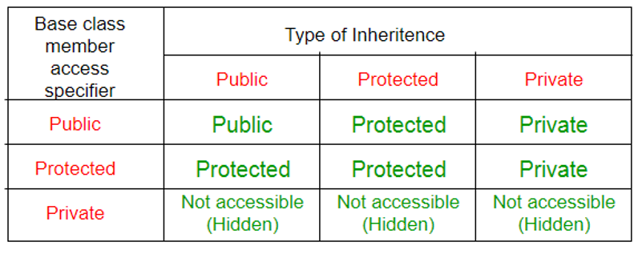
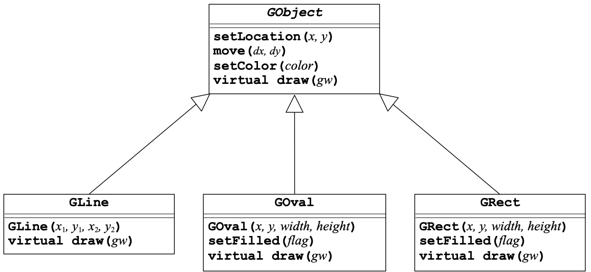
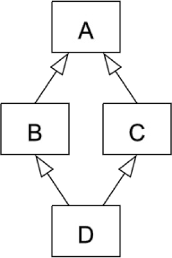
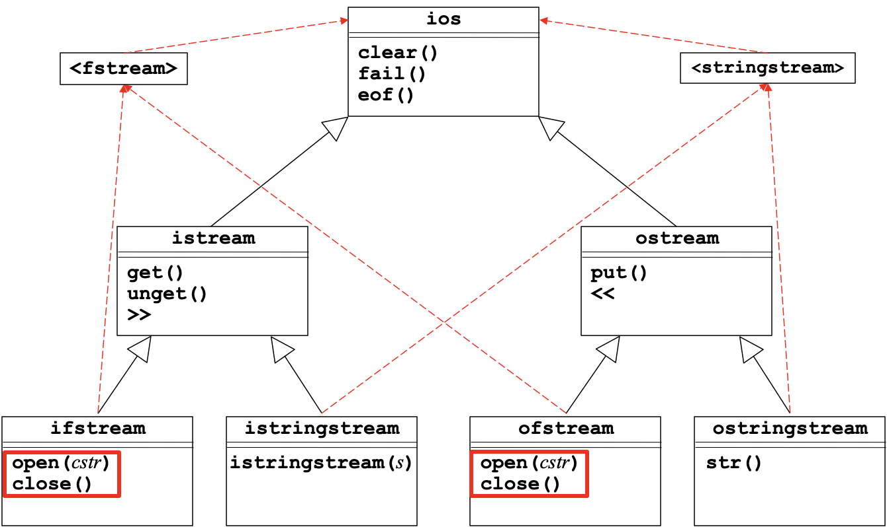
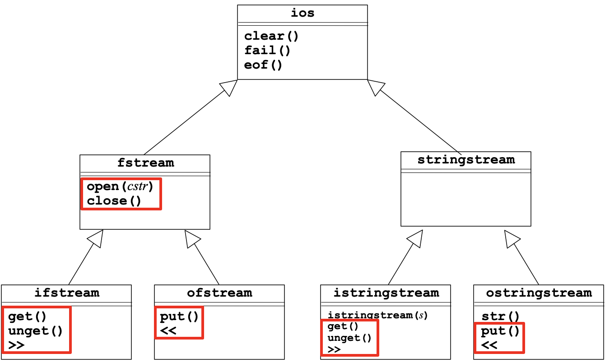
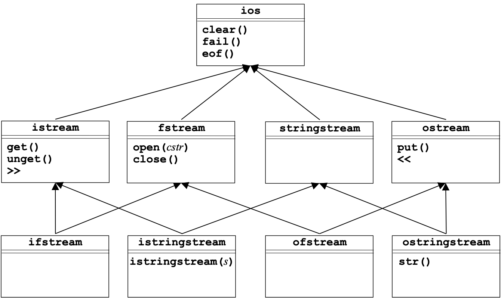

# 18. Inheritance

## 18.1 Simple Inheritance

### 18.1.1 Inheritance Strategies

**Class Hierarchies**

Much of the power of modern object-oriented languages comes from the fact that they support **class hierarchies** between the ***subclass*** and the ***superclass***:

+ Each subclass represents a **specialization** of its superclass. An instance of a class is also that of all other classes in the hierarchy above it in the superclass chain. 

+ superclass : subclass $\neq$ superset : subset (rectangle : square)

+ Although C++ supports ***multiple inheritance*** (a class can inherit behavior from more than one superclass), the vast majority of class hierarchies use ***single inheritance***, which means that class hierarchies tend to form **trees** rather than **graphs**.

**Representing Inheritance in C++**

The first step in creating a C++ subclass is to indicate the superclass on the header line:

```cpp
class subclass : public superclass {
   body of class definition
};
```

You can use this feature to specify the types for a template collection class, as in the following definition of `StringMap`:

```cpp
class StringMap : public Map<string,string> {
   /* Empty */
};
```

Subclasses have access to the `public` and `protected` (but not `private`) members/methods in the superclass:



**Overloading vs. Overriding**

In C++, *polymorphism* is represented in two types:

+ **Static/Compile-time polymorphism: ** *Overloading* is about multiple functions/operators/methods of the same name but different signatures and possibly different implementations.
+ **Dynamic /Run-time polymorphism: ** *Overriding* is about multiple methods of the same signature but different implementations defined in different classes connected through inheritance.

In Python, defining a subclass method automatically overrides the definition of that method in its superclass (no explicit marking is needed). 

If you leave out the **virtual** keyword, the compiler for C++ determines which version of a method to call based on **how the object is declared** and **not on how the object is constructed**. 

If a pointer is declared as the superclass but pointed to the subclass, and a method is called using this pointer, the superclass method will be called if it’s non-`virtual`, but the overridden method in the subclass will be called if it’s marked as `virtual` in the superclass.

**Virtual methods and Abstract classes**

In the superclass hierarchy, the method *overridden* differently in each subclass is a ***virtual method***. Once a method is declared as a virtual method, it becomes virtual in every subclass (thus no keyword `virtual` needed).

Any method that is always implemented by a concrete subclass is indicated by including `= 0` before the `;` on the prototype line, to mark the definition of a ***pure virtual method***.

```cpp
class Employee {
   virtual double getPay() = 0;
};
```

Because of the *pure virtual method*, an ***abstract class*** could never be instantiated, but instead serves as a common superclass for other ***concrete classes*** corresponding to actual objects. If its subclasses also fail to implement those virtual methods, they will become *concrete classes* as well.

If we declare a pointer of an abstract class, it will later be used to **point to an object of a concrete subclass** inheriting from the abstract superclass, and thus is a representation of *polymorphism* (instead of the *hiding* behaviour corresponding to a non-`virtual` one.

**Slicing problem**

In Python, it is always legal to assign an object of a subclass to a variable declared to be its superclass. When similar operations happen in C++, it throws away any *fields* in the assigned object that don’t fit into the superclass by default, which is called ***slicing***. 

To avoid slicing, one approach is to define *private* versions of the **copy constructor** and **assignment operator** so that copying objects in that inheritance hierarchy is prohibited (just like the stream class hierarchy in C++).

However, it is always legal to assign *pointers* to objects, as all pointers are of the same size. Then we use pointers rather than objects themselves.

```cpp
// ERR!
Vector<Employee> payroll;
payroll.add(bobCratchit);
```

Instead,

```cpp
Vector<Employee *> payroll;
payroll.add(&bobCratchit);
for (Employee *ep : payroll) {
   cout << ep->getName() << ": " << ep->getPay() << endl;
}
```

**Practical Implementation**

The designers of the C++ libraries made different choices in different situations.

+ **The collection classes** are implemented as **independent** classes that do not form an inheritance hierarchy. 
+ **The stream classes**, by contrast, **form a sophisticated hierarchy** but do not allow assignment and copying. In each case, the designers chose to keep the details of memory management hidden from the client.

Here is an example:

```cpp
class A {
public:
    int a = 1;
    void display() { cout << 'A' << a << endl; }
};

class B: public A {
public:
    int b = 2;
    void display() {
        cout << 'B' << a << b << endl;
    }
};
class C: public B {
public:
    int c = 3;
    virtual void display() {
        cout << 'C' << a << b << c << endl;
    }
};
class D: public C {
public:
    int d = 4;
    void display() {
        cout << 'D' << a << b << c << d << endl;
    }
};

int main() {
    A oA;
    oA.display();
    B oB;
    oB.display();
    C oC;
    oC.display();
    D oD;
    oD.display();
    oA = oB;
    oA.display();
    oC = oD;
    oC.display();
    A* pA = &oB;
    pA->display();
    C* pC = &oD;
    pC->display();
}
```

and the output:

```txt
A1
B12
C123
D1234
A1
C123
A1
D1234
```

### 18.1.2 Example of the Graph Abstraction



```cpp
/*
 * File: gobjects.h
 * ----------------
 * This file defines a simple hierarchy of graphical objects.
 */

#ifndef _gobjects_h
#define _gobjects_h

#include <string>
#include "gwindow.h"

/*
 * Class: GObject
 * --------------
 * This class is the root of the hierarchy and encompasses all objects
 * that can be displayed in a window.  Clients will use pointers to
 * a GObject rather than the GObject itself.
 */

class GObject {

public:
/*
 * Method: setLocation
 * Usage: gobj->setLocation(x, y);
 * -------------------------------
 * Sets the x and y coordinates of gobj to the specified values.
 */

   void setLocation(double x, double y);

/*
 * Method: move
 * Usage: gobj->move(dx, dy);
 * --------------------------
 * Adds dx and dy to the coordinates of gobj.
 */

   void move(double x, double y);

/*
 * Method: setColor
 * Usage: gobj->setColor(color);
 * -----------------------------
 * Sets the color of gobj.
 */

   void setColor(std::string color);

/*
 * Abstract method: draw
 * Usage: gobj->draw(gw);
 * ----------------------
 * Draws the graphical object on the GraphicsWindow specified by gw.
 * This method is implemented by the specific GObject subclasses.
 */

   virtual void draw(GWindow & gw) = 0;

protected:

/* The following methods and fields are available to the subclasses */

   GObject();                        /* Superclass constructor         */
   std::string color;                /* The color of the object        */
   double x, y;                      /* The coordinates of the object  */

};

/*
 * Subclass: GLine
 * ---------------
 * The GLine subclass represents a line segment on the window.
 */

class GLine : public GObject {

public:

/*
 * Constructor: GLine
 * Usage: GLine *lp = new GLine(x1, y1, x2, y2);
 * ---------------------------------------------
 * Creates a line segment that extends from (x1, y1) to (x2, y2).
 */

   GLine(double x1, double y1, double x2, double y2);

/* Prototypes for the overridden virtual methods */

   virtual void draw(GWindow & gw);

private:
   double dx;                      /* Horizontal distance from x1 to x2    */
   double dy;                      /* Vertical distance from y1 to y2      */

};

class GRect : public GObject {

public:

/*
 * Constructor: GRect
 * Usage: GRect *rp = new GRect(x, y, width, height);
 * --------------------------------------------------
 * Creates a rectangle of the specified size and upper left corner at (x, y).
 */

   GRect(double x, double y, double width, double height);

/*
 * Method: setFilled
 * Usage: rp->setFilled(flag);
 * ---------------------------
 * Indicates whether the rectangle is filled.
 */

   void setFilled(bool flag);

   virtual void draw(GWindow & gw);

private:
   double width, height;           /* Dimensions of the rectangle          */
   bool filled;                    /* True if the rectangle is filled      */

};

class GOval : public GObject {

public:

/*
 * Constructor: GOval
 * Usage: GOval *op = new GOval(x, y, width, height);
 * --------------------------------------------------
 * Creates an oval inscribed in the specified rectangle.
 */

   GOval(double x, double y, double width, double height);

/*
 * Method: setFilled
 * Usage: op->setFilled(flag);
 * ---------------------------
 * Indicates whether the oval is filled.
 */

   void setFilled(bool flag);

   virtual void draw(GWindow & gw);

private:
   double width, height;           /* Dimensions of the bounding rectangle */
   bool filled;                    /* True if the oval is filled           */

};

/*
 * Implementation notes: GObject class
 * -----------------------------------
 * The constructor for the superclass sets all graphical objects to BLACK,
 * which is the default color.
 */

GObject::GObject() {
   setColor("BLACK");
}

void GObject::setLocation(double x, double y) {
   this->x = x;
   this->y = y;
}

void GObject::move(double dx, double dy) {
   x += dx;
   y += dy;
}

void GObject::setColor(string color) {
   this->color = color;
}

/*
 * Implementation notes: GLine class
 * ---------------------------------
 * The constructor for the GLine class has to change the specification
 * of the line from the endpoints passed to the constructor to the
 * representation that uses a starting point along with dx/dy values.
 */

GLine::GLine(double x1, double y1, double x2, double y2) {
   this->x = x1;
   this->y = y1;
   this->dx = x2 - x1;
   this->dy = y2 - y1;
}

void GLine::draw(GWindow & gw) {
   gw.setColor(color);
   gw.drawLine(x, y, x + dx, y + dy);
}

GRect::GRect(double x, double y, double width, double height) {
   this->x = x;
   this->y = y;
   this->width = width;
   this->height = height;
   filled = false;
}

void GRect::setFilled(bool flag) {
   filled = flag;
}

void GRect::draw(GWindow & gw) {
   gw.setColor(color);
   if (filled) {
      gw.fillRect(x, y, width, height);
   } else {
      gw.drawRect(x, y, width, height);
   }     
}

GOval::GOval(double x, double y, double width, double height) {
   this->x = x;
   this->y = y;
   this->width = width;
   this->height = height;
   filled = false;
}

void GOval::setFilled(bool flag) {
   filled = flag;
}

void GOval::draw(GWindow & gw) {
   gw.setColor(color);
   if (filled) {
      gw.fillOval(x, y, width, height);
   } else {
      gw.drawOval(x, y, width, height);
   }     
}
```

**Calling Superclass Constructors**

When you call the constructor for an object, the constructor ordinarily calls the ***default constructor*** for the superclass, which is the one that takes no arguments.

You can call a different version of the superclass constructor by adding an initializer list to the constructor header, which is the second form of the initializer list.

```cpp
class GSquare : public GRect {
   GSquare(double x, double y, double size)
                  : GRect(x, y, size, size) {
      /* Empty */
   }
};
```

This example is only used to illustrate an initializer list, and generally square should not be a subclass of rectangle.

## 18.2 Multiple Inheritance

### 18.2.1 Strategies for Multiple Inheritance

Multiple Inheritance tends to be dangerous. 



This is "deadly diamond of death", an ambiguity that arises when two classes B and C inherit from A, and class D inherits from both B and C. If there is **a method in A** that **B and C have overridden**, and **D does not override it**, then which version of the method does D inherit: that of B, or that of C? 

```cpp
class A {
public:
    int a = 1;
    void display() { cout << a << endl; }
};

class B: public A {
public:
    int b = 2;
    void display() {
        cout << a << b << endl;
    }
};
class C: public A {
public:
    int c = 3;
    void display() {
        cout << a << c << endl;
    }
};
class D: public B, public C {
public:
    int d = 4;
    void display() {
        cout /* ERR: << a */ << b << c << d << endl;
    }
};

int main() {
    A oA;
    oA.display();
    B oB;
    oB.display();
    C oC;
    oC.display();
    D oD;
    oD.display();
    /*ERR:
    A* pA = &oD;
    pA->display();
    */
    B* pB = &oD;
    pB->display();
    C* pC = &oD;
    pC->display();
}
```

and the output

```txt
1
12
13
234
12
13
```

What’s the output if `display()` is `virtual` in `A` or `B` or `C`?

**Virtual Inheritance**

Different languages have different ways of dealing with these problems of multiple inheritance. C++ by default follows each inheritance path separately, so a D object would actually contain two separate A objects, and uses of A's members have to be properly qualified.

If the inheritance from A to B and the inheritance from A to C are both marked `virtual`, C++ takes special care to only create one A object, and uses of A's members work correctly. 

In the stream hierarchy, `ios` is a virtual base of both `istream` and `ostream`.

```cpp
class A {
public:
    virtual void doSomething();
};

class B : virtual public A {
public:
    void doSomething() override; // overide: C++11, B's version
};

class C : virtual public A {
public:
    void doSomething() override; // C's version
};

class D : public B, public C {
public:
    void useMethod() {
        B::doSomething(); // Call B's version
        C::doSomething(); // Call C's version
    }
};

```

Here is an example:

```cpp
class A {
public:
    int a = 1;
    void display() { cout << a << endl; }
};

class B: virtual public A {
public:
    int b = 2;
    void display() {
        cout << a << b << endl;
    }
};
class C: virtual public A {
public:
    int c = 3;
    void display() {
        cout << a << c << endl;
    }
};
class D: public B, public C {
public:
    int d = 4;
    void display() {
        cout << a << b << c << d << endl;
    }
};

int main() {
    A oA;
    oA.display();
    B oB;
    oB.display();
    C oC;
    oC.display();
    D oD;
    oD.display();
    A* pA = &oD;
    pA->display();
    B* pB = &oD;
    pB->display();
    C* pC = &oD;
    pC->display();
}

```

and the output

```txt
1
12
13
1234
1
12
13
```

### 18.2.2 stream hierarchy

**A Classic UML Diagram** 



**An alternative UML Diagram**



**A Multi-Inheritance UML Diagram**



**An improved Multi-Inheritance UML Diagram**


---

