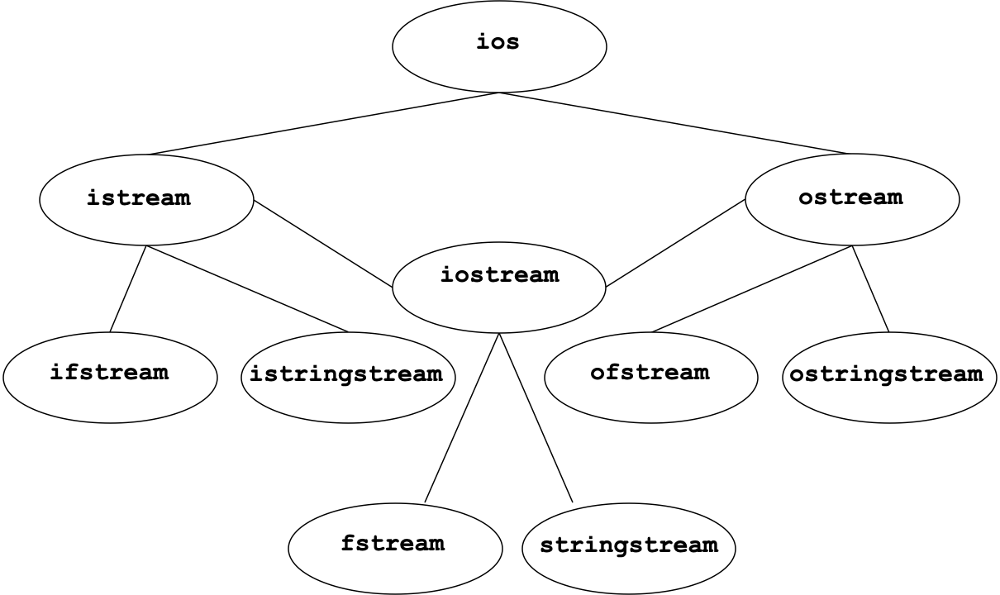

# 18. Inheritance

> Simple Inheritance, Multiple Inheritance

*Last Update: 23-11-29*

## 18.1 Simple Inheritance

### 18.1.1 Inheritance Strategies

The designers of the C++ libraries made different choices in different situations.

+ **The collection classes** are implemented as **independent** classes that do not form an inheritance hierarchy. 
+ **The stream classes**, by contrast, **form a sophisticated hierarchy** but do not allow assignment and copying. In each case, the designers chose to keep the details of memory management hidden from the client.

**Class Hierarchies**

Much of the power of modern object-oriented languages comes from the fact that they support **class hierarchies** between the ***subclass*** and the ***superclass***:

+ Each subclass represents a **specialization** of its superclass. An instance of a class is also that of all other classes in the hierarchy above it in the superclass chain. 

+ superclass : subclass $\neq$ superset : subset (rectangle : square)

+ Although C++ supports ***multiple inheritance*** (a class can inherit behavior from more than one superclass), the vast majority of class hierarchies use ***single inheritance***, which means that class hierarchies tend to form **trees** rather than **graphs**.

**Representing Inheritance in C++**

The first step in creating a C++ subclass is to indicate the superclass on the header line:

```cpp
class subclass : public superclass {
   body of class definition
};
```

You can use this feature to specify the types for a template collection class, as in the following definition of `StringMap`:

```cpp
class StringMap : public Map<string,string> {
   /* Empty */
};
```

Subclasses have access to the `public` and `protected` (but not `private`) members/methods in the superclass:


Here maybe we need to explain `protected` in greater details:

+ **Inside the class:** Protected members are accessible within the interior of the class they belong to, just like private members. 
+ **Derived classes:** Unlike private members, protected members are **accessible within derived classes**. This means that a base class's protected members can be accessed by any of its direct or indirect subclasses. 
+ **Outside the class:** Different from public members, protected members cannot be directly accessed by class objects. In other words, outside of the class, these members behave like private members.

**Calling Superclass Constructors**

In the example above, we have some new findings. When you call the constructor for an object, the constructor ordinarily calls the ***default constructor*** for the superclass, which is the one that takes no arguments.

You can call a different version of the superclass constructor by adding an initializer list to the constructor header, which is the second form of the initializer list.

```cpp
class GSquare : public GRect {
   GSquare(double x, double y, double size)
                  : GRect(x, y, size, size) {
      /* Empty */
   }
};
```

This example is only used to illustrate an initializer list, and generally square should not be a subclass of rectangle.

### 18.1.2 Polymorphism Representation

**Overloading vs. Overriding**

In C++, the *polymorphism* is reflected in two types, both static and dynamic ones:

+ ***Overloading*** is about multiple functions/operators/methods of the same name but different signatures and possibly different implementations. It is a reflection of **static/compile-time polymorphism**.

+ ***Overriding*** is about multiple methods of the same signature but different implementations defined in different classes connected through inheritance. It is a reflection of **dynamic/run-time polymorphism**.

In Python, defining a subclass method automatically overrides the definition of that method in its superclass (no explicit marking is needed). In C++, things become somehow complex.

**Virtual methods and Abstract classes**

In the superclass hierarchy, the method *overridden* differently in each subclass is a ***virtual method***. Once a method is declared as a virtual method, it becomes virtual in every subclass, thus the keyword `virtual` is not a must.

**(*)** Each class that uses virtual functions (or is derived from a class that uses virtual functions) has its own *virtual function table*, and every object of a class with virtual functions has a hidden a *vptr*.

The concept of a pure virtual function is to **specify an interface in the base class without providing an implementation**, forcing the derived class to provide an implementation. If the base class has already provided an implementation, then the function is no longer a pure virtual function. 

Any method that is always implemented by a concrete subclass is indicated by including `= 0` before the `;` on the prototype line, to mark the definition of a ***pure virtual method***.

```cpp
class Employee {
   virtual double getPay() = 0;
};
```

Because of the *pure virtual method*, an ***abstract class*** could never be instantiated, but instead serves as a common superclass for other ***concrete classes*** corresponding to actual objects. If its subclasses also fail to implement those virtual methods, they will become *concrete classes* as well.

If we declare a pointer of **a class with virtual methods**, it could later be used to **point to an object of a  subclass** inheriting from it, and thus is the core of *polymorphism*. Using `->`, the pointer could invoke the method of that in the concrete subclass.

```cpp
class Base {
public:
   virtual void virtualMethod() { /* Base */ }
};

class Derived : public Base {
public:
   void virtualMethod() { /* Derived */ }
};

Base* ptr = new Derived();
ptr->virtualMethod();  // Derived::virtualMethod

Base* ptr = new Base();
ptr->virtualMethod();  // Base::virtualMethod
```

If the class with virtual methods is an abstract class, it will behave exactly the same.

```cpp
class Base {
public:
   virtual void virtualMethod() = 0；
};

class Derived : public Base {
public:
   void virtualMethod() { /* Derived */ }
};

Base* ptr = new Derived();
ptr->virtualMethod();  // Derived::virtualMethod

Base* ptr = new Base();
ptr->virtualMethod();  // ERR
```

FIf we declare a pointer of an abstract class, it could later be used to **point to an object of a concrete subclass** inheriting from the abstract superclass, and thus is the core of *polymorphism*. Using `->`, the pointer could invoke the method of that in the concrete subclass.

However, for a non-`virtual` one with *hiding* behaviour, 

```cpp
class Base {
public:
   void nonVirtualMethod() { /* Base */ }
};

class Derived : public Base {
public:
   void nonVirtualMethod() { /* Derived */ }
};

Base* ptr = new Derived();
ptr->nonVirtualMethod();  // Base::nonVirtualMethod

Base* ptr = new Derived();
ptr->nonVirtualMethod();  // Base::nonVirtualMethod
```

**(*)** In case you get frustrated, C++11 provides a keyword `override` to check if it really overrides in the compile time.

**Slicing problem**

Maybe you havve noticed we always use pointers above. In Python, it is always legal to assign an object of a subclass to a variable declared to be its superclass. When similar operations happen in C++, it **throws away any fields in the assigned object that don’t fit into the superclass by default**, which is called ***slicing***. 

To avoid slicing, one approach is to define *private* versions of the **copy constructor** and **assignment operator** so that copying objects in that inheritance hierarchy is prohibited (just like the stream class hierarchy in C++).

However, it is always legal to assign *pointers* to objects, as all pointers are of the same size. Then we **use pointers rather than objects themselves**.

```cpp
// ERR!
Vector<Employee> payroll;
payroll.add(bobCratchit);
```

Instead,

```cpp
Vector<Employee *> payroll;
payroll.add(&bobCratchit);
for (Employee *ep : payroll) {
   cout << ep->getName() << ": " << ep->getPay() << endl;
}
```

### 18.1.3 Examples for `virtual` methods

**Dynamic Example**

This code followed defines four classes: `A`, `B`, `C`, and `D`, where `A` is the base class, and `B`, `C`, and `D` are its derived classes. Each class includes a `display()` function that outputs the class name and the values of some member variables.

- Class `A` has an integer member `a` and a `display()` function.
- Class `B`, inheriting from `A`, adds an integer member `b` and overrides the `display()` function.
- Class `C`, inheriting from `B`, adds an integer member `c` and overrides the `display()` function, where the `C::display()` function is declared as a virtual function.
- Class `D`, inheriting from `C`, adds an integer member `d` and overrides the `display()` function.

In the `main()` function, objects of these four classes are created, and their respective `display()` functions are called. Then, through object assignment and pointer operations, the concepts of polymorphism and object slicing are demonstrated.

- Objects `oA`, `oB`, `oC`, `oD` are created and call their respective `display()` methods.
- `oA = oB;`  performs object slicing, where only the `A` part of `B` is copied to `oA`, so `oA.display()` still calls the `display()` method of class `A`.
- `oC = oD;` where object slicing occurs again. This means that only the `C` part of `oD` is copied to `oC`. Since this copying process is based on the `C` type, the `C::display()` method will take effect though it is `virtual`.
- `A* pA = &oB;` creates a pointer of type `A` pointing to `oB`. Since `A::display()` method is not virtual, `pA->display()` calls the `display()` method of class `A`.
- `C* pC = &oD;` creates a pointer of type `C` pointing to `oD`. Here, since `C::display()` method is a virtual function, `pC->display()` calls the overridden `D::display()` method.

With this example you could better understand how *dynamic binding* functions.

```cpp
class A {
public:
    int a = 1;
    void display() { cout << 'A' << a << endl; }
};

class B: public A {
public:
    int b = 2;
    void display() {
        cout << 'B' << a << b << endl;
    }
};
class C: public B {
public:
    int c = 3;
    virtual void display() {
        cout << 'C' << a << b << c << endl;
    }
};
class D: public C {
public:
    int d = 4;
    void display() {
        cout << 'D' << a << b << c << d << endl;
    }
};

int main() {
    A oA;
    oA.display(); 
    B oB;
    oB.display();
    C oC;
    oC.display();
    D oD;
    oD.display();
    oA = oB;
    oA.display(); // A::display()
    oC = oD;
    oC.display(); // C::display()
    A* pA = &oB;
    pA->display(); // A::display()
    C* pC = &oD;
    pC->display(); // D::display()
}
```

Hence we have the output:

```txt
A1
B12
C123
D1234
A1
C123
A1
D1234
```

**Chain Example**

Inheritance of the virtual methods is **like a chain**. Once some method in the chain is not `virtual`, the dynamic binding will stop there. Here is a further illustration:

```cpp
class A {
public:
    virtual void display() { /* ... */ }
};

class B : public A {
public:
    void display() { /* ... */ } // Not using virtual
};

class C : public B {
public:
    virtual void display() { /* ... */ } // Even using virtual
};

A* pA;
B* pB;
C oC;

pA = &oC;
pB = &oC;

pA->display(); // B::display()
pB->display(); // B::display()
```

## 18.2 Multiple Inheritance

### 18.2.1 Strategies for Multiple Inheritance

Multiple Inheritance tends to be dangerous. 


This is "deadly diamond of death", an ambiguity that arises when two classes B and C inherit from A, and class D inherits from both B and C. If there is **a method in A** that **B and C have overridden**, and **D does not override it**, then which version of the method does D inherit: that of B, or that of C? 

Different languages have different ways of dealing with these problems of multiple inheritance. In C++ it by default **follows each inheritance path separately**, so a D object would actually contain two separate A objects, and uses of A's members have to be properly qualified. Though this could be solved by specifying `B::method_1` and `C::method_2` , it could still be tedious for even more problems:

+ **Increased Complexity**: Diamond inheritance increases the complexity of the class structure, making the code more difficult to understand and maintain.

+ **Constructor and Destructor Issues**: In a diamond inheritance structure, the constructor and destructor of the base class may be called multiple times, which can lead to problems with resource management.

Before we solve the issue, we still go trough an example. The following code defines four classes: `A`, `B`, `C`, and `D`, where `A` is the base class, and `B`, `C`, and `D` are its derived classes. 

+ **Class A**: Has an integer member `a` and a `display()` function. 
+ **Class B**: Inherits from `A`. Adds an integer member `b` and overrides the `display()` function. 
+ **Class C**: Inherits from `A`. Adds an integer member `c` and overrides the `display()` function. 
+ **Class D**: Inherits from both `B` and `C`. Adds an integer member `d` and overrides the `display()` function.

In the `main()` function, objects of these four classes are created, and their respective `display()` functions are called. 

+ `display()` method is not virtual, `pA->display()` calls the `display()` method of class `A`. However, this will raise an error for member collision and pointer type conversion (2 `A` objects in `D`, one from `B` and another from `C`)
+ `B* pB = &oD;` creates a pointer of type `B` pointing to `oD`, and `pB->display()` calls the overridden `B::display()` method in `B`.
+ `C* pC = &oD;` creates a pointer of type `C` pointing to `oD`, and `pC->display()` calls the overridden `C::display()` method in `C`.

```cpp
class A {
public:
    int a = 1;
    void display() { cout << a << endl; }
};

class B: public A {
public:
    int b = 2;
    void display() {
        cout << a << b << endl;
    }
};
class C: public A {
public:
    int c = 3;
    void display() {
        cout << a << c << endl;
    }
};
class D: public B, public C {
public:
    int d = 4;
    void display() {
        cout /* ERR: << a (multiple a) */ << b << c << d << endl;
    }
};

int main() {
    A oA;
    oA.display();
    B oB;
    oB.display();
    C oC;
    oC.display();
    D oD;
    oD.display();
    /*ERR: Multiple display()
    A* pA = &oD;
    pA->display();   
    */
    B* pB = &oD;
    pB->display(); // B::display()
    C* pC = &oD;
    pC->display(); // C::display()
}
```

and the output

```txt
1
12
13
234
12
13
```

**Virtual Inheritance**

Then we introduce the concept of ***virtual inheritance***.

With virtual inheritance, the derived class D will have **only one** shared instance of class A, even though it is inherited via two different paths (B and C). This shared instance ensures that **there is a single set of base class member variables**, preventing duplication and inconsistency, allowing the derived class D to interact with the base class A's members as if it had inherited them directly.

Practically in the stream hierarchy, `ios` is a virtual base of both `istream` and `ostream`.

Here is another example:

```cpp
class A {
public:
    int a = 1;
    void display() { cout << a << endl; }
};

class B: virtual public A {
public:
    int b = 2;
    void display() {
        cout << a << b << endl;
    }
};
class C: virtual public A {
public:
    int c = 3;
    void display() {
        cout << a << c << endl;
    }
};
class D: public B, public C {
public:
    int d = 4;
    void display() {
        cout << a << b << c << d << endl;
    }
};

int main() {
    A oA;
    oA.display(); 
    B oB;
    oB.display(); 
    C oC;
    oC.display(); 
    D oD;
    oD.display(); 
    A* pA = &oD; 
    pA->display(); // A::display()
    B* pB = &oD;
    pB->display(); // B::display()
    C* pC = &oD;
    pC->display(); // C::display()
}
```

Here's the corresponding output

```txt
1
12
13
1234
1
12
13
```

### 18.2.2 stream hierarchy

Here are multiple thoughts of the stream hierarchy, with the last one implemented in STL.

**A Classic UML Diagram** 


**An alternative UML Diagram**


**A Multi-Inheritance UML Diagram**


**An improved Multi-Inheritance UML Diagram**




---

