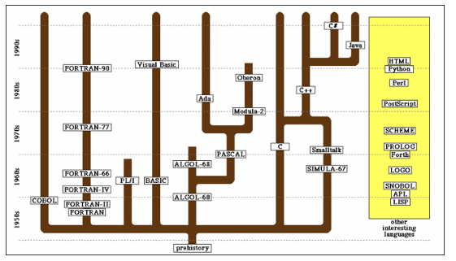
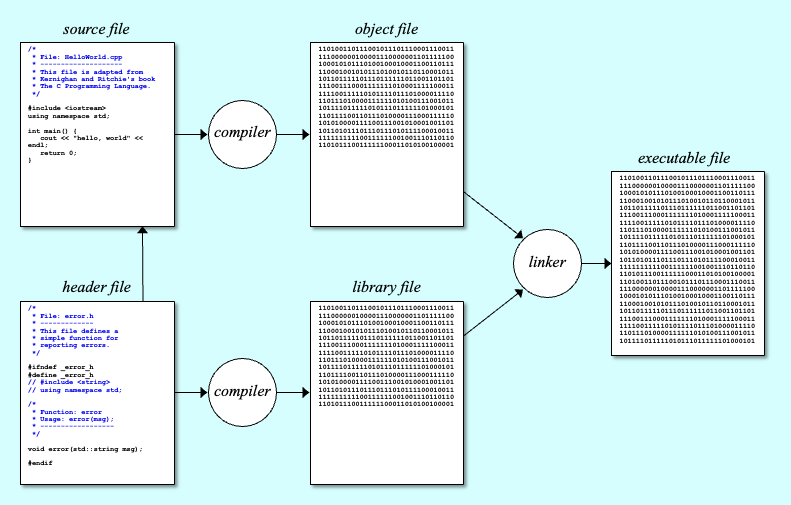
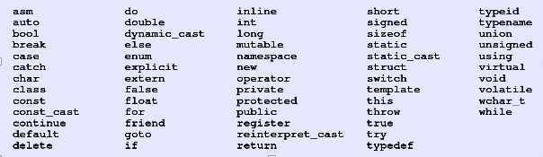
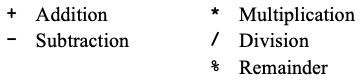
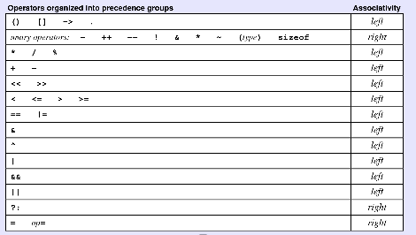
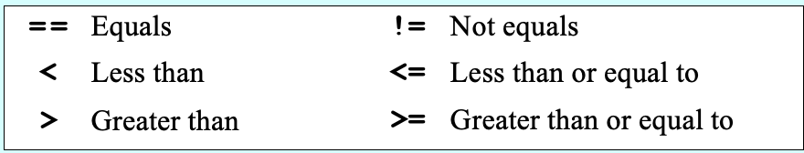
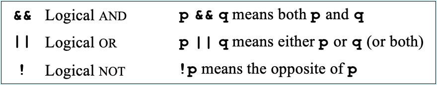

# 1. Introduction to C++

> History of C++, Comparisons, Structure and Syntaxes

*Last Update: 23-11-15*


## 1.1 History of C++

Here we have a brief review of the development of coding languages:



The C++ programming language was developed by Bjarne Stroustrup at Bell Labs since 1979, as an extension of the C language.

C++ was initially standardized in 1998 by the International Organization for Standardization (ISO) as C++98, which was then amended by the following standards like C++03 and C++11, etc.

We will apply C++98 in most of the material, and occasionally refer to features from C++11.

## 1.2 Comparisons

**C++ vs. Python**

| Feature             | C++                                                          | Python                                                       |
| ------------------- | ------------------------------------------------------------ | ------------------------------------------------------------ |
| Execution           | **Compiled** and linked into an executable.                  | **Interpreted** and executed by an engine.                   |
| Types               | **Static typing**, explicitly declared, bound to names, checked at compile time | **Dynamic typing**, bound to values, checked at run time, and are not so easily subverted |
| Memory Management   | Requires much **more attention** to bookkeeping and storage details | Supports **garbage collection**.                             |
| Language Complexity | **Complex** and full-featured. Diverse language feature under the sun while never (forcibly) abstracting anything. | **Simple**. Only one or a few ways designed to be simple, at the cost of power or efficiency. |

**Compiler vs. Interpreter**

+ A ***compiler*** takes entire program and converts it into object code which is typically stored in a file. The object code is also refereed as binary code and can be directly executed by the machine after linking. 

  Examples: **C** and **C++**.

  

+ An ***interpreter*** directly executes instructions written in a programming or scripting language without previously converting them to an object code or machine code. 

  Examples: **Python** and **R**.

+ In general, *interpreted* programs run slower than the *compiled* programs.

   **Java** is a compiled programming language, but its source code is compiled to an intermediate binary form called *bytecode*. The bytecode is then executed by a Java Virtual Machine (JVM), which supports different systems. 

## 1.3 Structure and Syntaxes

We begin from the "hello world" program:

```cpp
#include <iostream>
using namespace std;

int main() {
   cout << "hello, world" << endl;
   return 0;
}
```

### 1.3.1 The Structure of a C++ Program

**Libraries**

***Libraries*** are collections of previously written tools that perform useful operations.

To instruct the compiler to read the relevant definitions from a header file, we have

```cpp
#include <iostream>
#include "mylib.h"
```

**Namespaces**

To ensure that the names defined in different parts do not interfere with one another, C++ segments code into structures called ***namespaces***, each of which keeps track of its own set of names. The **Standard C++ Libraries** use a namespace called `std`.

Instead of mentioning the namespace name all the time, we may use `using`:

```cpp
using namespace x;
using namespace x::name1; // explicitly
```

(*****) To declare a namespace, simply use

```cpp
namespace math {
    int value;
    int add_one() {
        return value + 1;
    }
}
```

To use instances inside the namespace, we should apply the `::` operator:

```cpp
int main() {
    math::value = 5;
    math::add_one();
}
```

**Preprocessor directives**

***Preprocessor directives*** are not program statements but directives for the *preprocessor*, which examines the code before actual compilation. It takes in the codes as *tokens*, which is similar to that of a *string*.

Each directive has the following syntax structure:

- The number character `#`.

- Preprocessing instruction: one of `include`, `define`, `undef`, `if`, `ifdef`, `ifndef`, `else`, `elif`, `endif`, `line`, `error`, `pragma`.

- Arguments (depending on the instruction).

- The line break (no semicolon `;` but newline `\`) for directives of more than one line.

A ***macro*** is a fragment of code that has been given a name. Whenever the name is used, it is replaced by the contents of the macro.

**Functions**

A ***function*** is a named section of code that performs a specific operation. 

Every C++ program must contain a function with the name `main` to call other functions, which specifies the starting point for the computation and the end of execution when `return`.

A declaration of the function called a ***function prototype*** must appear before the `main` function, to comply with the “declare-before-use” rule.

**Comments**

A ***comment*** is text that is ignored by the compiler but nonetheless conveys information about the source code.

+ Multi-line comments:

```cpp
/* Comments line 1
   Comments line 2
   Comments line 3 */
```

+ Single-line comments:

```cpp
// Comments line 1
// Comments line 2
```

### 1.3.2 Variables and Data Type

**Data Types**

A ***data type*** is defined by a domain with values and operations:

+ A set of values that belong to that type
+ A set of operations, which defines the behavior of that type.

Although many data types are represented using object classes or other compound structures (more details later), C++ defines a set of ***primitive types*** to represent simple data, like `int`, `double`, `bool` and `char`.

**Variables**

A ***variable*** is a named *address* for storing a type of value. In C++, you must *declare* a variable before you can use it. 

```cpp
type name = value;
```

Here are some rules for the naming of variables:

+ Variable name is case sensitive, and should avoid *reserved words*.

+ The name must start with a letter or the underscore character (_).

+ All other characters in the name must be letters, digits, or the underscore. No spaces or other special characters are permitted in names.



There is a *scope* and an *extent* for the variables:

+ The ***scope*** of a variable describes where in a program's text the variable may be used
+ The ***extent*** (or ***lifetime***) describes when a variable has a (meaningful) value in a program's execution.

Here are 3 types of variables different in ther scopes and extents:

+ Most declarations appear as statements in the body of a function definition. Variables declared in this way are called ***local/automatic variables*** and are accessible only inside that function. 

+ Variables may also be declared as part of a class, called ***instance variables***.

+ Variables declared outside any function and class definition are ***global variables***, which is often avoided.

**Constants**

Unlike a *variable*, which is a placeholder for a value that can be updated as the program runs, the value of a ***constant*** does not change during the course of a program.

+ To create a named constant in C++, precede the regular variable declaration with the keyword `const`. Hence the value created is *invariable*:

  ```cpp
  const double PI = 3.14159265358979323846;
  ```

+ The `constant` exists only in the file where it is created. To the contrary, the way to define in the *directive* will hold it valid throughout execution:

  ```cp
  #define PI 3.14159265358979323846
  ```

### 1.3.3 Expressions

An expression in C++ consists of ***terms*** joined together by ***operators***.

Each ***term*** must be one of the following:

- A constant *value* (such as `3.14159265` or `"hello, world"`)

- A constant/variable *name* (such as `PI`, `n1`, `n2`, or `total`)

- A function call that returns a value (such as `readInt()`)

- An expression enclosed in parentheses (recursive definition)

The most common ***operators*** in C++ are the ones that specify arithmetic computation:



+ Operators in C++ usually appear between two sub-expressions, which are called its ***operands***. Operators that take two operands are called *binary operators*.

+ The `-` operator can also appear as a *unary operator*, as in the expression `-x`, which denotes the negative of `x`.

If an expression contains more than one operator, C++ uses ***precedence rules*** to determine the order of evaluation. Anyway, parentheses `()` may be used to change the order of operations. 



**Division and Type Casts**

In C++, whenever you apply a binary operator to numeric values, the result will be of type `int` if both operands are of type `int`, but will be a `double` if either operand is a `double`.

The conversion could be accomplished by means of a ***type cast***.

```cpp
14/5									// 2
double(14)/double(5)  // 2.8
double(14)/5					// 2.8
double(14/5)					// 2
```

**Shorthand Assignments**

The general form of a ***shorthand assignment*** is

```cpp
variable op= expression;
```

which is the same as

```cpp
variable = variable op (expression);
```

For example, the following statement multiplies salary by 2:

```cpp
salary *= 2;
```

**Increment and Decrement Operators**

Another important shorthand form that appears frequently in C++ programs is the ***increment operator***, which is most commonly written as `x++` or `x--`.

These operations are similar in effect:

```cpp
x++;				// x increased by 1 before other operations
++x;				// x increased by 1 after other oprations
x += 1;			
x = x + 1;	 
```

**Boolean Expressions**

The operators used with the `boolean` data type fall into two categories: ***relational operators*** and ***logical operators***.

+ ***Relational operators*** compare values and produce a `boolean` result:

  

+ Also three ***logical operators***:

  

C++ evaluates the `&&` and `||` operators using a strategy called **short-circuit mode** in which it evaluates the right operand only if it needs to do so. 

One of the advamtages is to prevent execution errors. If `n` were 0 in the earlier example, evaluating `x % n` would cause a “division by zero” error:

```cpp
n != 0 && x % n == 0
```

### 1.3.4 Statements

Statements in C++ fall into three basic types:

+ **Simple statements:** 

  It is formed by adding a semicolon `;` to the end of a C++ expression.

+ **Compound statements** (called **blocks**): 

  There are sequences of statements enclosed in curly braces.

+ **Control statements**
  
  + **Conditional statements** that specify some kind of test.
  + **Iterative statements** that specify repetition.

One can break a long line of code using a backslash `\`. Most of the time compilers can recognize a broken line, but sometimes a `\` is needed, especially in preprocessor directives.

**`if` Statements**

The examples use only the following forms of the `if` statement:

+ Single line `if` statement

  ```cpp
  if (condition) statement
  ```

+ Multiline `if` statement with curly braces

  ```cpp
  if (condition) {
     statement
     ...more statements...
  }
  ```

+ `if`/`else` statement with curly braces

  ```cpp
  if (condition) {
     statements_true
  } else {
     statements_false
  }
  ```

+ Cascading `if` statement

  ```cpp
  if (con1) {
     statements_1
  } else if (con2) {
     statements_2
  } else {
     statements_3
  }
  ```

There is also a shortcut named `?:` operator.

```cpp
max = (x > y) ? x : y;
```

**`switch` Statements**

It provides a convenient syntax for choosing among a set of possible paths:

```cpp
switch (expression) {
  case v1:
     statements to be executed if expression = v1
     break;
  case v2:
     statements to be executed if expression = v2
     break;
  default:
     statements to be executed if no values match
     break;
}
```

If `break` is not included in one case, all statements **following the case** are also executed, until a `break` is reached or the end of the switch block.

**`for` statements and `while` statements**

+ The `while` statement has the following form:

  ```cpp
  init;
  while (test) {
     statements to be repeated
     step;
  }
  ```

+  The `for` statement is in another form:

  ```cpp
  for (init; test; step) {
     statements to be repeated
  }
  ```

  As shown above, how many times the loop will run is explicitly included in the header line. it is a reminder that we will exit from the loop if the value of `test` is `false`.

  ```cpp
  for (int i = 0; i < N; i++)
  for (int x = 1; x <= 1024; x *= 2)
  ```

* The `do-while` statement allows us to execute first then checks the condition (*****):

  ```cpp
  do {
      statements to be repeated
  } while (condition);
  ```

**Keywords for loops**

- **`break` **: The `break` keyword is used to immediately terminate the execution of  a `for`/`while`/`do-while` loop, exiting the currently innermost loop that it is in.
- **`continue`**: The `continue` keyword is used to skip the remaining part of the current loop iteration and proceed to the next iteration. It only affects the current iteration of the loop, not the entire loop.

### 1.3.5 Preprocessing Directives (*****)

Here are preprocessing directives commonly used:

+ **`include`**: This directive is used to include the contents of another file into the current file. 

  ```cpp
  #include <stdio.h>
  ```

+ **`define`**, **`undef`**: Defines or undefines a macro, about instructing the compiler to replace subsequent instances of an identifier with a specific value or code snippet. 

   ```cpp 
   #define PI 3.14159
   ```

+ **`if/elif/else`**: Used for conditional compilation. It allows code blocks to be compiled only if a certain condition (usually a macro definition) is true.

  ```cpp
  #if defined(DEBUG)
  ```

+ **`ifdef/ifndef`**: Stands for "if defined/if not defined" and compiles the subsequent code only if the specified macro is defined. 

  ```cpp
  #ifndef PI
  ```

+ **`endif`**: Ends a conditional block started with `if`, `ifdef`, or `ifndef`.

+ **`line`**: Changes the compiler's current line number and filename, useful for error debugging information.

+ **`error`**: Generates an error during compilation, and the compilation will stop here.

+ **`pragma`**: Additional compiler instructions, the interpretation of which depends on the specific compiler. 

  ```cpp
  #pragma once
  ```

### 1.3.6 Error Handling (*****)

```cpp
#include <iostream>
#include <stdexcept> // Include the standard exceptions library

int divide(int numerator, int denominator) {
    if (denominator == 0) {
        throw std::invalid_argument("Denominator cannot be zero."); // Throw an exception
    }
    return numerator / denominator;
}

int main() {
    int a = 10, b = 0, result;

    try {
        result = divide(a, b);
        std::cout << "Result is " << result << std::endl;
    } catch (const std::invalid_argument& e) {
        std::cerr << "Caught exception: " << e.what() << std::endl;
        // Handle the exception, such as attempting a recovery or logging the error
    } catch (...) {
        // Catch-all handler for any other types of exceptions
        std::cerr << "An unknown error occurred!" << std::endl;
    }

    std::cout << "Program continues after exception handling." << std::endl;

    return 0;
}
```

In the `main` function, the `divide` function is called within a `try` block. The `try` block is used to wrap code that might potentially throw an exception.

Immediately following the `try` block are two `catch` blocks: The first  is designed to catch exceptions of the type `std::invalid_argument`,  and the second is a **catch-all handler** (`catch (...)`) for that wasn't caught by the previous `catch` block. 

The `try`-`catch` pair is a typical way to handle errors in C++.


---

