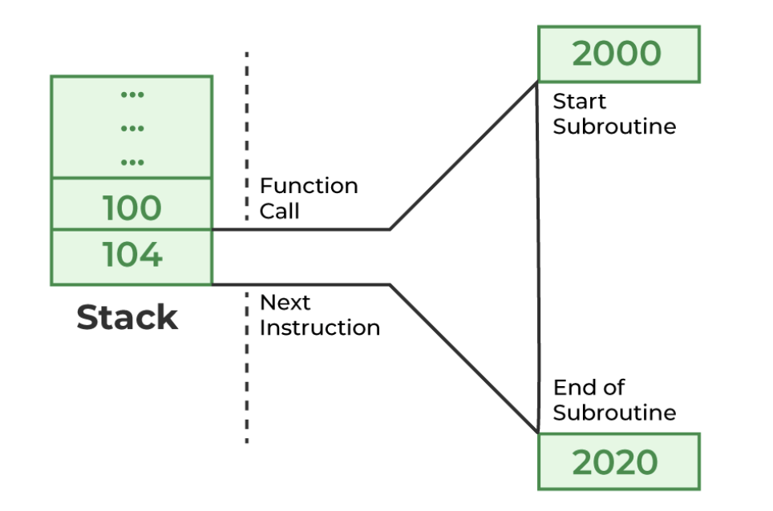

# 2. Functions & Libraries I

*Last update: 23-09-19*

## 2.1 Functions in Programming

A ***function*** is a block of code that has been organized into a separate unit and given a name. The act of using the name to invoke that code is known as *calling* that function, with the variables known as ***parameters*** replaced by ***arguments*** each time:

+ ***parameter:*** A parameter is a variable in a function declaration and definition, and a placeholder for the argument.
+ ***argument:*** An argument is an expression used when calling the function, and an actualization of the parameter.

The advantages of using functions could be concluded as:

+ **Reuse:** Shortens a program.
+ **Abstraction:** Easier to read.
+ **Decomposition:** Simplifies program maintanance.
+ Top down step-wise refinement.

## 2.2 Functions in C++

Derived from C, the general form of a function looks like:

```cpp
type name (parameter list) {
    statements in the function body
}
```

Here are some further explanations:

+ **type:** What type the function returns.
+ **name:** The name of the function.
+ **parametre list:** A list of variable declarations.
+ **statements in the function body:** Implementation of the function, including at least a `return` .

Specially, a functions that returns `bool` is called a *predicate function*, and the`void` function (which returns no value at all) is called a *procedure* .

**Function Prototype**

A ***function prototype*** is simply the header line of the function followed by a semicolon, before the main function or you actually define it.

```cpp
#include <iostream>
int add(int a, int b); // function prototype

int main() {
   int result = add(2, 3);
   std::cout << result;
   return 0;
}

int add(int a, int b) {
   return a + b;
}
```

If you always define functions **before** you call them, prototypes are not required. However, this strategy can be counterintuitive by a *top-down design*, and there might be situations where you cannot always define functions before you call them, like *mutual recursion*.

```cpp
#include <iostream>
int add(int a, int b) {
    return a + b;
}

int main() {
    int result = add(2, 3);
    std::cout << result;
    return 0;
}
```

**Functions and Algorithms**

Now we continue with **functions and algorithms**. Algorithms for solving a particular problem can vary widely in their efficiency (or complexity), and function could be seen as a structure to express them. Here we will take the example of **greatest common divisor**.

Here is what we call ***Brute-Froce Approach***, which is literally **trying every possibility**, so as to count backwards from the smaller value until you find one that divides evenly into both.

```cpp
int gcd(int x, int y) {
   int guess = (x < y) ? x : y;
   while (x % guess != 0 || y % guess != 0) {
      guess--;
   }
   return guess;
}
```

Also we have the **Euclid’s Algorithm**. A fact is applied: The greatest common divisor of `x` and `y` must also be the greatest common divisor of `y` and the remainder of `x` (divided by `y`). 

```cpp
int gcd(int x, int y) {
   int r = x % y;
   while (r != 0) {
      x = y;
      y = r;
      r = x % y;
   }
   return y;
}
```

**Function Overloading**

In C++, Functions can be ***overloaded***, which means that you can define several different functions with the same name as long as the adaptable version can be determined by looking at the ***signature*** (also called the pattern of arguments: **the number and types of the arguments**, but **NOT** the parameter names).

```cpp
#include <iostream>

int add1(int x);
double add1(double x);   

int main() {
   double x;
   std::cin >> x;
   std::cout << add1(x)/4;
   return 0;
}

double add1(int x) {    
   return x + 1;

int add1(int y) { //ERR
   return y + 1;
}
double add1(double x) {
   return x + 1;
}
```

Functions can specify *optional parameters* by including an initializer after the variable name in the function prototype, like 

```cpp
void setMargin(int margin = 72);
```

In C++, the specification of the default arguments appears **only** in the *function prototype* and **NOT** in the function definition, and any optional parameters must appear **at the end of the parameter list**. 

Here is an example:

```cpp
void setInitialLocation(double x = 0, double y = 0);
void setInitialLocation(double x, double y = 0);
void setInitialLocation(double x = 0, double y);   
```

If we want to keep the users from calling the function with only one argument, but provide either all arguments or no arguments at all, we could use

```cpp
void setInitialLocation(double x = 0, double y = 0);
```

However, it will be assigned to `x` if only one parameter is given, which may not be that robust. Instead, we could apply *overloading* as a safer approach: 

```cpp
void setInitialLocation(double x, double y);

void setInitialLocation() {
   setInitialLocation(0, 0);
}
```

## 2.3 Machanics of Calling a Function

When you invoke a function, the following actions occur:

+ **Argument Evaluation**: Expressions for arguments are evaluated in the caller's context.

+ **Argument Copying**: Copies argument values into parameter variables in a new stack frame.
+ **Function Execution**: Executes function body using the stack frame for local variables.
+ **Return Statement**: Computes return value, substituting it in place of the function call.
+ **Stack Frame Discard**: Discards function's stack frame and returns control to the caller.

Under this machanism, global `n1` and `n2` remain the initial values after execution.

```cpp
void swap(int x, int y) {
   int tmp = x;
   x = y;
   y = tmp;
}

int n1 = 1, n2 = 2;
swap(n1, n2);
```

**Reference Variables**

To bring this value out, could apply ***reference variables*** in C++. 

A *reference variable* could be thought of as an alias for an already existing variable, indicated by a prefix `&` character. 

A reference must be initialized when it is declared, after which it cannot be reassigned.

```cpp
void swap(int & x, int & y) {
   int tmp = x;
   x = y;
   y = tmp;
}
```

This way for callers and functions to share information is known as ***call by reference***, with a single function often having both *value parameters* and *reference parameters*, like

```cpp
int main() {
   double a, b, c, r1, r2;
   getCoefficients(a, b, c);
   solveQuadratic(a, b, c, r1, r2);
   printRoots(r1, r2);
   return 0;
}

void solveQuadratic(double a, double b, double c, double & r1, double & r2) {
   if (a == 0) error("The coefficient a must be nonzero.");
   double disc = b * b - 4 * a * c;
   if (disc < 0) error("This equation has no real roots.");
   double sqrtDisc = sqrt(disc);
   r1 = (-b + sqrtDisc) / (2 * a);
   r2 = (-b - sqrtDisc) / (2 * a);
}
```

The `&` could actually be handy if you want to "return" multiple values.

In fact, a *reference* is a simple reference datatype that is **less powerful but safer** compared to ***pointer*** inherited from C. It can be considered as a new name for an existing object, but **NOT** a copy of the object it refers to.

We will delay the discussion of references until when we have a deeper understanding of pointers. 

---

