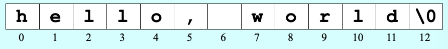

# 3. Strings

> Introduction, Characters, Strings

*Last Update: 23-09-18*

## 3.1 Introduction

Though all our codes are executed in C++ compiler, some of them are in C-style. Different strategies used by C and C++ on strings show the differences in *programming paradigms*.

Conceptually, a ***string*** is simply a sequence of ***characters***, which is precisely how strings are implemented in C. As a newly designed language, C++ supports a higher-level view of strings as ***objects***. Both of them are useful and effctive.

## 3.2 Characters

Both C and C++ use ***ASCII*** as their encoding for a ***character*** representation. The data type `char` therefore fits in a single eight-bit byte. 

ASCII supports only $$2^8=256$$ characters, thus the C++ libraries define the wide-character type `wchar_t`. In most modern language, it has been superseded by *Unicode*.

You could specify a character with the ASCII code:

```cpp
char ch;
char ch = 'a';
char ch = 97;   // ASCII for the character
```

For special control characters, we have

```cpp
char ch = 9;    // '\t' (Tab)
char ch = 10;   // '\n' (New line)
char ch = 13;   // '\r' (Return)
```

It's a reminder that to break a line, Mac uses `\r`, Unix uses `\n`, and Windows uses `\r\n`.

**Character Functions**

For libraries, we have the `<cctype>` interface (from `type.h`). It is a cluster of C character classification functions, with part of them shown as below:

| Function                | Description                                             |
| ----------------------- | ------------------------------------------------------- |
| `bool isdigit(char ch)` | Determines if `ch` is a digit.                          |
| `bool isalpha(char ch)` | Determines if `ch` is a letter.                         |
| `bool isalnum(char ch)` | Determines if `ch` is a letter or a digit.              |
| `bool islower(char ch)` | Determines if `ch` is a lowercase letter.               |
| `bool isupper(char ch)` | Determines if `ch` is an uppercase letter.              |
| `bool isspace(char ch)` | Determines if `ch` is whitespace (spaces and tabs).     |
| `char tolower(char ch)` | Converts `ch` to its lowercase equivalent, if possible. |
| `char toupper(char ch)` | Converts `ch` to its uppercase equivalent, if possible. |

Examples are as follows:

```cpp
#include <iostream>
#include <cstring>

int main() {
    char cstr[80];
    strcpy(cstr, "these ");
    strcat(cstr, "strings ");
    strcat(cstr, "are ");
    strcat(cstr, "concatenated.");
    std::cout << cstr << " length = " << strlen(cstr);
    return 0;
}
```

## 3.3 Strings

### 3.3.1 The Legacy of C-Style Strings

In C, we can represent strings (sequences of characters), as plain ***arrays*** of elements of a character type:

```cpp
char cstr[10];
char cstr[] = "hello";
char cstr[] = { 'h', 'e', 'l', 'l', 'o', '\0' };
```

After definition, we could refer to `cstr` as a ***C-String array***.

If you put double quotation marks `" ` around a sequence of characters, you get what is called a ***C string literal*** (`const char[]` type)*.* The characters are stored in an *array* of bytes, terminated by a `null` byte whose ASCII value is 0. The `null` type, however, functions as a signal for end of the string.

That's why `'a'` and `''a''` are actually quite different.



The character positions in a C string are identified by an *index* that begins at **0** and extends up to one less than the length of the string, just like that in Python.

**C String Functions**

Now we continue to introduce *C String Functions*. The `<cstring>` (`string.h`) interface offers a lot of functions you can use to operate C strings. 

Though it is in C-style, we could initialize it like

```cpp
char * cstr;
cstr = "world";

char cstr1[] = "world";
char cstr2[] { "world" }; // available since C++11
```

To determine the **length** of a C String `cstr`, we have (`sizeof` as an operator):

```cpp
char cstr[] = "hello";
int len = strlen(cstr); // human intuition
int size = sizeof cstr; // actual memory size of x
```

The appropriate way to **assign**, or to copy C-string value is like:

```cpp
strcpy(cstr, "world");
```

Though sometimes it works, it should be forbidden to assign in a longer string like `strcpy(cstr, "student");`.

Here is a practical example:

```cpp
#include <iostream>
#include <cstring>
using std::cout; using std::endl;

int main() {
    char cstr[] = "hello";      
    cout << cstr << endl
         << sizeof cstr << endl
         << strlen(cstr) << endl;
    strcpy(cstr, "hello world"); // ERR: dangerous overflow
    cout << cstr << endl
         << sizeof cstr << endl
         << strlen(cstr) << endl;
    return 0;
}
```

For most compilers, the outputs are `hello`, `6`, `5`; `hello world`, `6` and `11  `respectively. 

The size of the array is always fixed, hence `sizeof` will always return the size as `6`; `strlen()` will return once a `\0` is met, thus we have the answer to be `5` and `11`.

Also, there is possibility you will see weird in 4th output like `"hello weirdthing"` for *memory overwriting*, especially when hardware resource is extremely restricted.

**C-String Libraries**

For libraries supporting C String, we have the `<cctype>` interface (from `type.h`):

| Category            | Function  | Description                   |
| ------------------- | --------- | ----------------------------- |
| ***Copying***       |           |                               |
|                     | `memcpy`  | Copy block of memory          |
|                     | `memmove` | Move block of memory          |
|                     | `strcpy`  | Copy string                   |
|                     | `strncpy` | Copy characters from string   |
| ***Concatenation*** |           |                               |
|                     | `strcat`  | Concatenate strings           |
|                     | `strncat` | Append characters from string |
| ***Comparison***    |           |                               |
|                     | `memcmp`  | Compare two blocks of memory  |
|                     | `strcmp`  | Compare two strings           |
|                     | `strcoll` | Compare using locale          |
|                     | `strncmp` | Compare characters of strings |
|                     | `strxfrm` | Transform using locale        |
| ***Searching***     |           |                               |
|                     | `memchr`  | Locate character in memory    |
|                     | `strchr`  | Locate first occurrence       |
|                     | `strcspn` | Get span until character      |
|                     | `strpbrk` | Locate characters in string   |
|                     | `strrchr` | Locate last occurrence        |
|                     | `strspn`  | Get span of character set     |
|                     | `strstr`  | Locate substring              |
|                     | `strtok`  | Split into tokens             |

### 3.3.2 Using C++ Strings as Abstract Values

As introduced initially, older `char` type is retained in C++ by including `<cctype>` and `<cstring>`. As a newly-designed language, C++ supports a high-level view of strings as *objects*, which is provided in the `<string>` library.

However, there are a few you should be aware about with ***string concentration*** of strings. Assume `name`, `", "` and `"hello"` are in *C String* forms, and we will illustrate that in the following:

+ C++ allows *concentration* with the stream. `name` could either be *C++ String object* or *C String array*.

  ```cpp
  cout << "Hello, " << name << "!" << endl;
  ```

+ C++ automatically converts a C string literal to a C++ string object for your need. However, we could not use `+` to connect multiple *C-String literals*:

  ```cpp
  string str = "hello, world";
  string str = "hello" + ", " + "world"; // ERR
  ```

+ To solve the issue, just convert one *literal* to the *object*:

  ```cpp
  string str = string("hello") + ", " + "world";
  ```

C++ allows classes to redefine certain operators, which is a kind of *overloading*. Here are some other operators:

| Operation     | Description                           |
| ------------- | ------------------------------------- |
| `str[i]`      | Accesses the `i`th character of `str` |
| `s1 + s2`     | Concatenates `s1` and `s2`            |
| `s1 = s2`     | Copies `s2` into `s1`                 |
| `s1 += s2`    | Appends `s2` to `s1`                  |
| `s1 == s2`    | Lexicographical comparison of strings |
| `str.c_str()` | Returns a C-style char array of `str` |

Here is a detailed example:

```cpp
#include <iostream>
#include <string>

int main() {
    char name1[] = "Ray";
    std::string name2 = "Ray";
    std::cout << "Hello, " << name1 << std::endl;
    std::cout << "Hello, " << name2 << std::endl;
    std::cout << "Hello, " + name1 << std::endl; // ERR: add a char array with a const char*
    std::cout << "Hello, " + name2 << std::endl; 
    return 0;
}
```

Now we continue with *String Methods*. First I need to emphasize that `c_str` methods could be applied to C++ string, with objects automatically converted into the C String literal.

Recall that Python has both `len(str)` and `str.__len__()`. As C++ is also an *OOP* language, it behaves exactly the same. As `string` is a class, we have coresponding methods like 

```cpp
int len = str.length();
```

However, it is OK if we use

```cpp
int len = strlen(str.c_str()); // Correct, but tedious.
```

instead of

```cpp
int len = strlen(str); // ERR
```

Here we will introduce more useful functions for C++ Strings:

**Selecting characters in strings**

The string in C++ is ***mutable***, which is a great difference from Python. Anyway, the `<string>` library offers two machanisms for selecting individual characters:

```cpp
str[index] = 'H'; 	 // won't check if it is in-range
str.at(index) = 'H'; // always check if it is in-range
```

**Iterating through characters**

It requies codes like:

```cpp
for (int i = 0; i < str.length(); i++) 
for (int i = str.length() - 1; i >= 0; i--)
```

**Modifying Contents of a String**

C++ strings are **mutable**! It allows for methods like

| Function                        | Description                                               |
| ------------------------------- | --------------------------------------------------------- |
| `str.erase(pos, count)`         | Deletes `count` characters from `str` at `pos`            |
| `str.insert(pos, text)`         | Inserts `text` into `str` at `pos`                        |
| `str.replace(pos, count, text)` | Replaces `count` characters in `str` with `text` at `pos` |

### 3.3.3 Technics for C++ Strings

**Avoiding the use of destructive operations**

As you have seen initially, Strings in C++ is mutable, thus we need to emphasis more about the philosophy of using that. Among three possible solutions, we could make a comparison:

+ **Case convertion without changing the original:** Safe, but not that efficient.

  ```cpp
  string toUpperCase1(string str) {
      string result = ""
      for (int i = 0; i < str.length(); i++) {
          result += toupper(str[i]);
      }
      return result;
  }
  ```

+ **Case conversion in place:** More efficient but not safe.

  ```cpp
  void toUpperCase3(&string str) {
      for (int i = 0; i < str.length(); i++) {
        &str[i] = toupper(str[i]);
      }
  }
  ```
  
+ **Case conversion:** Safe and efficient.

  ```cpp
  string toUpperCase(string str) {
     for (int i = 0; i < str.length(); i++) {
        str[i] = toupper(str[i]);
     }
     return str;
  }
  ```

**Conclusion for `#include`**

At last there is a conclusion for various `#include` syntax.

| Include Statement      | Description                                                  |
| ---------------------- | ------------------------------------------------------------ |
| `#include <cstring>`   | C string library (for C++)                                   |
| `#include <string.h>`  | C string library (for C, also acceptable in C++)             |
| `#include "string.h"`  | **Risky:** may conflict if you've defined your own "string.h" |
| `#include <string>`    | C++ string library                                           |
| `#include "cstring.h"` | **Incorrect** unless you've defined your own "cstring.h"     |
| `#include <cstring.h>` | Likely an **error** even if you've defined your own "cstring.h" |

**Conclusion for initializing a String** (*****)

Here are multiple ways to initialize a String:

+ C String literal Initialization:

  ```cpp
  char str1[] = "Hello World";
  char str2[50] = "Hello World"; // large enough
  ```

+ C String Initialization char by char:

  ```cpp
  char str3[] = {'H', 'e', 'l', 'l', 'o', ' ', 'W', 'o', 'r', 'l', 'd', '\0'};
  ```

+ Pointer to a C String literal:

  ```cpp
  const char* str4 = "Hello World";
  ```

+ C++ String Initialization:

  ```cpp
  std::string str5("Hello World");
  std::string str6({'H', 'e', 'l', 'l', 'o'}); // "Hello"
  ```

There are still numerous approaches, like using dynamic allocation with `new`, copying from an existing one with `strcpy`, etc.

## 3.4 OOP as a Programming Paradigm

C++ is of an ***object-oriented programming paradigm (OOP)***, with the operations that apply to instances of a class called ***methods***. 

A language purposely designed to allow programming in many paradigms is called a multi-paradigm programming language, like C++ and Python. You can write programs or libraries that are largely ***procedural***, ***object-oriented***, or ***functional*** (through the interface `<functional>`) in C++.

Also you need to have a slight taste of the philosophy called ***abstraction***.

Here are some characteristics about the *OOP* paradigm:

+ **Structured**: Programs have clean, `goto`-free, nested control structures.

+ **Procedural**: Imperative programming with procedures operating on data.

+ **Object-Oriented**: Objects have/combine states/data and behavior/methods; Computation is effected by sending messages to objects (receivers).
+ **Class-based**: Objects get their states and behavior based on membership in a class.
  
+ **Prototype-based**: Objects get their behavior from a prototype object.

We will further extend these topics later.


---

