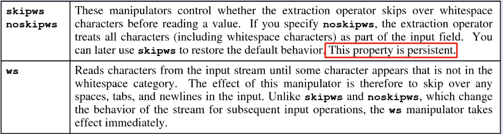
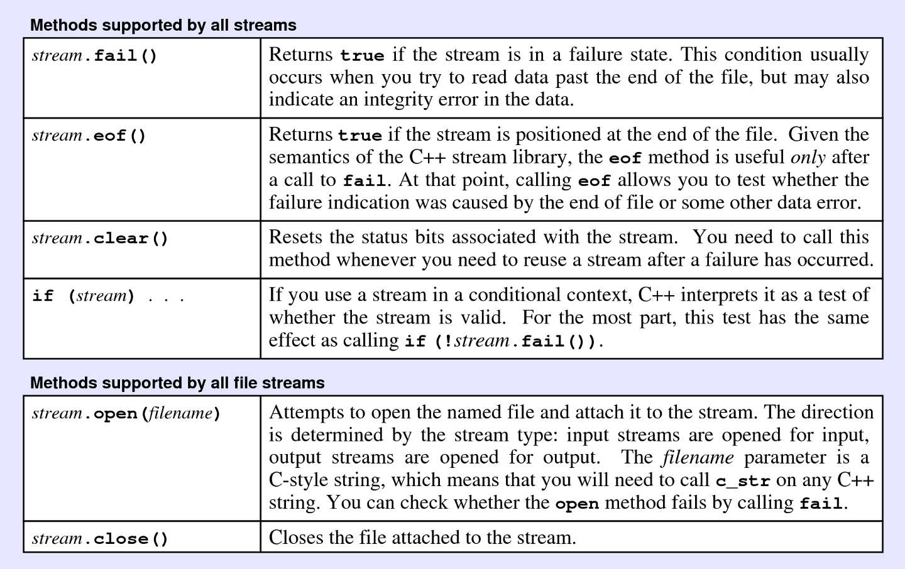
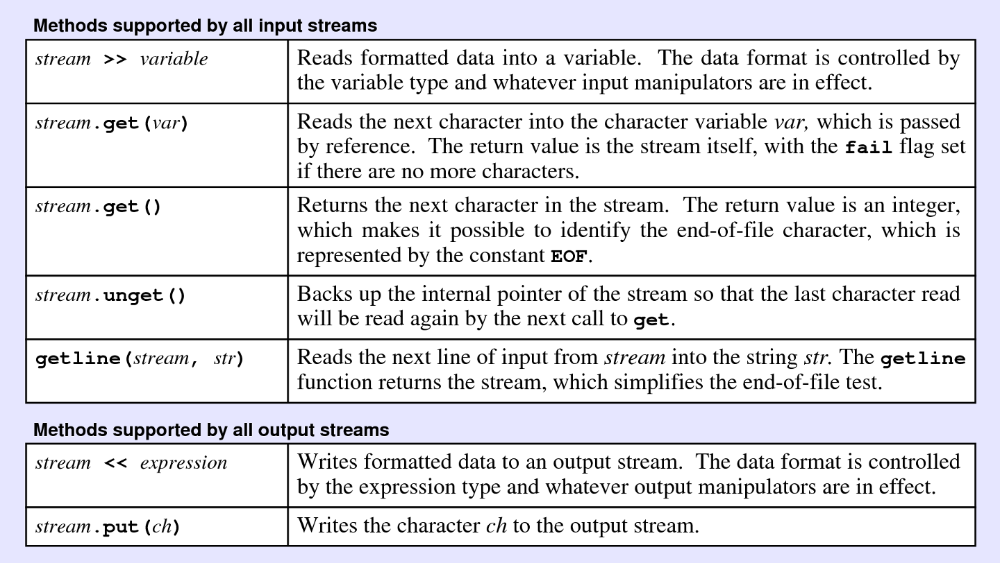

# 4. Streams

*Last Update: 23-09-20*

## 4.1 Introduction

Actually, there had been multiple functions for streams in `<cstdio>` from C standard library, like `printf` with *specifiers*, which is out-of-scope of the text. 

```cpp
#include <cstdio>
#include <iostream>
#include <iomanip>
using namespace std;

int main() {
   char c = 'a';
   int i = 1;
   double d = 3.14159265358979323846;
   /* C style, acceptable in C++ */
   printf("This is a character: %c\n", c);
   printf("This is an integer: %d\n", i);
   printf("This is a double: %.2f\n", d);  // floating number, with 2 digits reserved
   /* C++ style */
   cout << "This is a character: " << c << endl;
   cout << "This is an integer: " << i << endl;
   cout << "This is a double: " << fixed 
        << setprecision(2) << d << endl;   // float, 2 digits
   return 0;
}
```

For a standard output in C++, we will introduce *C++ streams* with syntax like`std::cin` and `std::cout`.

Here we introduce the important *object* called a ***stream***. A stream is an *abstraction* (object) that represents an input **source** or output **destination** of characters of indefinite length, on which *input* and *output* operations can be performed, like:

+ **File stream:** a disk file
+ **Keyboard:** standard input stream `cin`
+ **Console:** the output stream `cout`

## 4.2 Input and Output

### 4.2.1 Input: Insertion

The standard technique to specify formatted output in C++ uses the ***insertion operator***, which is written as `<<`. This operator takes **an output stream** on the left and **an expression of any type** on its right. 

The insertion operator **returns the output stream** as its result. The advantage of this interpretation is that output operations can be chained together

C++ allows you to control the output *format* by including items in the output chain called *manipulators* in `<iomanip>`, with common functions like

| Function                | Description                                         |
| ----------------------- | --------------------------------------------------- |
| `endl`                  | Moves cursor to the next line.                      |
| `setw(n)`               | Sets the width of the next value to `n` characters. |
| `setprecision(digits)`  | Sets how many digits should appear.                 |
| `setfill(ch)`           | Sets the fill character used to pad values.         |
| `left`                  | Aligns the value at the left edge of the field.     |
| `right`                 | Aligns the value at the right edge of the field.    |
| `fixed`                 | Sets fixed-point output (no scientific notation).   |
| `scientific`            | Sets scientific-notation output.                    |
| `showpoint/noshowpoint` | Controls whether a decimal point must appear.       |
| `showpos/noshowpos`     | Controls appearance of a plus sign.                 |
| `uppercase/nouppercase` | Controls whether uppercase is used in hex.          |
| `boolalpha/noboolalpha` | Controls whether bools appear as `true`/`false`.    |

Here is the example:

```cpp
#include <iostream>
#include <iomanip>
using namespace std;

const double PI = 314.159265358979323846;

int main() {
   cout << fixed << setprecision(20) << PI << endl;
   cout << fixed << setprecision(6) << PI << endl;
   cout << scientific << setprecision(15) << PI << endl;
   cout << uppercase << scientific << setprecision(6) << PI << endl;
   cout << fixed << setw(16) << setprecision(9) << PI << endl;
   cout << fixed << setfill('0') << setw(10) 
     		<< setprecision(4) << PI << endl;
   cout << fixed << setfill('0') << setw(10) 
     		<< setprecision(4) << left << PI << endl;
   return 0;
}
```

The corresponding output is:

```txt
314.15926535897932581065
314.159265
3.141592653589793e+02
3.141593E+02
   314.159265359
00314.1593
314.159300
```

### 4.2.2 Output: Extraction

For input, C++ includes the `>>` operator, which is called the ***extraction operator***. The `>>` operator is symmetrical to the `<<` operator and reads **formatted data from the stream** on the left **into** the variables that appear on the right.

Here is a critical comparison of *manipulators* concerning `ws`:



To conclude in one sentence,

- `skipws` is a **persistent** setting that automatically skips any leading whitespace characters before all read operations.

  ```cpp
  std::cin >> std::skipws >> variable;
  ```

- `ws` is a **one-time** stream manipulator used to clear all leading whitespace characters before a specific read operation, often set before `getline` and so on.

  ```cpp
  std::cin >> ws;
  std::getline(std::cin, line);
  ```

Here is an example:

```cpp
#include <iostream>
#include <sstream>

int main() {
    std::istringstream iss("   123");
    int value;

    iss >> noskipws >> value; // ERR: ws is not skipped so it fails.
    std::cout << value << std::endl; // ERR: undefined value

    iss.clear();  // Clear error flags
    iss.seekg(0); // Reset stream position

    iss >> ws >> value; // Use ws to skip leading whitespace.
    std::cout << value << std::endl; // Output: 123

    return 0;
}
```

## 4.3 File Streams

A *file* is the generic name for any named collection of **multiple types** of data maintained on the  **permanent** storage media attached to a computer. Files can be both a source associated to an input stream and a destination associated to an output stream.

To use data from a **text file**, it takes steps like

+ **Declare the variables:** Construct a new `ifstream` object by declaring a stream variable for the reference to the file.
+ **Open the file: **Call the `open` method for the stream. For historical reasons, the argument to open is applied for a **C string literal** rather than a C++ String object.
+ **Call the function:** Call the methods provided by the `<ifstream>` class to read data from the file in sequential order.
+ **Close the file:** Break the association between the reader and the file by calling the stream’s `close` method.

Here are some **methods** for processing the file:






The following program does not uppercase the first character in a file. As `get` is executed, the head will automatically move to the next. For example, if the initial one is **"text"**, it will actually convert into **"tTxt"**. For an appropriate conversion, apply `file.seekp(0);` instead.

```cpp
#include <iostream>
#include <fstream>
#include <string>
#include <cctype>
using namespace std;
int main() {
   string filename;
   fstream file;
   char c;
   cout << "Input file name: ";
   cin >> filename;
   
   file.open(filename.c_str());
   file.get(c); // Equivalent: c = file.get();
   c = toupper(c);
   file.put(c);
   file.close();
   
   return 0;
}
```

**Function `get`**

Here are some more details about `get`:

+ If you supply no arguments, `get()` reads and returns the next character value as an `int`, which is `EOF` at the end of the file.

  ```cpp
  int ch;   // int get();
  while ((ch = infile.get()) != EOF) {}
  ```

+ If you instead pass a *character variable* by reference, `get(ch)` reads the next character into that variable.  This form of get returns a value that acts like `false` at the end of the file. 

  This approach is **less conventional** but **more convenient**.
  
  ```cpp
  char ch;   // istream& get(char& c);
  while (infile.get(ch)) {}
  while (!infile.fail()) {}
  ```
  

Also, the effect of `getline` is to store the next line of data from the file into the string variable after **discarding the end-of-line character**.

+ To work with C++ String, the *free function* `std::getline` is defined in `<string>` and works as

  ```cpp
  istream & getline(istream & is, string & str, char delim);
  istream & getline(istream & is, string & str);
  ```

+ To work with C String, another **overloaded version** is the one from `istream` class, which is `std::stream::getline`

  ```cpp
  istream & getline(char * s, streamsize n);
  istream & getline(char * s, streamsize n, char delim);
  ```

The `istream` is in the parameter list of the first version but not in the second one.

## 4.4 String Streams

Compared with strings, text files have characteristics including:

+ The information stored in a file is **permanent**;
+ Data in files are usually accessed **sequentially**.

A ***string*** is a collection of characters, a ***stream*** is an object to manipulate a flow of data (e.g. characters), and a ***string stream*** is a special stream object that lets you use a string as the source and destination of the flow of data.

Given that files and strings are both sequences of characters, we have the following libraries

+ `<sstream>`: Exports several classes that associate a stream **with a string value**.

+ `<fstream>`: Exports several classes that associate a stream **with a file**.

+ The `istringstream` class is the counterpart of `ifstream` and makes it possible to use stream operators to **read data** from a string;

  For output, the `ostringstream` class works very much like `ofstream` except that **the output** is directed to a string rather than a file.

```cpp
#include <iostream>
#include <string>
#include <sstream>
using namespace std;

int main() {
    int i;
    cin >> i;
    cout << "My favorite number is: " << i << endl;
    string s = "My favorite number is: " + to_string(i); // since C++11
    cout << s << endl;
    stringstream ss;
    ss << "My favorite number is: " << i;
    s = ss.str();
    cout << s << endl;
}
```

---

