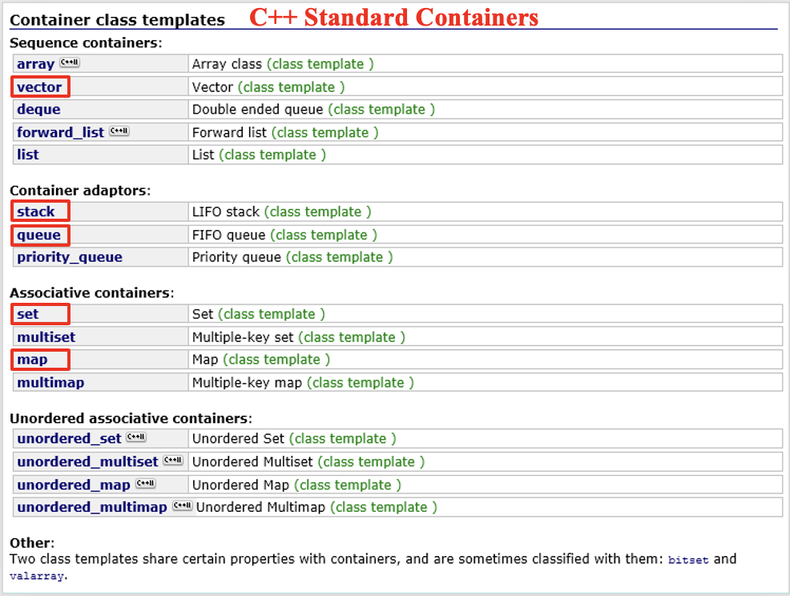
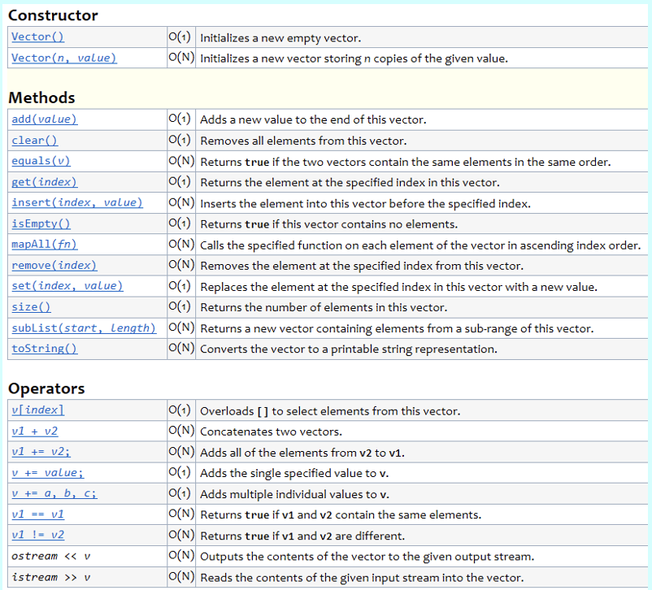
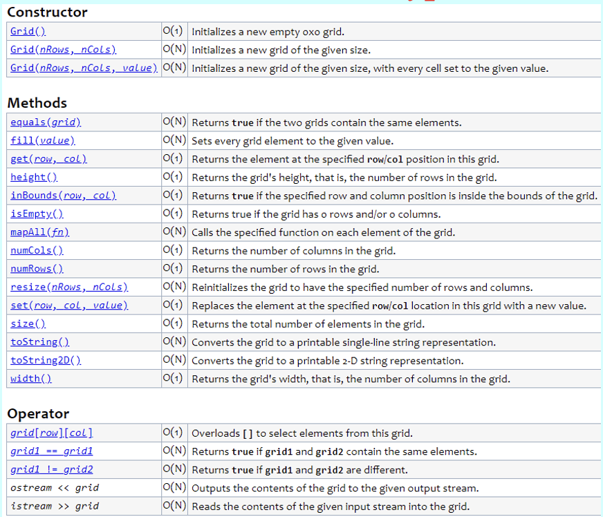
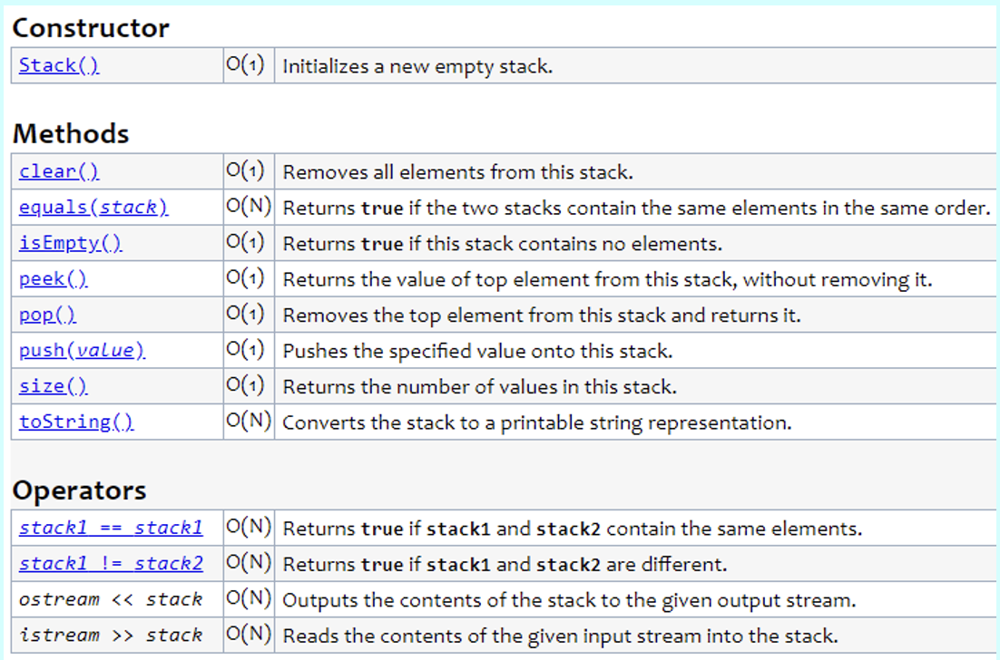
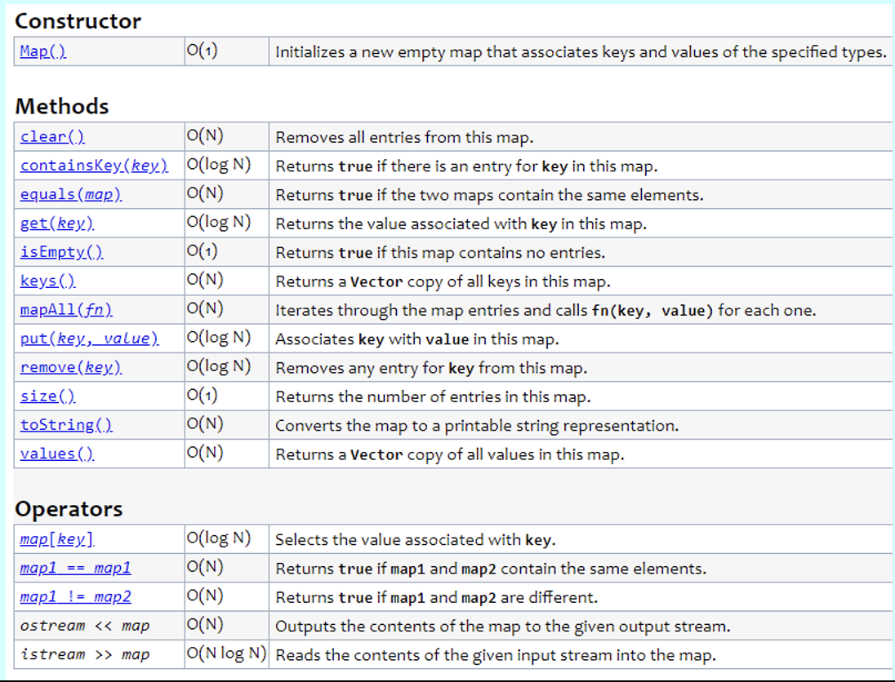
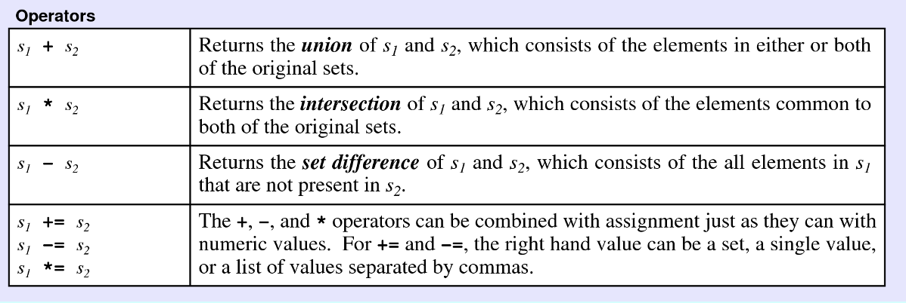
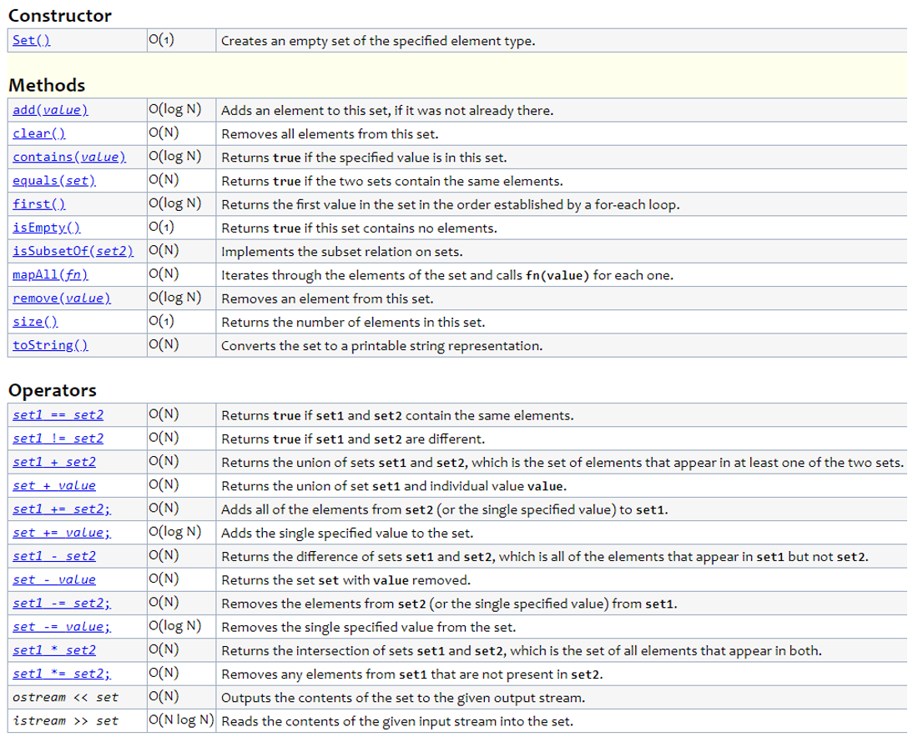
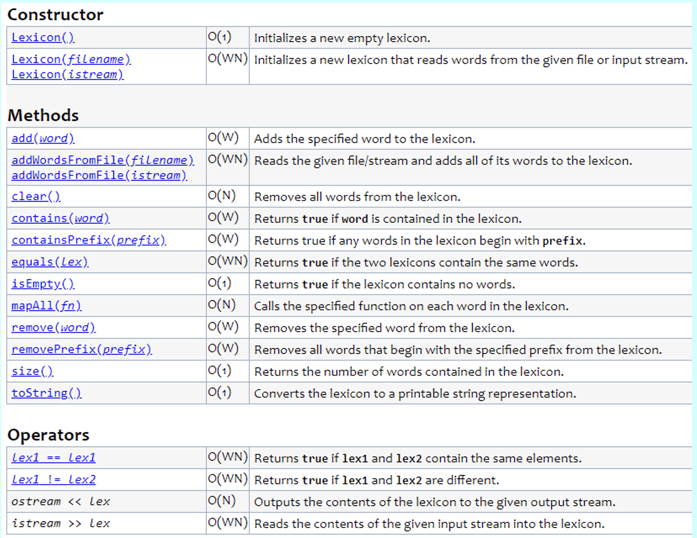

# 5. Collections

> The collection classes, Classes for clients, Iterating over a collection

*Last Update: 23-11-17*

## 5.1 The collection classes
### 5.1.1 Abstract Data Type

A type defined in terms of its behavior rather than its representation is called an ***Abstract Data Type (ADT)***.

The classes that contain collections of other objects are called ***containers*** or ***collection*** *classes*, while classes that include a base-type specification are called *parameterized classes*.

In C++, parameterized containers are implemented as *template* classes. The *C++ Standard Library* and the *Standard Template Library (STL)* share many features, though neither is a strict superset of the other.

Here you could have a look at the ***container*** class templates:



### 5.1.2 The Stanford Collection Classes

In order to let students have a brief understanding of the *Colletions*, the Stanford C++ Library is implemented. The Stanford C++ Library includes a simplified version of that in Standard C++ Libraries, such as ***Vector***, ***Grid***, ***Stack***, ***Queue***, ***Map***, ***Set*** and ***Lexicon***. Here are some general rules:

+ These classes represent *ADTs* whose details are hidden.

+ Each class (except ***Lexicon***) requires ***type*** parameters.

+ Declaring variables of these types always invokes a class *constructor*.

+ Any memory for these objects is **freed (automatically)** when its declaration scope ends.

+ Assigning one value to another **copies** the entire structure. To avoid copying, these structures are usually passed **by reference**.

## 5.2 Classes for clients

### 5.2.1 The `Vector<type>` Class

The ***Vector*** class provides a facility similar to *list* in Python, and the underlying implementation is based on **array** in C++.

Start by `#include "vector.h"`, you could think as a **client** of the class.

**Declaring a Vector object**

For the instance to be created:

| Syntax                        | Description                                                  |
| ----------------------------- | ------------------------------------------------------------ |
| `Vector<Type> vec;`           | Initializes an empty vector of the specified element type.   |
| `Vector<Type> vec(n);`        | Initializes a vector with `n` elements set to default value of the type. |
| `Vector<Type> vec(n, value);` | Initializes a vector with `n` elements all set to `value`.   |

The Stanford C++ library implementation of *Vector* includes a shorthand form for initializing an array given a list of values:

```cpp
Vector<int> digits;
digits += 0, 1, 2, 3, 4, 5, 6, 7, 8, 9;
```

It is possible to create **nested** vectors, but the spaces around the inner type parameter are necessary, in case it is recognized as the extraction operator`>>` . 

For example, declare a two-dimensional vector of characters as 

```cpp
Vector< Vector<char> > nestedVector;
```

The type parameter can be of any C++ type. The following definition to represent a list of chess positions (a three-dimensional vector):

```cpp
Vector< Grid<char> > chessPositions; 
```

**Methods in the Vector Class**

Here are methods that are most frequently used:

| Method                                 | Description                                            |
| -------------------------------------- | ------------------------------------------------------ |
| `vec.size()`                           | Returns the number of elements in the vector.          |
| `vec.isEmpty()`                        | Returns `true` if the vector is empty.                 |
| `vec.get(i)`, `vec[i]`                 | Returns the `i`th element of the vector.               |
| `vec.set(i, value)`, `vec[i] = value;` | Sets the `i`th element of the vector to `value`.       |
| `vec.add(value)`, `vec += value`       | Adds a new element to the **end** of the vector.       |
| `vec.insert(index, value)`             | Inserts the value before the specified index position. |
| `vec.remove(index)`                    | Removes the element at the specified index.            |
| `vec.clear()`                          | Removes all elements from the vector.                  |

There are even more for references:



For example, it works as

```cpp
#include "vector.h"
Vector<int> vec;
vec.add(10);    // vec += 10;
vec.add(20);
vec.add(40);
vec.add(50);
vec.insert(2, 30);
vec.remove(0);
vec.set(3, 70); // vec[3] = 70;
```

**Methods in the STL vector Class (Omitted)**

### 5.2.2 The `Grid<type>` Class

**Methods in the Grid Class**

| Method                                   | Description                                                  |
| ---------------------------------------- | ------------------------------------------------------------ |
| `Grid<type> grid(nrows, ncols);`         | Constructs a grid with the specified dimensions.             |
| `grid.numRows()`                         | Returns the number of rows in the grid.                      |
| `grid.numCols()`                         | Returns the number of columns in the grid.                   |
| `resize(nrows, ncols)`                   | Changes the dimension of the grid and clears any previous contents. |
| `inBounds(row, col)`                     | Returns `true` if the specified row and column position is within the grid. |
| `get(i, j)`, `grid[i][j]`                | Returns the element at the specified row and column.         |
| `set(i, j, value)`, `grid[i][j] = value` | Sets the element at the specified row and column to the new value. |
| `grid[i][j]`                             | Selects the element in the `i`th row and `j`th column.       |



### 5.2.3 The `Stack<type>` Class

A ***stack*** is a data structure in which the elements are accessible only in a **Last In, First Out (LIFO)** order. This decipline is useful in programming contexts because it reflects the operation of function calls.

**Methods in the Stack Class**

| Method              | Description                                                  |
| ------------------- | ------------------------------------------------------------ |
| `stack.size()`      | Returns the number of values pushed onto the stack.          |
| `stack.isEmpty()`   | Returns `true` if the stack is empty.                        |
| `stack.push(value)` | Pushes a new value onto the stack.                           |
| `stack.pop()`       | **Removes and returns** the top value from the stack.        |
| `stack.peek()`      | Returns the top value from the stack **without removing it**. |
| `stack.clear()`     | Removes all values from the stack.                           |



**Methods in the STL stack Class (Omitted)**

### 5.2.3 The `Queue<type>` Class

A data structure that stores items using a **FIFO** discipline is called a ***queue***.

**Methods in the Queue Class**

| Method                 | Description                                                  |
| ---------------------- | ------------------------------------------------------------ |
| `queue.size()`         | Returns the number of values in the queue.                   |
| `queue.isEmpty()`      | Returns `true` if the queue is empty.                        |
| `queue.enqueue(value)` | Adds a new value to the *tail* of the queue.                 |
| `queue.dequeue()`      | **Removes and returns** the value at its head.               |
| `queue.peek()`         | Returns the value at the head of the queue without removing it. |
| `queue.clear()`        | Removes all values from the queue.                           |

**Methods in the STL queue Class (Omitted)**

### 5.2.4 The `Map<type>` Class
A ***map*** is conceptually similar to a dictionary in real life (and in Python), associating **keys** and **values**, which allows you to look up a word to find its meaning. It is declared as

```cpp
Map<key_type, value_type> map;
```

The type for the keys stored in a `Map` must define **a natural ordering**, usually through a `less` function and/or `<` operator so that the keys can be compared and ordered.

**Methods in the Map Classes**

The library offers two flavors of maps, ***Map*** and ***HashMap*** (more about hash later), both of which implement the following methods: 

| Method                                    | Description                                                  |
| ----------------------------------------- | ------------------------------------------------------------ |
| `map.size()`                              | Returns the number of `key`/`value` pairs in the map.        |
| `map.isEmpty()`                           | Returns `true` if the map is empty.                          |
| `map.put(key, value)`, `map[key] = value` | Makes an association between `key` and `value`, discarding any existing one. |
| `map.get(key)`, `map[key]`                | Returns the most recent value associated with `key`.         |
| `map.containsKey(key)`                    | Returns true if there is a value associated with `key`.      |
| `map.remove(key)`                         | Removes `key` from the map along with its associated value, if any. |
| `map.clear()`                             | Removes all `key`/`value` pairs from the map.                |



**Methods in the STL map Classes**

### 5.2.5 The `Set<type>` Class

This class is used to model the mathematical abstraction of a ***set***, which is a collection in which the elements are **unordered** and in which each value appears only once (**no duplicate**). The easy way to implement the `Set` class is to build it on top of the `Map` class.

**Methods in the Set Classes**

| Method                | Description                                                  |
| --------------------- | ------------------------------------------------------------ |
| `set.size()`          | Returns the number of elements in the set.                   |
| `set.isEmpty()`       | Returns `true` if the set is empty.                          |
| `set.add(value)`      | Adds `value` to the set.                                     |
| `set.remove(value)`   | Removes `value` from the set.                                |
| `set.contains(value)` | Returns `true` if the set contains the specified `value`.    |
| `set.clear()`         | Removes all words from the set.                              |
| `s1.isSubsetOf(s2)`   | Returns `true` if `s1` is a subset of `s2`.                  |
| `set.first()`         | Returns the first element of the set in the ordering specified by the value type. |

***Set*** also supports several mathematical operations (via operator *overloading*) based on mathematical *set theory*, in addition to the usual methods exported by the other collection classes.





The implementation of the `<cctype>` is highly based on ***Set***.

**Methods in the STL set Classes**

### 5.2.6 The Lexicon Class

**A set of words** with no associated definitions is called a ***lexicon***. Creating an English word list like:

```cpp
Set<string> english;
ifstream infile;
infile.open("EnglishWords.txt");
if (infile.fail()) error("Can't open EnglishWords.txt");

string word;
while (getline(infile, word)) {
   english.add(word);
}
infile.close();
```

which is equivalent to

```cpp
Lexicon english("EnglishWords.txt");
```

**Methods in the Lexicon Classes**

### Lexicon

| Method                               | Description                                                  |
| ------------------------------------ | ------------------------------------------------------------ |
| `lexicon.size()`                     | Returns the number of words in the lexicon.                  |
| `lexicon.isEmpty()`                  | Returns `true` if the lexicon is empty.                      |
| `lexicon.add(word)`                  | Adds `word` to the lexicon, always in **lowercase**.         |
| `lexicon.addWordsFromFile(filename)` | Adds all the words in the specified file to the lexicon.     |
| `lexicon.contains(word)`             | Returns `true` if the lexicon contains the specified `word`. |
| `lexicon.containsPrefix(prefix)`     | Returns `true` if the lexicon contains any word beginning with `prefix`. |
| `lexicon.clear()`                    | Removes all words from the lexicon.                          |



The ***Lexicon*** representation is extremely space-efficient. It makes it possible to implement a `containsPrefix` method that is useful in many applications, makeing it easy for *iterators* to process the words in alphabetical order.

## 5.3 Iterating over a collection

One of the common operations that clients need to perform when using a collection is to **iterate through the elements**. 

While it is easy to implement iteration for vectors and grids using `for` loops, the modern approach is to use a general tool called an **iterator** that delivers the elements of the collection, one at a time.

+ C++11 uses a ***range-based for*** **statement** to simplify iterators:

  ```cpp
  for (string key : map) {}
  ```

+ The Stanford libraries provide an alternative like this:

  ```cpp
  foreach (string key in map) {}
  ```

For the iterator order, you could kindly refer to the documentation. In Stanford C++ Library, iterators work as follows:

- Iterators for the `Vector` class operate in index order.
- Iterators for the `Grid` class operate in *row-major order*, which means that the iterator runs through every element in row 0, then every element in row 1, and so on.
- Iterators for the `Map` class deliver the keys in the order imposed by the standard comparison function for the key type; iterators for the `HashMap` class return keys in a *seemingly random order*.
- Iterators for the `Set` class deliver the elements in the order imposed by the standard comparison function for the value type; the `HashSet` class is unordered.
- Iterators for the `Lexicon` class always deliver words in alphabetical order.

We will discuss more about *STL* later.


---

