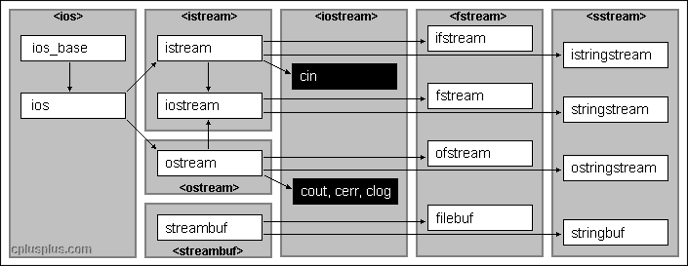

# Functions & Libraries II

*Last Update: 23-11-18*

## 1. Libraries

Libraries can be viewed from various aspects:

+ Code that uses a library is called a ***client***. 
+ The code for the library itself is called the ***implementation***.

+ The point at which the client and the implementation meet is called the ***interface***, which serves as **sharing and reuse** and **abstraction and hiding**.

Also, we briefly recommend some mathematical functions from `<cmath>`:

| Function      | Description                                                  |
| ------------- | ------------------------------------------------------------ |
| `abs(x)`      | Returns the absolute value of `x`.                           |
| `sqrt(x)`     | Returns the square root of `x`.                              |
| `floor(x)`    | Returns the largest integer less than or equal to `x`.       |
| `ceil(x)`     | Returns the smallest integer greater than or equal to `x`.   |
| `exp(x)`      | Returns the exponential function of `x` (`e^x`).             |
| `log(x)`      | Returns the natural logarithm (base `e`) of `x`.             |
| `log10(x)`    | Returns the common logarithm (base `10`) of `x`.             |
| `pow(x, y)`   | Returns `x^y`.                                               |
| `cos(theta)`  | Returns the trigonometric cosine of the radian angle `theta`. |
| `sin(theta)`  | Returns the sine of the radian angle `theta`.                |
| `tan(theta)`  | Returns the tangent of the radian angle `theta`.             |
| `atan(x)`     | Returns the principal arctangent of `x`.                     |
| `atan2(y, x)` | Returns the arctangent of `y` divided by `x`.                |

**Relationship Between C and C++**

One of the fundamental design principles of C++ was that it would **contain C as a subset**, which makes it possible to **convert** applications from C to C++ **incrementally**, but cause C++ to be **less consistent and integrated** than it might otherwise be.

## 2. Implement Libraries

**Think like an implementer**

In C++, libraries are made available to clients through the use of an interface file that has the suffix `.h`, which designates a *header file*. In order to design a good interface, there are a couple you need to follow:

+ **Unified**. Every library should define a consistent abstraction with a clear unifying theme. If a function does not fit within that theme, it should not be part of the interface.

+ **Simple**. The interface design should simplify things for the client. To the extent that the underlying implementation is itself complex, the interface must seek to hide that complexity.

+ **Sufficient**. For clients to adopt a library, it must provide functions that meet their needs. If some critical operation is missing, clients may decide to abandon it and develop their own tools. 

+ **General**. A well-designed library should be general enough to meet the needs of many different clients. A library that offers narrowly defined operations for one client is not nearly as useful as one that can be used in many different situations.

+ **Stable**. The functions defined in a class exported by a library should maintain precisely the same structure and effect, even as the library evolves. Making changes in the behavior of a library forces clients to change their programs, which reduces its utility.

Here is an illustration with the following `error.h` file:

```cpp
/*
 * File: error.h
 * -------------
 * This file defines a simple function for reporting errors.
 */

#ifndef _error_h
#define _error_h
// #include <string>
// using namespace std; 

/*
 * Function: error
 * Usage: error(msg);
 * ------------------
 * Writes the string msg to the cerr stream and then exits the program
 * with a standard status code indicating failure.
 */

void error(std::string msg);

#endif
```

Here are some reminders in the interface:

+ Interfaces require standardized *preprocessor directive definitions* called ***boilerplate***, to ensure that the interface file is read only once during a compilation.

+ `using namespace` should generally NOT be used in a header file, because it will probably be included by many other source files.

+  `#include <string>` was omitted as well, because `error.h` is included in `error.cpp`, and `<string>`is included there.

The implementations of those functions appear in the corresponding `.cpp` file:

```cpp
/*
 * File: error.cpp
 * ---------------
 * This file implements the error.h interface.
 */

#include <iostream>	// cerr, endl
#include <cstdlib>	// exit, EXIT_FAILURE
#include <string>		// string
#include "error.h" 
using namespace std;

void error(string msg) {
   cerr << msg << endl;
   exit(EXIT_FAILURE); // represent a standard failure code.
}
```

Here are some reminders during the implementation:

+ Implementation files typically include their own interface. 
+ `using namespace` should always come after the inclusion of all the libraries and header files, because it affects all the code after it.

**Exporting types**

Let’s create an interface that exports one of the **enumerated types**, such as the `Direction` type used to encode the four standard compass points:

```cpp
/*
 * File: direction.h
 * -----------------
 * This interface exports an enumerated type called Direction whose
 * elements are the four compass points: NORTH, EAST, SOUTH, and WEST.
 */

#ifndef _direction_h
#define _direction_h

#include <string>

/*
 * Type: Direction
 * ---------------
 * This enumerated type is used to represent the four compass directions.
 */

enum Direction { NORTH, EAST, SOUTH, WEST };

/*
 * Function: leftFrom
 * Usage: Direction newdir = leftFrom(dir);
 * ----------------------------------------
 * Returns the direction that is to the left of the argument.
 * For example, leftFrom(NORTH) returns WEST.
 */

Direction leftFrom(Direction dir);

/*
 * Function: rightFrom
 * Usage: Direction newdir = rightFrom(dir);
 * -----------------------------------------
 * Returns the direction that is to the right of the argument.
 * For example, rightFrom(NORTH) returns EAST.
 */

Direction rightFrom(Direction dir);

/*
 * Function: directionToString
 * Usage: string str = directionToString(dir);
 * -------------------------------------------
 * Returns the name of the direction as a string.
 */

std::string directionToString(Direction dir);

/*
 * Operator: <<
 * Usage: cout << dir;
 * -------------------
 * Overloads the << operator so that it is able to display Direction values.
 */

std::ostream & operator<<(std::ostream & os, Direction dir);

/*
 * Operator: ++
 * Usage: ++dir
 * ------------
 * Overloads the prefix version of the ++ operator to work with Direction
 * values.
 */

Direction operator++(Direction & dir);

/*
 * Operator: ++
 * Usage: dir++
 * ------------
 * Overloads the suffix version of the ++ operator to work with Direction
 * values, to support, e.g., the idiom
 *
 *    for (Direction dir = NORTH; dir <= WEST; dir++) . . .
 */

Direction operator++(Direction & dir, int);

#endif
```

Here we further implement it:

```cpp
/*
 * File: direction.cpp
 * -------------------
 * This file implements the direction.h interface.
 */

#include <string>
#include "direction.h"
using namespace std;

Direction leftFrom(Direction dir) {
   return Direction((dir + 3) % 4);
}
Direction rightFrom(Direction dir) {
   return Direction((dir + 1) % 4);
}

string directionToString(Direction dir) {
   switch (dir) {
    case NORTH: return "NORTH";
    case EAST: return "EAST";
    case SOUTH: return "SOUTH";
    case WEST: return "WEST";
    default: return "???";
   }
}

/* Implementaion: arithmetic operations */
std::ostream & operator<<(std::ostream & os, Direction dir) {
   return os << directionToString(dir);
}

Direction operator++(Direction & dir) {
   dir = Direction(dir + 1);
   return dir;
}

Direction operator++(Direction & dir, int) {
   Direction old = dir;
   dir = Direction(dir + 1);
   return old;
}
```

In C++, constants are by default *static* in the scope of a file, which means they are only accessible within the file they are defined in (also known as translation unit scope). 

If you want to use a constant defined in one file in other files as well, you need to declare it with the `extern` keyword.

```cpp
// in constants.h
extern const double PI;

// in constants.cpp
#include "constants.h"
extern const double PI = 3.141592653589793;
```

**The collection Class**

The classes that contain collections of other objects are called **containers** or **collection** classes.

Collection classes specify the type of objects they contain (base/element type) by including the type name in angle brackets following the class name. It offers the following advantages:

+ **Simplicity**: Fewer details for the client to understand.

+ **Flexibility**: Free to change underlying implementation as long as the interface remains the same.

+ **Security**: Prevents the client from changing the values in the underlying data structure in unexpected ways.

**Library vs Class Hierarchy**

Interestingly, the C++ stream libraries are not organized based on the class hierarchies.

Here is the organization of the *stream*:



which is slightly different from the hierarchies:


**Dynamic Libraries**

In case the size of the library is too large, we still have ***dynamic libraries***, compared to static ones.

| Operating System | Dynamic library | Static library | Library prefix |
| ---------------- | --------------- | -------------- | -------------- |
| Windows          | .dll            | .lib           | N/A            |
| macOS            | .dylib          | .a             | lib            |
| FreeBSD          | .so             | .a             | lib            |
| Linux            | .so             | .a             | lib            |

## 3. Designing a Random Number Library

Given that true nondeterminism is so difficult to achieve in a computer, libraries such as the `random.h` interface described in this chapter must instead *simulate* randomness by carrying out a deterministic process that satisfies the following criteria, which is said to be **pseudorandom**:

+ The values generated by that process should be difficult for human observers to predict.

+ Those values should appear to be random, in the sense that they should pass statistical tests for randomness.

We apply the function `rand` from `<cstdlib>`. It takes no arguments and returns an integer between 0 and `RAND_MAX` randomly. We still need:

+ Selecting a random integer in a specified range

+ Choosing a random real number in a specified range

+ Simulating a random event with a specific probability

Here we have the `random.h` as an interface:

```cpp
/*
 * File: random.h
 * --------------
 * This file exports functions for generating pseudorandom numbers.
 */

#ifndef _random_h
#define _random_h

/*
 * Function: randomInteger
 * Usage: int n = randomInteger(low, high);
 * ----------------------------------------
 * Returns a random integer in the range low to high, inclusive.
 */

int randomInteger(int low, int high);

/*
 * Function: randomReal
 * Usage: double d = randomReal(low, high);
 * ----------------------------------------
 * Returns a random number in the half-open interval [low, high).
 * A half-open interval includes the first endpoint but not the 
 * second.
 */

double randomReal(double low, double high);

/*
 * Function: randomChance
 * Usage: if (randomChance(p)) ...
 * -------------------------------
 * Returns true with the probability indicated by p.  The
 * argument p must be a floating-point number between 0 (never)
 * and 1 (always).
 */

bool randomChance(double p);

/*
 * Function: randomBool
 * Usage: if (randomBool()) ...
 * -------------------------------
 * Returns <code>true</code> with 50% probability.
 */

bool randomBool();

/*
 * Function: setRandomSeed
 * Usage: setRandomSeed(seed);
 * ---------------------------
 * Sets the internal random number seed to the specified value.
 * You can use this function to set a specific starting point
 * for the pseudorandom sequence or to ensure that program
 * behavior is repeatable during the debugging phase.
 */

void setRandomSeed(int seed);

#endif
```

Here is the `random.cpp` implemetation with detailed comments:
```cpp
/*
 * File: random.cpp
 * ----------------
 * This file implements the random.h interface.
 */

#include <cstdlib>
#include <cmath>
#include <ctime>
#include "random.h"
using namespace std;

/* Private function prototype */
void initRandomSeed();

/*
 * Implementation notes: randomInteger
 * -----------------------------------
 * The code for randomInteger produces the number in four steps:
 *
 * 1. Generate a random real number d in the range [0 .. 1).
 * 2. Scale the number to the range [0 .. N).
 * 3. Translate the number so that the range starts at low.
 * 4. Truncate the result to the next lower integer.
 *
 * The implementation is complicated by the fact that both the
 * expression RAND_MAX + 1 and the expression high - low + 1 can
 * overflow the integer range.
 */

int randomInteger(int low, int high) {
   initRandomSeed();
   double d = rand() / (double(RAND_MAX) + 1);
   double s = d * (double(high) - low + 1);
   return int(floor(low + s));
}

/*
 * Implementation notes: randomReal
 * --------------------------------
 * The code for randomReal is similar to that for randomInteger,
 * without the final conversion step.
 */

double randomReal(double low, double high) {
   initRandomSeed();
   double d = rand() / (double(RAND_MAX) + 1);
   double s = d * (high - low);
   return low + s;
}

/*
 * Implementation notes: randomChance
 * ----------------------------------
 * The code for randomChance calls randomReal(0, 1) and then checks
 * whether the result is less than the requested probability.
 */

bool randomChance(double p) {
   initRandomSeed();
   return randomReal(0, 1) < p;
}

bool randomBool() {
    return randomChance(0.5);
}

/*
 * Implementation notes: setRandomSeed
 * -----------------------------------
 * The setRandomSeed function simply forwards its argument to
 * srand.  The call to initRandomSeed is required to set the
 * initialized flag.
 */

void setRandomSeed(int seed) {
   initRandomSeed();
   srand(seed);
}

/*
 * Implementation notes: initRandomSeed
 * ------------------------------------
 * The initRandomSeed function declares a static variable that
 * keeps track of whether the seed has been initialized.  The
 * first time initRandomSeed is called, initialized is false,
 * so the seed is set to the current time.
 */

void initRandomSeed() {
   static bool initialized = false;
   if (!initialized) {
      srand(int(time(NULL)));
      initialized = true;
   }
}
```

---

