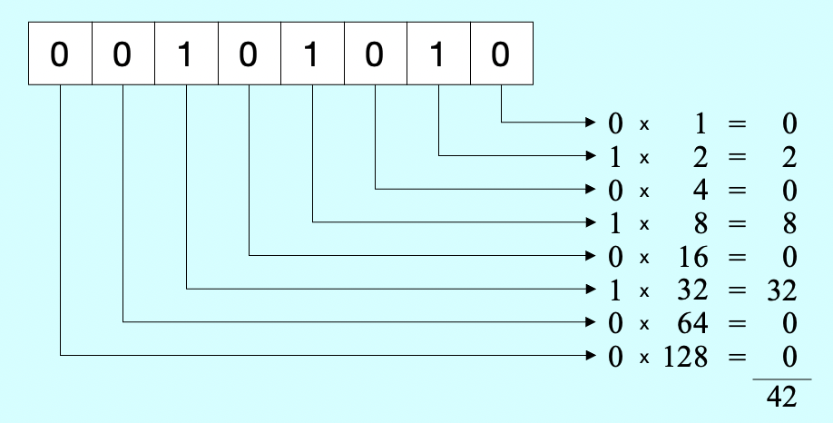
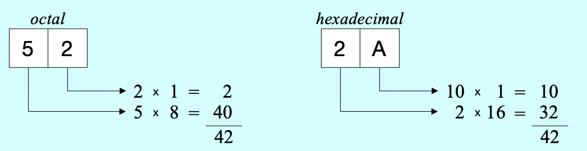
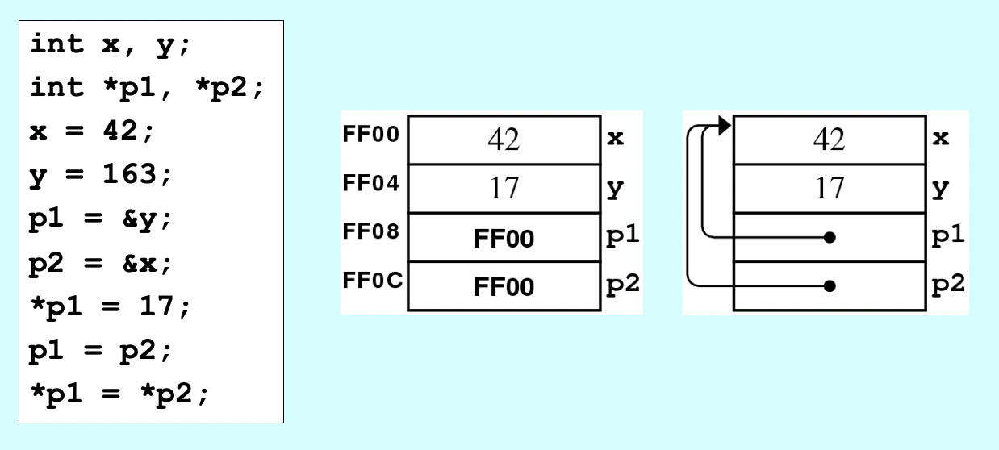

# 8. Pointers & Arrays

*Last Update: 23-10-16*

## 8.1 The structure of memory

### 8.1.1 Numbers and notions

Bytes and words can be used to represent integers of different sizes by interpreting the bits as a number in *binary notation*.



There are *octal* (base 8) or *hexadecimal* (base 16) notations as well:



Every four *binary* digits can be tranformed to one *hexadecimal* digit, thus the hexadecimal is also of vital importance.

### 8.1.2 Memory and Variables

**Structure of Memory**

+ ***bit:*** The fundamental unit of memory inside a computer (binary digit), either in the state of **0** or **1**.

+ ***byte:*** The smallest **addressable** unit on which the hardware operates as a sequence of *eight consecutive bits*.

+ ***word:*** The unit that represents the most common integer size on a particular hardware, also the number of bits the CPU can **process** at one time.

  The number of bits in a word vary from machine to machine because of architectures. For example, a word in *x86-64* (the 64-bit version of the x86 instruction set), is 64-bit.

**Word size and Address length**

+ ***word size:*** A word is usually the largest piece of data that can be transferred to/from the memory in a single operation of a particular processor, so the ***word size*** is an important characteristic of any specific processor/architecture. 

+ ***address length:*** The largest possible ***address length***, used to designate a location in memory, is typically a word, allowing one memory address to be efficiently stored in one word. 

In theory, modern *N-bit* computers can address $2^N$ bytes of memory, but in practice the amount of memory is limited by the CPU, the memory controller, etc.

**The Allocation of Memory to Variables**

When you declare a variable in a program, C++ allocates space for that variable from one of several memory regions:

+ ***static data:*** One region of memory is reserved for program code and global variables/constants that persist **throughout the lifetime of the program**. 
+ ***stack:*** Each time you **call a method**, C++ allocates a new block of memory called a ***stack frame*** to hold its local variables. 

+ ***heap:*** It is also possible to allocate memory **dynamically** from this pool of memory.

In classical architectures, the stack and heap grow toward each other to *maximize the available space*.

**Sizes of the Fundamental Types**

The memory space required to represent a value depends on the *type* of value. Although there remains some flexibility                                                                                                                                                                                                                                                                                                                                                                                                                                                                                                                                                                                                                                                                                                                                                                                                                                                                                                                                                                                                                                                                                                                                                                                                                                                                                                                                                                                                                                                                                         , the following sizes are typical:

|        Size         |    Datatypes     |
| :-----------------: | :--------------: |
|   1 byte (8 bits)   |  `char`, `bool`  |
|  2 bytes (16 bits)  |     `short`      |
|  4 bytes (32 bits)  |  `int`, `float`  |
|  8 bytes (64 bits)  | `long`, `double` |
| 16 bytes (128 bits) |  `long double`   |

+ `enum` types are typically assigned the space of an `int`.

+ `struct` types have a size equal to the sum of their fields.

+ **Arrays** take up the *element size* times *the number of elements*.

+ **Pointers** take up the space needed to hold an address, usually the size of a hardware *word*.

It is a reminder that `sizeof(t)` returns the actual number of bytes **required** to store a value of the type `t`, while `sizeof x` returns the **actual memory size** of the variable `x`.

**Variables**

A variable in C++ could be envisioned as a box capable of storing a value. Each variable has the following attributes:

+ A ***name***, which enables you to differentiate one variable from another.

+ A ***type***, which specifies what type of value the variable can contain.

+ A ***value***, which represents the current contents of the variable.

+ An ***address***.

The *address* and *type* of a named variable are fixed. The value changes whenever you *assign* a new value to the variable.

Any expression that refers to an internal memory location capable of storing data is called an ***lvalue***, which can appear on the left side of an assignment statement in C++:

+ Every ***lvalue*** is stored somewhere in memory and therefore has an address.

+ Once it has been declared, the *address* of an lvalue never changes, even though the contents of those memory locations may change.

+ The address of an lvalue is **a value of a pointer variable**, which can be stored in memory and manipulated as data.

## 8.2 Pointers

### 8.2.1 Brief Introduction

C++ is designed to allow programmers to control data at the lowest level, so the memory locations have addresses visible to the programmer.

A data item whose value is an address in memory is called a ***pointer***. 

It can be manipulated just like any other kind of data, and you could even assign one pointer value to another. Here are some characteris brought by pointers:

+ **Call by pointers:** Pointers allow you to refer to a large data structure in a compact way. 

+ **Dynamic allocation:** Pointers make it possible to reserve new memory during program execution. 

+ **Linked structures:** Pointers can be used to record relationships among data items. 

**Declaring a Pointer Variable**

To declare a variable as a pointer:

```cpp
double * px;		// a pointer to a double value
Point * pptr;		// a pointer to a Point structure
```

**Pointer Operators**

C++ includes two built-in operators for working with pointers:

+ The address-of operator `&` is written before an *lvalue* and returns the *address* of that variable.

+ The value-pointed-to operator `*` is written before a pointer expression and returns **the actual value** of a variable to which the pointer points, called ***dereferencing***.

Here is an example:

We Define a pointer variable `px` pointing to a double data, with the address of `x` assigned to `px`; also a double variable `y` getting value from pointer `px`, which is actually the value of `x`.
```cpp
double x = 2.5; 	
double * px = &x;	
double y = * px;
```

For a corresponding vivid diagram:



Here is a detailed example illustrating **why pointers are dangerous**:

```cpp
#include <iostream>
using namespace std;

int main() {
/* Here is a diagram:
 *   pi -> i = 1
 *   pd -> d = 2.0
 */
    int i = 1;
    int * pi = &i;
    double d = 2.0;
    double * pd = &d;
    cout << * pi << endl; // Output: 1
    cout << * pd << endl; // Output: 2, "default precision" of cout
    int * pi1 = (int *) pd;		
    cout << * pi1 << endl;   // Output: 0, ERR
    double * pd1 = (double *) pi;
    cout << * pd1 << endl;   // Output: 1.05845e+230, ERR
}
```

### 8.2.1 Call by Pointers

Recall *Call by Reference*, and in this `swap` example we could compare it with ***call by Pointers***:

+ Call by Reference: `swap(n1, n2)`

  The stack frame is given the *addresses* of the calling arguments rather than the *values*.

  ```cpp
  void swap(int & x, int & y) {
     int tmp = x;
     x = y;
     y = tmp;
  }
  ```

+ Call by Pointer: `swap(&n1, &n2);`

  ```cpp
  void swap(int * px, int * py) {
      int tmp = * px;
      * px = * py;
      * py = tmp;
  }
  ```

Here is the conclusion:

|                               |               Pointer                |                Reference                |
| :---------------------------: | :----------------------------------: | :-------------------------------------: |
|          Definition           |   The memory address of an object    | An alternative identifier for an object |
|          Declaration          |    `int i = 5;`<br>`int *p = &i;`    |     `int i = 5;`<br>`int & r = i;`      |
|         Dereferencing         |                `* p`                 |                   `r`                   |
|        Has an address         |             Yes (`& p`)              |         No (the same as `& i`)          |
| Pointing/referring to nothing | Yes (`NULL` / `nullptr` since C++11) |                   No                    |
| Reassignments to new objects  |                 Yes                  |                   No                    |
|         Supported by          |              C and C++               |                   C++                   |

**Pointers to Objects**

Here we will provide an example concerning pointers to objects. First we declare two variables, a **Point** object `pt` and a **Pointer** `pp` pointing to `pt`:

```cpp
Point pt(3, 4);
Point * pp = & pt;
```

Given a pointer to an object, we need to *deference* the pointers before selecting a field or calling a method. To invoke the method `getX()` of the object, you could not use

```cpp
pp.getX(); // ERR
```

As `.` takes precedence over `*`, you could not use equivalent syntaxes:

```cpp
* pp.get();  // ERR
*(pp.get()); // ERR
```

These are legal calls of methods:

```cpp
pt.getX();
(* pp).getX();
pp->getX();
```

**The Keyword `this`**

In the implementation of methods within a class, you could refer to the private instance variables just with their names in the **principle of proximity**:

+ Parameters or local variables declared in the **current method**
+ Instance variables of the **current object**
+ Global variables defined in this scope (NOT available here)

To use the same names for parameters and instance variables, use the keyword `this` (defined as a pointer to the current object), just as `self` in Python:

```cpp
Point::Point(int cx, int cy) {
   x = cx;
   y = cy;
}
```

It is equivalent to

```cpp
Point::Point(int x, int y) {
    this->x = x;
    this->y = y;
}
```

**Overloading Operators**

To overload `==` operator, we have such approaches:

+ The **free function** approach:

  ```cpp
  // in point.h, inside the class Point definition
  friend bool operator==(Point p1, Point p2);
  
  // in point.h, outside the class Point definition
  bool operator==(Point p1, Point p2);
  
  // in point.cpp
  bool operator==(Point p1, Point p2) {
     return p1.x == p2.x && p1.y == p2.y;
  }
  ```

+ The **method-based** style:

  ```cpp
  // in point.h, inside the class Point definition
  bool operator==(Point pt);
  
  // in point.cpp
  bool Point::operator==(Point pt) {
     return this->x == pt.x && this->y == pt.y;
  ```

## 8.3 Arrays

### 8.3.1 Simple C++ Arrays 

With low-level syntaxes like

```cpp
char cstr[10];  
char cstr[] = "hello";
char cstr[] = { 'h', 'e', 'l', 'l', 'o', '\0' };
```

We find ***Arrays*** have characteristics like

+ The only operator is *selection* with `[]`;
+ Array selection does not check whether index is in range;
+ The **declared length** of an array is fixed after it is initialized;
+ Arrays don't store their **actual length**, only the declared one.

The size of the array specified in the declaration is called the **allocated size**. The number of elements actively in use is called the **effective size**. To determine how many elements there are in a strange array, use `sizeof MY_ARRAY / sizeof MY_ARRAY[0]`.

### 8.3.2 Pointers and Arrays

In C++, the name of an array is synonymous with a pointer to its first element. For example, when declaring an array

```cpp
int list[100];
```

the C++ compiler treats the name `list` as a pointer to the address `& list[0]`, and `list[i]` is just `*(list+i)`.
Although an array is often treated as a *pointer*, they are not entirely equivalent. You can assign an array to a pointer (of the same type) but not vice versa, because an array is a **non-modifiable lvalue** (so are ***constant*** variables).

When you pass an array to a function, only the *address* of the array is copied into the parameter. This strategy has the effect of **calling by pointer**.

**Pointer Arithmetic**

Unlike C, C++ defines `+` and `-` operations to work with pointers. For the following declarations:

```cpp
double arr[5];
double * dp = arr;
```

To make it clear, here are some conclusions for 

```cpp
int a[] = {0, 1, 2, 3};
int * p = a; // &a[0]
```

|         |                  a                   |           &a            |          &a[0]          |            p            |
| :-----: | :----------------------------------: | :---------------------: | :---------------------: | :---------------------: |
|  Type   | array or used as pointer to an `int` |   address of an array   |   address of an `int`   |   pointer to an `int`   |
| Size of |         16 (4`*int` length)          |       4 (a word)        |       4 (a word)        |       4 (a word)        |
| lvalue  |         Yes (non-modifiable)         |           No            |           No            |           Yes           |
|  Value  |               `ADDR1`                |         `ADDR1`         |         `ADDR1`         |         `ADDR1`         |
|    *    |                  0                   |         `ADDR1`         |            0            |            0            |
|    &    |               `ADDR1`                |           N/A           |           N/A           |         `ADDR2`         |
|   +1    |        `ADDR1`+1`*int` length        | `ADDR1` +4`*int` length | `ADDR1` +1`*int` length | `ADDR1` +1`*int` length |

`&a` is a pointer at the entire array, and that is why the address will increase by a size of **the entire array**.

**C String are Pointers to Characters**

C++ supports the old *C Strings*, which is a pointer to a character, which is the first element of a character array, terminated by the *null character* `\0`:

```cpp
char* msg = "hello, world";
```

Here are two implementations of the C String Functions:

+ C Library function `strlen(cstr)` that returns the length of C-String `cstr`;

  ```cpp
  int strlen(char str[]) {
     int n = 0;
     while (str[n] != '\0') {
        n++;
     }
     return n;
  }
  
  int strlen(char * str) {
     int n = 0;
     while (*str++ != '\0') {
        n++;
     }
     return n;
  }
  
  int strlen(char * str) {
     char * cp;
     for (cp = str; *cp != '\0'; cp++);
     return cp - str;
  }
  ```

+ C Library function `strcpy(dst, src)`, which copies the characters from the string `src` into the character array indicated by `dst`.

  ```cpp
  void strcpy(char * dst, char * src) {
     while (*dst++ = *src++);
  }
  ```
  Understanding the `p++` idiom is important primarily because the same syntax comes up in ***STL iterators***, which are used everywhere in professional code. Here are brief explanations:
  
  + The pointer expression `* p++` is equivalent to `*(p++)`, because ***unary operators*** in C++ are evaluated in right-to-left order.
  + The `*p++` idiom means dereference `p` and return as an lvalue the object to which it currently points, and increment the value of `p` so that the new `p` points to the next element in the array.
  + Be careful with ***buffer overflow errors***.

---

