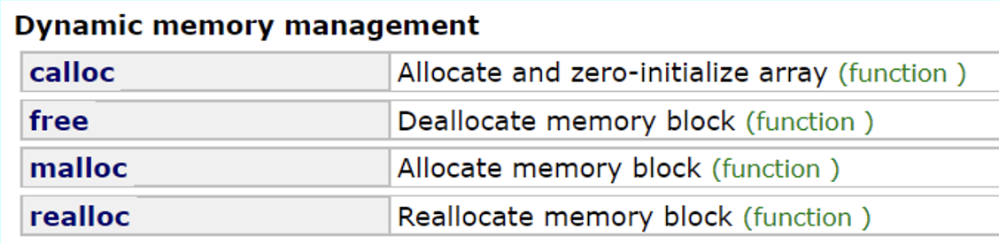

## 9. Dynamic Memory Management

*Last Update: 23-10-18*

## 9.1 Dynamic Allocation

### 9.1.2 Basic Memory Allocation

Here are two basic C++ syntaxes of memory allocation, and always pair these two when using:

+ The `new` operator to allocate memory on the heap

  ```cpp
  int * pi = new int; // allocate space for a int on the heap
  int * arr = new int[10]; // allocate an array of 10 integers
  ```
  
+ The `delete` operator frees memory previously allocated.

  ```cpp
  delete pi;
  delete [] arr; // for arrays
  ```
  As you see, no *size* is needed to be specified for `delete []`. 
  
  Also, `delete ptr` only frees the memory space pointed by `ptr`, but not the memory space occupied by itself. `ptr` is still a live, **dangling** variable until it is released.
  
  To avoid dangling pointers, after deleting a pointer one can *nullify* a pointer by
  
  ```cpp
  ptr = NULL; // nullptr since C++11
  ```

Here is an example of ***dynamic arrays***:

```cpp
int* createIndexArray(int n) {
   int* array = new int[n];
   for (int i = 0; i < n; i++) {
      array[i] = i;
   }
   return array;
}

int main() {
   int *digits = createIndexArray(10);
   delete [] digits;
}
```

**Garbage collection**

The big challenge in working with dynamic memory allocation is freeing the heap memory you allocate, or it will cause ***memory leaks***.

Garbage collection frees the programmer from manually dealing with *memory deallocation*, but is not always efficient in performances and manual allocations. In C++, objects can be allocated **either on the stack or in the heap**, and programmers must manage heap memory allocation **explicitly**.

### 9.1.3 Destructor

In C++, class definitions often include a ***destructor***, which specifies how to free the storage used to represent an instance of that class.

The prototype for a destructor **has no return type** and uses the name of the class preceded by a tilde `~`. The destructor must not take any arguments.

C++ calls the destructor automatically whenever a variable of a particular class is released. For stack objects, this happens **when the function returns**, so as to automatically reclaim those variables of the object previously declared as local variables on the *stack*.

If you instead allocate space for an object in the *heap* using `new`, you must explicitly free that object by calling `delete`, which automatically invokes the destructor. Also, if `new` is used in constructors, `delete` should most probably be used in destructors as well.


**Heap-Stack Diagram**

Here we will use a **heap-stack diagram**, where a block of memory to the **heap** side of the diagram will be added when using `new`, and a new **stack** frame will be created whenever a program calls a *method* (with its memory reclaimed when a method returns).


**Dynamic Allocation in C**

Supported in `<cstdlib>` (for the header file`stdlib.h`):



## 9.2 Linked Structures

Pointers are important in programming because they make it possible to represent the relationship among objects by **linking them together** in various ways.


C++ marks the end of linked list using the constant `NULL`, which signifies a pointer that does not have an actual target.

Here is a vivid example of passing the message via the towers:

```cpp
struct Tower {
   string name;    
   Tower * link;  
};

Tower * createTower(string name, Tower * link) {
   Tower * tp = new Tower;
   tp->name = name;
   tp->link = link;
   return tp;
}
 
void signal(Tower * start) {
   if (start != NULL) {
      cout << "Lighting " << start->name << endl;
      signal(start->link);
   }
}
```

For a better understanding, we implement a `CharStack` Class using dynamic allocation. The comments are intentionally removed for readers' further thoughts.

+ Here we have the `charstack.h` interface:

  ```cpp
  #ifndef _charstack_h
  #define _charstack_h
  
  class CharStack {
  public:
     /* Constructor and Destructor */
     CharStack();
     ~CharStack();
    	
     /* Public Class Methods */
     int size();
     bool isEmpty();
     void clear();
     void push(char ch);
     char pop();
  
  #include "charstackpriv.h"
  }
  
  #endif
  ```

+ Here is the even deeper `charstackpriv.h` file:

  ```cpp
  private:
     char * array;          
     int capacity; // allocated size of the array  
     int count; // crt count of chars pushed 
  
  	 /* Private function prototypes */
     void expandCapacity();
  ```

+ Thus we implement the `charstack.cpp` file:

  ```cpp
  #include "charstack.h"
  #include "error.h"
  using namespace std;
  
  const int INITIAL_CAPACITY = 10;
  
  CharStack::CharStack() {
     capacity = INITIAL_CAPACITY;
     array = new char[capacity];
     count = 0;
  }
  
  CharStack::~CharStack() {
     delete[] array;
  }
  int CharStack::size() {
     return count;
  }
  
  bool CharStack::isEmpty() {
     return count == 0;
  }
  
  void CharStack::clear() {
     count = 0;
  }
  
  void CharStack::push(char ch) {
     if (count == capacity) expandCapacity();
     array[count++] = ch;
  }
  
  char CharStack::pop() {
     if (isEmpty()) error("pop: Attempting to pop an empty stack");
     return array[--count];
  }
  
  void CharStack::expandCapacity() {
     char * oldArray = array; 
     capacity *= 2;
     array = new char[capacity];
     for (int i = 0; i < count; i++) {
        array[i] = oldArray[i];
     }
     delete[] oldArray;
  }
  ```

From the codes above, there are two which deserves paying attention to:

+ **`array` and `oldArray`:** 

  In the code, `array` is the original character array pointer, and `oldArray` is a backup pointer used to save the original address of `array`. When you reallocate memory for `array` (using `new`), `array` will point to the new memory address, while `oldArray` still points to the original memory address.

+ **Here `++i` and `i++` are quite different:** 

  `array[count++] = ch;` first **stores** the value `ch` at the current position in `array` (specified by the `count` index) and then *increments* `count` by 1.

  `return array[--count];` first *decrements* `count` by 1 and then **returns** the value of `array` at that position.

## 9.3 Copying Objects

When you are defining a new *ADT* in C++, you typically need to define two methods to ensure that copies are handled correctly:

+ The operator `operator=`, which takes care of **assignments**;

  ```cpp
  type & type::operator=(const type & src)
  ```

+ A *copy constructor*, which takes care of **by-value parameters**.

  ```cpp
  type::type(const type & src)
  ```

Call/return by value might cause unnecessary calls to the copy constructor. **Constant call by reference** protects the source.


**Assignment and Copy Constructors**

An assignment operator can return anything it wants, but the standard C/C++ *assignment operators* return a reference to the left-hand operand, which allows you to **chain** assignments together:

```cpp
int a, b, c;
a = b = c = 10;
```

The default behavior of C++ is to **copy** only the top-level fields in an object, which means that all dynamically allocated memory is shared between the original and the copy, sometimes called ***shallow copying***.

*Shallow copying* violates the **semantics** of data structures such as the collection classes. The collection classes in C++ are defined so that copying one collection to another creates an entirely new copy of the collection called ***deep copying***, which copies the data in the dynamically allocated memory as well.

## 9.4 Unit Testing


## 9.5 The Uses of `const`
