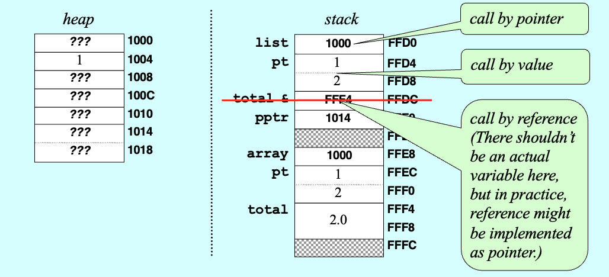
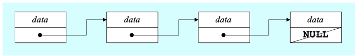
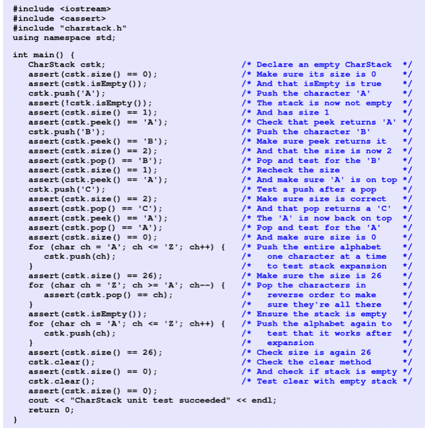

# 9. Dynamic Memory Management

> Dynamic Allocation, Linked Structures, Copying Objects, Unit Testing, `const` and `static`, Smart Pointers

*Last Update: 23-10-18*

## 9.1 Dynamic Allocation

### 9.1.1 Basic Memory Allocation

Here are two basic C++ syntaxes of memory allocation which is especially suitable for dealing with *objects*:

+ The `new` operator **allocates memory on the heap** and **executes the constructor**:

  ```cpp
  int * pi = new int; 			// allocate space for a int on the heap
  int * arr = new int[10];  // allocate an array of 10 integers
  ```
  
+ The `delete` operator will always pair with `new` operator. It **frees memory previously allocated** and **executes the destructor**:

  ```cpp
  delete pi;
  delete [] arr; // for arrays
  ```
  As you see, no *size* is needed to be specified for `delete []`. 
  
  Also, `delete ptr` only frees the memory space pointed by `ptr`, but not the memory space occupied by itself. Hence, `ptr` is still **a live, dangling pointer** until it is released.
  
  To avoid dangling pointers, after deleting a pointer one can **nullify a pointer** by
  
  ```cpp
  ptr = NULL; // nullptr since C++11
  ```

Here is an example of ***dynamic arrays***:

```cpp
int *createIndexArray(int n) {
   int *array = new int[n];
   for (int i = 0; i < n; i++) {
      array[i] = i;
   }
   return array;
}

int main() {
   int *digits = createIndexArray(10);
   delete [] digits;
}
```

**Garbage collection**

The biggest challenge in working with dynamic memory allocation is to free the heap memory you allocate, or it will cause **memory leaks**.

Garbage collection frees the programmer from manually dealing with *memory deallocation*, but is not always efficient in performances as manual allocations. In C++, objects can be allocated **either on the stack or in the heap**, and programmers must **manage heap memory allocation explicitly**.

### 9.1.2 Destructor

In C++, class definitions often include a ***destructor*** taking NO arguments, which specifies how to free the storage used to represent an instance of that class. The prototype for a destructor **has no return type** and uses the name of the class preceded by a tilde `~`. 

C++ calls the destructor automatically whenever a variable of a particular class is released. For stack objects, this happens **when the function returns**, so as to automatically reclaim those variables of the object previously declared as local variables on the *stack*.

If you instead allocate space for an object in the *heap* using `new`, you must explicitly free that object by calling `delete`, which automatically invokes the destructor. Also, if `new` is used in constructors, `delete` should most probably be used in destructors as well.

**Heap-Stack Diagram**

Here we will use a **heap-stack diagram**, where a block of memory to the **heap** side of the diagram will be added when using `new`, and a new **stack** frame will be created whenever a program calls a *method* (with its memory reclaimed when a method returns).



**Comparison with Dynamic Allocation in C**

Supported in `<cstdlib>` (for the header file`stdlib.h`):

| Function  | Description                        |
| --------- | ---------------------------------- |
| `calloc`  | Allocate and zero-initialize array |
| `free`    | Deallocate memory block            |
| `malloc`  | Allocate memory block              |
| `realloc` | Reallocate memory block            |

Here is a specific example:

```cpp
#include <stdio.h>
#include <stdlib.h> // For malloc and free

int main() {
    int n = 5; // Number of integers to allocate
    int *array = (int*)malloc(n * sizeof(int)); // Allocate memory for 5 integers

    if (array == NULL) {
        // malloc returned NULL, meaning memory allocation failed
        printf("Memory allocation failed.\n");
        return 1; // Exit with an error code
    }

    // Initialize the array with values
    for (int i = 0; i < n; i++) {
        array[i] = i * i; // Set each element to its index squared
    }

    // Print the array
    printf("Array values: ");
    for (int i = 0; i < n; i++) {
        printf("%d ", array[i]);
    }
    printf("\n");

    free(array); // Don't forget to free the memory when done

    return 0;
}
```

These operators `new` and `delete` only deal with memory allocation without taking care of constructor or destructors:

+ `new` and `delete` are type-safe, meaning they are **only aware of the type of object they are allocating and deallocating**.

  `malloc` and `free` are not type-safe, as they only handle memory in terms of bytes. 

+ If `new` fails to allocate memory, it throws a `std::bad_alloc` exception.

  If `malloc` is unable to allocate memory, it will return a null pointer. 

+ `new` returns a pointer of the specified type, so no type conversion is needed.

  `malloc` returns **a pointer of type `void*`**, which needs to be converted to a pointer of the target type.

## 9.2 Linked Structures

Pointers are important in programming because they make it possible to represent the relationship among objects by **linking them together** in various ways.



C++ marks the end of linked list using the constant `NULL`, which signifies a pointer that does not have an actual target.

Here is a vivid example of passing the message via the towers:

```cpp
struct Tower {
   string name;  /* The name of this tower    */
   Tower *link;  /* Pointer to the next tower */
};

/*
 * Function: createTower(name, link);
 * ----------------------------------
 * Creates a new Tower with the specified values.
 */

Tower *createTower(string name, Tower *link) {
   Tower *tp = new Tower;
   tp->name = name;
   tp->link = link;
   return tp;
}

/*
 * Function: signal(start);
 * ------------------------
 * Generates a signal beginning at start.
 */
 
void signal(Tower *start) {
   if (start != NULL) {
      cout << "Lighting " << start->name << endl;
      signal(start->link);
   }
}
```

For a better understanding, we implement a `CharStack` Class using dynamic allocation. The comments are intentionally removed for readers' further thoughts.

+ Here we have the `charstack.h` interface:

  ```cpp
  /*
   * File: charstack.h
   * -----------------
   * This interface defines the CharStack class.
   */
  
  #ifndef _charstack_h
  #define _charstack_h
  
  class CharStack {
  public:
  
  /*
   * CharStack constructor and destructor
   * ------------------------------------
   * The constructor initializes an empty stack.  The destructor
   * is responsible for freeing heap storage.
   */
  
     CharStack();
     ~CharStack();
    
  /*
   * Methods: size, isEmpty, clear, push, pop
   * ----------------------------------------
   * These methods work exactly as they do for the Stack class.
   * The peek method is deleted here to save space.
   */
  
     int size();
     bool isEmpty();
     void clear();
     void push(char ch);
     char pop();
  
  #include "charstackpriv.h"
  
  }
  
  #endif
  ```

+ Here is what in the even deeper `charstackpriv.h` file:

  ```cpp
  /*
   * File: charstackpriv.h
   * ---------------------
   * This file contains the private data for the CharStack class.
   */
  
  private:
  
  /* Instance variables */
  
     char *array;          /* Dynamic array of characters   */
     int capacity;         /* Allocated size of that array  */
     int count;            /* Current count of chars pushed */
  
  /* Private function prototypes */
  
     void expandCapacity();
  ```

+ Thus we implement the `charstack.cpp` file:

  ```cpp
  /*
   * File: charstack.cpp
   * -------------------
   * This file implements the CharStack class.
   */
  
  #include "charstack.h"
  #include "error.h"
  using namespace std;
  
  /*
   * Constant: INITIAL_CAPACITY
   * --------------------------
   * This constant defines the initial allocated size of the dynamic
   * array used to hold the elements.  If the stack grows beyond its
   * capacity, the implementation doubles the allocated size.
   */
  
  const int INITIAL_CAPACITY = 10;
  
  /*
   * Implementation notes: constructor and destructor
   * ------------------------------------------------
   * The constructor allocates dynamic array storage to hold the
   * stack elements.  The destructor must free these elements
   */
  
  CharStack::CharStack() {
     capacity = INITIAL_CAPACITY;
     array = new char[capacity];
     count = 0;
  }
  
  CharStack::~CharStack() {
     delete[] array;
  }
  
  int CharStack::size() {
     return count;
  }
  
  bool CharStack::isEmpty() {
     return count == 0;
  }
  
  void CharStack::clear() {
     count = 0;
  }
  
  void CharStack::push(char ch) {
     if (count == capacity) expandCapacity();
     array[count++] = ch;
  }
  
  char CharStack::pop() {
     if (isEmpty()) error("pop: Attempting to pop an empty stack");
     return array[--count];
  }
  
  /*
   * Implementation notes: expandCapacity
   * ------------------------------------
   * This private method doubles the capacity of the elements array
   * whenever it runs out of space.  To do so, it must copy the
   * pointer to the old array, allocate a new array with twice the
   * capacity, copy the characters from the old array to the new
   * one, and finally free the old storage.
   */
  
  void CharStack::expandCapacity() {
     char *oldArray = array;
     capacity *= 2;
     array = new char[capacity];
     for (int i = 0; i < count; i++) {
        array[i] = oldArray[i];
     }
     delete[] oldArray;
  }
  ```

From the codes above, there are two which deserves paying attention to:

+ **`array` and `oldArray`:**  In the code, `array` is the **original** character array pointer, and `oldArray` is a **backup** pointer used to save the original address of `array`. When you reallocate memory for `array` (using `new`), `array` will point to the new memory address, while `oldArray` still points to the original memory address.

+ **Here `++i` and `i++` are quite different:** `array[count++] = ch;` first **stores** the value `ch` at the current position in `array` (specified by the `count` index) and then *increments* `count` by 1, while `return array[--count];` first *decrements* `count` by 1 and then **returns** the value of `array` at that position.

## 9.3 Copying Objects

When you are defining a new *ADT* in C++, you typically need to define two methods to ensure that copies are handled correctly:

+ The operator `operator=`, which takes care of **assignments**;

  ```cpp
  type & type::operator=(const type & src)
  ```

+ A *copy constructor*, which takes care of **by-value parameters**.

  ```cpp
  type::type(const type & src)
  ```

Call/return by value might cause unnecessary calls to the copy constructor. **Constant call by reference** protects the source.

**Assignment and Copy Constructors**

An assignment operator can return anything it wants, but the standard C/C++ *assignment operators* return a *reference* to the left-hand operand, which allows you to **chain** assignments together:

```cpp
int a, b, c;
a = b = c = 10;
```

The default behavior of C++ is to **copy** only the top-level fields in an object, which means that all dynamically allocated memory is shared between the original and the copy, known as ***shallow copying***:

+ A ***shallow copy*** allocates new fields for the object itself and copies the information from the original. Unfortunately, the dynamic array is **copied as an address**, not the data.
+ A ***deep copy*** also copies the contents of the dynamic array and therefore creates two independent structures

Here we implement a ***deep copy***. These methods make it possible to pass a `CharStack` by value or assign one `CharStack` to another.
```cpp
/*
 * Implementation notes: copy constructor and assignment operator
 * --------------------------------------------------------------
 * These methods make it possible to pass a CharStack by value or
 * assign one CharStack to another.
 */

CharStack::CharStack(const CharStack & src) {
   deepCopy(src);
}

CharStack & CharStack::operator=(const CharStack & src) {
   if (this != & src) { // in case of self-copy
      delete[] array;
      deepCopy(src);
   }
   return *this; // return a reference of the current object
}

void CharStack::deepCopy(const CharStack & src) {
   array = new char[src.count];
   for (int i = 0; i < src.capacity; i++) {
      array[i] = src.array[i];
   }
   count = src.count;
   capacity = src.capacity;
}

```

Pay attention: `this` provides **a pointer to the current object**, while `*this` provides **a reference to the object itself**. When you use `this`, you are dealing with a pointer; when you use `*this`, you are dealing with the object itself.  

## 9.4 Unit Testing

One of the most important responsibilities you have as a programmer is to test your code as thoroughly as you can. Thus we adpat **unit test** of the `assert` macro from the `<cassert>` library on the implementation of a stack:



Also, there have been comprehensive frameworks like *google tests*, which offers more assertions and test cases options.

## 9.5 `const` and `static`

### 9.5.1 The Uses of `const`

The `const` keyword has many distinct purposes in C++. This text uses it in the following three contexts:

+ **Constant definitions**: Adding the keyword `const` to a variable definition tells the compiler to disallow subsequent assignments to that variable, thereby making it constant.

  ```cpp
  const double PI = 3.14159265358979323846;
  static const int INITIAL_CAPACITY = 10;
  ```
+ **Constant call by reference**: **Adding `const` to the declaration of a reference parameter** signifies that the function will not change the value of that parameter. 

  ```cpp
  void deepCopy(const CharStack & src);
  ```
+ **Constant methods**: Adding `const` after the parameter list of a method guarantees that the method will not change the object.

  ```cpp
  int CharStack::size() const;
  ```

Classes that use the `const` specification for all appropriate parameters and methods are said to be `const`-correct. 

As an example,

```cpp
#include <iostream>
using namespace std;

class A {
public:
   const int c1;
   const int c2;
   A();
   A(int x, int y);
};

A::A():c1(3),c2(4){}
A::A(int x, int y):c1(x),c2(y){}

int main() {
   A a;
   A b(5, 6);
   cout << a.c1 << a.c2 << endl; // 34
   cout << b.c1 << b.c2 << endl; // 56
}
```

also

```cpp
#include <iostream>
using namespace std;

class A {
public:
   const int c1 = 1; // Since C++11
   const int c2 = 2; // Since C++11
};

int main() {
   A a, b;
   cout << a.c1 << a.c2 << endl; 			// 12
   cout << b.c1 << b.c2 << endl;			// 12
   cout << (&a.c1 == &b.c1) << endl;	// 0
   cout << (&a.c2 == &b.c2) << endl;	// 0
}
```

**Constant Expression **(*****)

The `constexpr` is a keyword introduced in the C++11 standard, used to define ***compile-time constant expressions***. It instructs the compiler to compute the value of an expression **at compile time rather than at runtime**, and it can be applied to variables:

```cpp
constexpr int max_size = 100; 
int array[max_size]; 
```

It could also be applied to (constructor) functions.:

```cpp
constexpr int square(int x) {
    return x * x;
}
constexpr int squared_value = square(5);
```

In comparison, `const` is mainly used to specify that a value cannot be changed after initialization (immutable), but it does not guarantee that the value is known at compile time. 

### 9.5.2 The Uses of `static`

The lifetime of `static` variables **begins** the first time the program flow **encounters the declaration** and it **ends** at program **termination**:

| Applied to                           | Meaning                                                      |
| ------------------------------------ | ------------------------------------------------------------ |
| a local variable                     | The variable is permanent, in the sense that it is **initialized only once** and retains its value from one function call to the next. It is like having a *global variable* (life span), but only with local scope (effective scope). |
| a global constant                    | Since a global constant has **internal linkage** by default, meaning it is only available for use in the file in which it is defined thus in effect, `static const`. |
| a global variable or a free function | The scope is limited to the file in which it is defined with a `static` qualifier, or any free function or global variable in a file has the `extern` qualifier by default. |
| a member variable                    | There is **only one** such variable for the class, no matter how many objects of the class are created, turning the member variable from an *instance variable* into a *class variable*. |
| a member function                    | The function may access **only static members** of the class, not any *instance members*. |

```cpp
#include <iostream>
using namespace std;

class A {
public:
   static const int c = 1;
   static int i;
};

int A::i = 2;

int main() {
   A a, b;
   cout << a.c << a.i << endl;			// 12
   cout << b.c << b.i << endl;			// 12
   cout << (&a.c == &b.c) << endl;	// 1
   cout << (&a.i == &b.i) << endl;	// 1
   a.i = 3;
   cout << b.i << endl;							// 3
}
```

## 9.6 Smart Pointers (*****)

In C++, ***smart pointers*** are a category of template classes that provide safer memory management than raw pointers. 

By using **automatic reference counting** or other mechanisms, smart pointers ensure that the memory they point to is automatically released when the object is no longer needed, helping to prevent **memory leaks** and **dangling pointer** issues.

Here are some typical uses of *smart pointers*:

+ `std::unique_ptr` example:

  ```cpp
  #include <iostream>
  #include <memory>
  
  class Box {
  public:
      Box() { std::cout << "Box created\n"; }
      ~Box() { std::cout << "Box destroyed\n"; }
  };
  
  int main() {
      std::unique_ptr<Box> myBox = std::make_unique<Box>(); // Box is created here
      // myBox can be used like a regular pointer
      // No need to delete Box, as it will be automatically destroyed when myBox goes out of scope
  }
  // Box is destroyed automatically when the unique_ptr myBox goes out of scope
  ```

  In this example, `std::unique_ptr` takes care of managing the `Box` object's lifetime. When `myBox` goes out of scope, the destructor for `Box` is called, and the memory is freed without needing to call `delete` manually.

+ `std::shared_ptr` example:

  ```cpp
  #include <iostream>
  #include <memory>
  
  class Box {
  public:
      Box() { std::cout << "Box created\n"; }
      ~Box() { std::cout << "Box destroyed\n"; }
  };
  
  int main() {
      std::shared_ptr<Box> box1 = std::make_shared<Box>(); // Box is created here
      {
          std::shared_ptr<Box> box2 = box1; // box2 is now sharing ownership of Box
          // The reference count for Box is now 2
      } // box2 goes out of scope, reference count for Box is decreased to 1
      // Box is still alive because box1 is still owning it
  }
  // Box is destroyed automatically when the last shared_ptr (box1) goes out of scope
  ```

  In this example, `box1` is copied to `box2`, which increases the reference count of the `Box` object to 2. When `box2` goes out of scope, the reference count decreases to 1. Finally, when `box1` goes out of scope, the reference count goes to 0, and the `Box` is destroyed.

+ `std::weak_ptr` example:

  ```cpp
  #include <iostream>
  #include <memory>
  
  class Box {
  public:
      Box() { std::cout << "Box created\n"; }
      ~Box() { std::cout << "Box destroyed\n"; }
  };
  
  int main() {
      std::shared_ptr<Box> box = std::make_shared<Box>(); // Box is created here
      std::weak_ptr<Box> weakBox = box; // weakBox points to Box but doesn't increase the reference count
      // We can check if weakBox is expired or not
      if (!weakBox.expired()) {
          std::shared_ptr<Box> box2 = weakBox.lock(); // Creates a shared_ptr from weak_ptr if it's not expired
          // The reference count for Box is now 2
      }
      // Box is still alive here as box is still owning it
      box.reset(); // Decreases the reference count for Box, and since it's the last shared_ptr, Box is destroyed
      // At this point, weakBox is expired.
  }
  ```

  Here, `weakBox` is constructed from a `shared_ptr`, but it **does not** contribute to the **reference count**. When `box` is reset, the `Box` is destroyed even though `weakBox` is still in scope. This is because `weak_ptr` does not control the object's lifetime. The `expired()` method can be used to check if the object is still alive, and `lock()` can be used to create a `shared_ptr` if the object is still there.

## 9.7 Move Semantics (*****)

Introduced in C++11, ***move semantics*** is a significant feature that changes the way objects are handled in memory, particularly during object assignment and passing. Move semantics allows **the ownership of resources**, such as dynamically allocated memory, to be transferred from one object to another, which is often more efficient than traditional copy operations.

The core of move semantics is the right-value reference. Classes can define ***move constructors*** and ***move assignment operators*** to accept right-value references:

```cpp
class MyClass {
public:
    
    MyClass(MyClass&& other) noexcept
        : data(other.data) {
        other.data = nullptr;
    }

 
    MyClass& operator=(MyClass&& other) noexcept {
        if (this != &other) {
            delete[] data;
            data = other.data;
            other.data = nullptr;
        }
        return *this;
    }

private:
    int* data;
};
```

*Move semantics* need to be used in conjunction with `std::move(temp)`. It converts `temp` into a right-value reference, **allowing the *move constructor* rather than the *copy constructor*** to be called when returning `temp`. This means that resources are transferred instead of creating a duplicate, which can improve efficiency and reduce memory usage.

---


